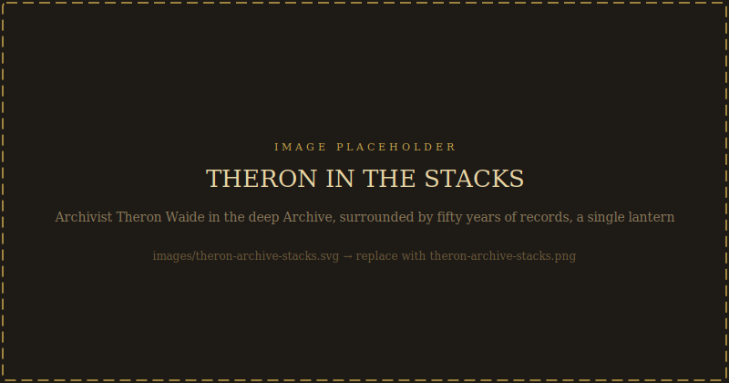
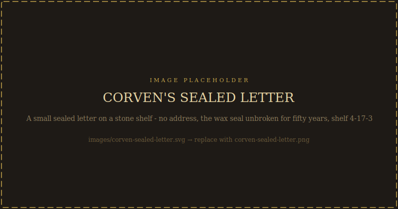
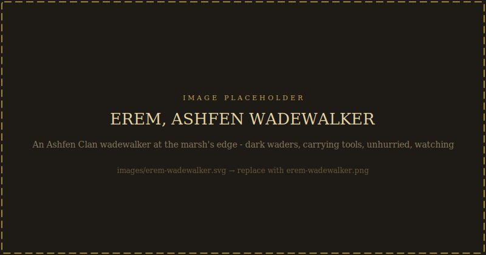

# The Deep Archive

*Primary source documents — letters, journals, reports, pamphlets, and oral traditions — that your characters may discover across all five sessions. Each entry notes where it can be found and when it becomes available.*

*Documents are most powerful when players discover them at the right moment through investigation and trust, not as information dumps. Release them as discoveries.*

*[PLAYER-SAFE] documents can be handed directly to players. [GM READ-ALOUD] documents include a player-visible excerpt and a collapsed GM section with full context and timing notes. [GM ONLY] documents include a brief player-visible description and full content in the GM collapse.*

---

## Part One: Historical Documents

*The public record of the twilight — what anyone with access to the Archive could eventually find.*

---

### Document A1: Corven's Research Grant Application
**Source:** Varenhold Spire Research Registry, Year 15 Before the Twilight
**Found:** Archive research floor, public records; available Session 1
**Type:** [PLAYER-SAFE]

> **To the Varenhold City Council, Research Grants Office**
>
> I write to request continued funding for the Solar Amplification Research Program now entering its third year of formal study. I will state the case plainly, as I believe the Council deserves plain speech on matters of this magnitude.
>
> The Ritual of Eternal Dawn is achievable within fifteen years. I am as certain of this as I have ever been certain of anything in forty years of scholarly work.
>
> The mechanism I have identified — a sympathetic resonance between anchored light and ambient solar energy — would allow the city to store and amplify incoming solar radiation during the spring and summer months, releasing it continuously through the winter. The effect would not be dramatic: not a second sun, not perpetual blazing noon. But it would mean that Varenhold's agricultural output would increase by an estimated thirty to forty percent, and that the scholars who have been worrying about the city's food security for two decades could direct their attention to something more productive.
>
> The ritual requires careful preparation. The anchoring mechanism — I call it a Lux Anchor in my working notes — must be properly calibrated to the ambient field before activation. I am currently exploring three possible approaches to anchor calibration and expect to narrow to one within the year.
>
> The preliminary tests have been encouraging. The Primer Stones in the plaza prototype showed consistent resonance patterns in controlled conditions. I believe we are close.
>
> I ask for five hundred amber script to continue the work for three more years.
>
> Respectfully submitted,
> **Archmagister Corven Ash**
> *Head of Theoretical Division, the Spire*

GM Notes — A1: Research Grant Application

Corven's certainty here is genuine. He was not lying to the Council. He was wrong about what the anchor was, but he did not know this yet. Plant this in Session 1 to establish his voice before his tragedy. The optimism here hits harder once players read B5 and B6.

---

### Document A2: The First Naming — Healers' Guild Report, Year 1
**Source:** Healers' Guild Public Health Archives
**Found:** Healers' Guild headquarters or Archive, medical records floor; available Session 1
**Type:** [PLAYER-SAFE]

> **Preliminary Clinical Report: Twilight-Associated Condition**
> *Healers' Guild of Varenhold, Month 8, Year 1 of the Twilight*
>
> Guild practitioners have observed, across the past eight months, a pattern of symptoms in the adult population that does not correspond to any previously documented condition. We believe this pattern is directly related to the absence of natural sunlight.
>
> **Presenting symptoms** (in order of prevalence): persistent fatigue unresolved by sleep; flattened affect and reduced emotional response; cognitive slowing in sequential tasks; reduced appetite; increased sensitivity to cold.
>
> **Population most affected:** Adults over forty; children under twelve show reduced incidence that we do not yet understand.
>
> **Proposed name:** We are calling the condition "the grey sickness" in internal correspondence. The name is provisional. We chose it because the most visible symptom is a greying of the face and hands that several senior practitioners noted independently before comparing records.
>
> **Prognosis:** Unknown. We do not have a treatment. We are investigating the connection to sunlight directly, but our research capacity is limited.
>
> **Recommendation to the Council:** Increase Guild staffing by fifteen practitioners. Establish a dedicated research position for this condition. Act quickly — we believe the symptom progression will worsen over months, not years.
>
> *Signed: Guild Practitioner Yvette Morr, on behalf of the Healers' Guild senior staff*

GM Notes — A2: First Naming Report

The Council increased staffing by six practitioners. It was not enough. Yvette Morr died of the grey sickness in Year 18 — the Guild's most experienced practitioner of the condition, taken by it. If players ask about her, Sevra Dain knows.

---

### Document A3: The Earliest Restorers — Pamphlet, Year 20
**Source:** Found in the Archive's political ephemera collection; the original pamphlet
**Found:** Archive research floor or Restorer compound (older members have copies); available Session 2
**Type:** [PLAYER-SAFE]

> **TO THE PEOPLE OF VARENHOLD**
>
> Twenty years have passed.
>
> We have watched the scholars work. We have read their papers — three hundred of them now — and attended their public lectures, and asked our questions in the public forums, and waited.
>
> We are still waiting.
>
> We do not write this in anger. We write it in grief, which is something different, and we believe you know the difference.
>
> The ritual can be completed. We have read what Archmagister Corven wrote, before the documents were sealed, and we believe his foundational theory was sound even if his execution failed. The failure was not in the theory. The failure was in the execution. And a failure in execution can be corrected.
>
> We are the Varenhold Restoration Fellowship. We are not scholars — we are your neighbors. We are the baker whose crops fail every autumn. We are the healer who cannot treat what the twilight has done. We are the parent who cannot tell their child what morning looks like.
>
> We are asking the Council to open the ritual documents. To share what Corven found with the scholars who can finish his work. To treat this as the emergency it is.
>
> We are asking politely. We intend to keep asking.
>
> *The Varenhold Restoration Fellowship*
> *Year 20 of the Twilight*

GM Notes — A3: Earliest Restorers Pamphlet

Brother Edoran was seventeen when this pamphlet was written. His father was one of the signatories. He has a copy in his desk at the compound, worn from handling. If players notice this detail and mention it to Edoran, it opens a conversation about inheritance — about what you do with a cause your parent believed in.

---

### Document A4: Theron's Private Accession Log Entry
**Source:** Archive private administrative records — his personal logbook
**Found:** Archive, Theron's personal office (his desk, bottom drawer); available Session 1 but requires DC 15 Sleight of Hand or player asking Theron directly after trust is earned
**Type:** [GM READ-ALOUD]

*What players see:* A worn personal logbook in Theron's desk. One entry is heavily re-read — the paper is soft from handling. It is dated Year 42.

> *Entry, Month 4, Year 42 of the Twilight*
>
> Found them today.
>
> I've been doing the systematic catalog of the lower floors for three years. Corven's assistant sealed this section in Year 1 and died in Year 6. The catalog has never been completed. I had no specific reason to expect anything unusual.
>
> The documents are in a lockbox inside a secondary shelf unit on the east wall of sub-floor three. Twelve items. Some in Corven's own hand. Some in a notation system that took me four hours to work through.
>
> I read them in the order I found them. I wish I had prepared myself for what they said. I did not know what they would say.
>
> The ritual did not fail in the way I was taught. It did not fail at all, strictly speaking. It completed. But what it completed was not what Corven intended to build.
>
> The anchors he calibrated were not external structures. They were biological. The ten children born that night are the anchors. The light is in them. It has been in them for forty-two years. The inversion path — which he describes in the third document — requires those ten people to be present and willing at the Ashring simultaneously.
>
> I have been sitting here for six hours.
>
> I know what I should do. I should bring this to the Chancellor. I should have the scholars examine it. I should tell someone.
>
> I am not going to. Not tonight. I need to think.
>
> It has been eleven years since I needed to think.

GM Notes — A4: Theron's Accession Log

**Release:** Share the full entry once Theron trusts the players enough to show his desk, or after they've confronted him about hiding the documents. Paraphrase with "something he found, something about the ritual failing differently than the official story" until trust is earned — then hand it over directly.

**What this reveals:** Theron has known for eight years. The specific shame of "I need to think" followed by eight years of inaction is the core of his character. When players read this, they see exactly when he became complicit.

**Follow-up:** After they read it, Theron will ask: "I know what you're thinking. Ask me directly."

---

### Document A5: The High Penitent's Reply to Corven
**Source:** Solenne Cathedral archives; also a copy in the Archive's diplomatic records
**Found:** Requires either travel to Solenne or DC 17 Investigation in Archive restricted floor; available Session 3+
**Type:** [PLAYER-SAFE]

> *To Archmagister Corven Ash, Head of Theoretical Division, the Spire of Varenhold*
> *From the Office of the High Penitent of Solenne*
> *Year 5 Before the Twilight*
>
> Your proposal has been reviewed by our theological council.
>
> We are prepared to offer conditional approval of the Ritual of Eternal Dawn, contingent on the following:
>
> First, that the ritual be understood and publicly framed as an act of devotion to Auris, not merely a scientific exercise. The language of the public announcement should reflect this.
>
> Second, that the Auris Cathedral of Varenhold be formally consulted before the ritual date is set, and that clergy be present at the ritual's performance.
>
> Third, and most important: you have described the anchor mechanism as "requiring a resonant living substrate during the calibration phase." We do not fully understand this terminology. We ask that you clarify whether this substrate is a person or persons. If it is, we require your assurance that no person will come to harm through this ritual.
>
> We await your clarification before finalizing our approval.
>
> *In the light of Auris,*
> *High Penitent Caros Ven*

GM Notes — A5: High Penitent's Reply

Corven replied that the "resonant substrate" was the ritual participants, the ten Primer Stone operators, who would experience no harm. He was not lying — he believed this. He did not know that the anchor mechanism would seek biological hosts and find them in the children born that night.

High Penitent Ven never received the clarification he asked for, because the ritual was performed three years later and Corven died the same night. High Penitent Ven still has this letter in his private study. It is why he has been in correspondence with the Penitent faction in Varenhold for six years. He needs to know if the ritual's outcome was Corven's fault or Auris's plan.

If players travel to Solenne and meet Ven, he will show them his copy. He will ask what they know. He is genuinely uncertain whether to hope or grieve.

---

### Document A6: A Family's Goodbye — Letter, Year 8
**Source:** Found in the Archive's collected ephemera; someone donated their correspondence records
**Found:** Archive research floor, public collection; available Session 1
**Type:** [PLAYER-SAFE]

> *To Nessa and Pell and the children, at 14 Copper Lane, Lowmark*
>
> We are going. By the time you read this we'll be on the northern road.
>
> I know you said you'd come when things got better. I'm not writing to argue about that. I just wanted you to have something to hold, since I couldn't find a way to say it right to your face.
>
> We have been here since before our parents were born. Three generations in this district. I never thought I'd leave. I still don't want to. But the boy hasn't been right since spring — you've seen it, the fog that comes over him in the mornings — and the healer says there's nothing more to do here, and I believe her.
>
> Keep the lamp we gave you when you moved in. Keep the cord on the hook by the door. I put a red knot in it.
>
> We'll write when we get somewhere. I don't know where yet.
>
> *Yours always,*
> *Harren*

GM Notes — A6: A Family's Goodbye

They settled in the Dusk Parishes. The boy recovered partially — the grey sickness progressed more slowly outside Varenhold but did not stop. He died in Year 30. Nessa and Pell never left. Their grandchildren still live in the Lowmark. Nessa maintains the memorial room in the Great Dawnhall.

The name "Harren" is not a coincidence — this is a variant spelling of Harran (the Reckoning's commander). If players have discovered Harran's identity and read this letter, the connection is there to make. Do not confirm it unless they ask.

---

### Document A7: Compact Trade Report, Year 25
**Source:** Arveth Compact internal trade analysis
**Found:** Compact House records, or via Compact contact; available Session 2+
**Type:** [GM READ-ALOUD]

*What players see:* A formal trade analysis document with an Arveth Compact seal, dated twenty-five years ago. It is stamped CONFIDENTIAL in two places. Someone has left it in the accessible records, perhaps accidentally, perhaps not.

> **Summary assessment: Decline is structural, not cyclical.**
>
> Transit volume through Varenhold has fallen 55% from baseline over twenty-five years. Current rate of decline suggests transit volume will reach non-viable levels within fifteen to twenty years unless the twilight condition resolves.
>
> Varenhold's amber workshops continue to operate profitably in absolute terms, but the margin compression from regional imitators is accelerating.
>
> Our analysis of the grey sickness data suggests the working-age population will experience significant attrition over the next twenty years. Current emigration rates, if sustained, reduce the population to below viable city-scale within thirty years.
>
> **Recommendation:** Maintain commercial relationships at current level. Do not increase exposure. Monitor quarterly. If the twilight condition shows signs of resolution, increase engagement rapidly to capture first-mover advantages. If not, begin transition planning for alternative northern routes.

GM Notes — A7: Compact Trade Report

**Full document header (paraphrase for players, share the summary block directly):**
*CONFIDENTIAL: INTERNAL ANALYSIS — Trade Factor Report: Varenhold Region, Year 25 of the Twilight*

The date is twenty-five years ago. Factor Dara Mell has the current version of this report, which uses the same language with updated numbers. She does not leave it where people can find it.

**What this tells players:** The Compact has been watching Varenhold decline with clinical detachment. The "first-mover advantages" language is chilling — the Compact is planning for both outcomes and positioning to profit from whichever occurs.

**If players show this to Saret Onn:** He will not be alarmed. He will say, with perfect calm, "That analysis is accurate. The updated version is less optimistic." He is not the villain — he is a man doing his job in a city where the math is getting worse.

---

### Document A8: Sevra Dain's Desperate Winter Mortality Report, Year 23
**Source:** Healers' Guild mortality records
**Found:** Healers' Guild medical archives, restricted; requires Guild trust to access; available Session 2+
**Type:** [GM READ-ALOUD]

*What players see:* A restricted Guild document with Sevra Dain's name on the cover. The writing is formal and controlled until the final paragraphs, where something shifts.

> **INTERNAL MORTALITY REPORT: THE DESPERATE WINTER**
> *Year 23 of the Twilight — Month 2 through Month 5*
>
> Final count: 412 deaths directly attributable to grey sickness Stage 3 progression during the food shortage period.
>
> Contributing factors: Reduced compound supply. Malnutrition accelerating Stage 2 to Stage 3 transition. Inadequate care house capacity.
>
> Demographic breakdown: 61% over age 50. 27% between 30 and 50. 12% under 30.
>
> The 12% statistic is the one I cannot put down. Forty-nine people under thirty. I have their names. I am not including the names in this report because I do not believe the Council should be able to read a number and feel they have understood it.
>
> The compound supply problem is solvable. The food supply problem is solvable. The care house capacity problem is solvable. None of these problems required 412 people to die.
>
> I am submitting this report as required by Guild policy. I am also submitting, separately, a request that the Council read the names.
>
> *Senior Practitioner Sevra Dain*

GM Notes — A8: Desperate Winter Mortality Report

The Council read the report. They did not request the names. Sevra has not forgotten this. She is professionally cooperative with the Council in all matters. She is not forgiving them.

**When to use:** This document is most powerful when players have already met Sevra and seen her professional composure. Reading it creates a specific dissonance — the voice in the document is the same controlled register, right up until it isn't.

**If players show this to the Chancellor:** She will say she remembers reading it. She will not say whether she requested the names. She already knows what that silence communicates.

---

### Document A9: A Child's Essay, Year 30
**Source:** Found in the Dawnhalls District school records, donated by a teacher
**Found:** Dawnhalls community archive; available any session
**Type:** [PLAYER-SAFE]

> **"What the Sun Looks Like"**
> *By Essie, age 8. Submitted for the Year 30 Memorial Remembrance school assignment.*
>
> I have not seen the sun. Nobody my age has. My grandmother says it was warm. She says the warmth is the hardest thing to describe because it is not like the warmth from a lantern or a hearth, which comes from a direction. She says the sun's warmth came from everywhere at once, from the sky, and you could close your eyes and feel it on your face and know you were alive.
>
> I looked at the painting in the Healing House. The one where the Ashring is in full sunlight. The shadows go in one direction in that painting. I have never seen shadows go in one direction. Our shadows come from lanterns and they go in many directions depending on where the light is. In the painting there is one source of light and everything is clear.
>
> I think the sun must have made things very clear.
>
> My grandmother says she still dreams about it sometimes. She wakes up and for a moment she thinks it came back. Then she opens her eyes and she knows it didn't.
>
> I asked her if that made her sad. She said yes. She said it made her sad every morning.
>
> I think when the sun comes back I will understand what she means.
>
> I think about it a lot.

GM Notes — A9: A Child's Essay

Essie grew up. She's twenty-eight now, in the Lowmark, working the river docks. She is one of the Desperate. She is not an ideologue — she just grew up and is still waiting for what she wrote about when she was eight.

If players encounter the Desperate and ask about ordinary members — who are these people, why do they care so much — Essie is the answer. She's not angry. She's been patient for twenty years. She is still waiting.

---

### Document A10: The Last Entry in Orya Doss's Working Map Log
**Source:** Orya's personal mapping archive
**Found:** Requires Orya's trust; available Session 3+
**Type:** [GM READ-ALOUD]

*What players see:* The final entry in a meticulous professional logbook. Twenty-three years of map logs. This last page is different in tone.

> *Month 11, Year 49 of the Twilight*
>
> Completed the updated regional map today. Twelve drafts. Sent the final to the Compact for reproduction.
>
> I have been making maps for twenty-three years. The map has not meaningfully changed. The roads are the same roads. The cities are the same cities. The river is the same river.
>
> What changes is what the map cannot show: which inns are still open, which roads are maintained, how the Parishes look now compared to the last time I traveled them. Maps are always already wrong. They are a record of how things were.
>
> I have been thinking about what a map of Varenhold will look like after the ritual. If the ritual works. The roads will be the same. The buildings will be the same. But the light will fall differently — shadows in one direction, warm. You can't put that on a map either.
>
> I keep making them anyway.
>
> I think that's the only answer I have.

GM Notes — A10: Orya's Map Log

**When to use:** After players have met Orya (Session 3+) and seen her methodical, quietly skeptical personality. This document is the thing she doesn't say out loud — the hope she keeps making maps to preserve.

**After the ritual:** If Ending A or C occurs, give the players an opportunity to tell Orya. The appropriate response is not celebration. It's the specific silence of someone who has been right to keep making maps.

---

## Part Two: Corven's True Story

*Release these six documents in order, across the campaign. Theron can guide players to them in the Archive once he trusts them. They transform the Archmagister from a name into a person. The early documents establish his voice before his tragedy. The final one — B6, Corven's sealed letter — is the campaign's moral center.*

---

### Document B1: "The Solar Hypothesis" — Early Abstract
**Found:** Archive, public research collection (Year 25 Before); available Session 1
**Release:** Plant this early — it establishes Corven's voice before his tragedy

> **On the Sympathetic Resonance of Solar-Ambient Magical Fields**
> *A brief abstract submitted to the Reaches Scholarly Assembly*
> *By Corven Ash, Year 25 Before the Twilight*
>
> The theoretical model I am proposing is elegant in its simplicity: all solar-spectrum light carries a faint magical resonance — not spellwork, not divine energy, simply the resonance that accompanies all natural phenomena of sufficient energy. This resonance can be captured and stored in sympathetic material structures, much as heat can be stored in stone.
>
> My preliminary work suggests that a properly calibrated anchor structure could store this resonance indefinitely, releasing it at a controlled rate. The applications are significant: supplementing agricultural light through winter months, improving working conditions in high-altitude regions, and — most ambitiously — stabilizing light supply in regions subject to seasonal extremes.
>
> I am forty-three years old. I have been at this for six years. I expect to spend the rest of my career on it. I am more excited about this research than I have been about anything since I was a graduate student, which tells me either that I am onto something real, or that I have been working too hard and need a holiday. My graduate student tells me it's both.
>
> *[Submitted to the Year 25 Reaches Scholarly Assembly. Won the Assembly's Outstanding Theoretical Contribution prize. Corven framed the certificate. It was found in his office after his death.]*

GM Notes — B1: The Solar Hypothesis

This is Corven before the doubt set in. The self-deprecating humor, the genuine excitement — this is who he was. When players eventually read B5 and B6, the distance between this voice and that one is the emotional weight of the campaign. Plant B1 in Session 1, even if players don't look for it specifically. Leave it accessible.

---

### Document B2: Letter to Student Theron
**Found:** Archive, Theron's personal collection; requires Theron's trust; available Session 2+
**Release:** After players have built a real relationship with Theron

> *To my former student Theron Waide, now Archive Assistant, Year 15 Before the Twilight*
>
> You asked me, at your going-away dinner, whether I was really sure this would work. You asked it in the kind way you have of asking hard questions, where you make it sound like you're curious rather than worried. I answered evasively, because there were people around, and because I didn't want to say in public what I'll say here:
>
> I am as sure as I can be. Which is not the same as certain.
>
> The anchor mechanism works in principle. The controlled tests in Year 18 showed exactly the resonance patterns I predicted. The issue is scaling: what works at small scale does not always work at large scale, and I have not found a way to test the full ritual in advance. You cannot practice an anchor calibration of this size. You simply have to do it and see.
>
> What I know is that the calibration phase — the moment when the anchor structures become resonant with the ambient field — will be brief and, I believe, dramatic. There will be a visible energy surge in the Ashring. And then, if my calculations are correct, the anchor will hold and release light at the intended rate.
>
> I am not worried about the anchor structure. I am worried about the calibration phase. There is a moment in the ritual — Step 9, if you look at my working documents — where the anchor must synchronize with the ambient field, and I am working with an imperfect model of what that field actually looks like. I have three possible approaches to the synchronization and I am not yet sure which is correct.
>
> I will figure it out. I have twelve years.
>
> Take care of the Archive. It will outlast both of us.
>
> *Your former teacher and current colleague,*
> *Corven*

GM Notes — B2: Letter to Theron

This is the first hint of the doubt — "I am as sure as I can be. Which is not the same as certain." Corven is telling Theron something he hasn't said publicly. Note that he names Step 9 as his worry: that's the step that produced the Dawnborn.

When Theron shows players this letter, he will read it with a specific stillness. He's read it many times. He knows exactly which line the players will react to. He will not say anything until they do.

---

### Document B3: Research Journal Entry, Year 3 Before
**Found:** Archive, sub-floor three restricted collection; requires Theron's full disclosure; available Session 3+
**Release:** After the players have earned Theron's complete trust

> *Month 7, Year 3 Before the Twilight — Personal Research Journal*
>
> Ran the synchronization simulation again today. Third time this week.
>
> The model keeps giving me the same result for Step 9 that I don't like. The ambient field synchronization is not happening in the external structure the way my theory predicts. Instead, the resonance model keeps suggesting the field is "seeking" something biological during the calibration phase.
>
> I don't know what to do with that.
>
> The obvious interpretation — that the anchor mechanism will try to calibrate to living persons present at the ritual — is not possible. I have run the calculations assuming the ritual operators as the substrate and the numbers don't work. The ritual operators are positioned at the Primer Stones; they are too spread out to create a resonant substrate at the calibration density the model requires.
>
> So either the model is wrong, or there is something else biological present at the ritual that could serve as substrate.
>
> I cannot think of what that would be. There will be people in the plaza — spectators. But the ritual circle is sealed during the calibration phase. Nothing inside it, nothing outside it. Ten operators, the Primer Stones, and open air.
>
> I am probably overthinking the simulation output. Models are approximations. Real systems deviate from models at the margins. This is likely a margin effect.
>
> I have two years to figure out if I'm right about that.
>
> I hope I'm right about that.

GM Notes — B3: Research Journal, Year 3 Before

This is the moment Corven saw the problem and talked himself out of it. "I hope I'm right about that" is one of the most important lines in the campaign. He was not right.

**The question the model raised:** The biological substrate the field "sought" was not inside the ritual circle — it was in the city beyond it, in the children who would be born that night. Corven's model was more accurate than he gave it credit for. The calibration zone extended beyond the circle. He never thought to check that.

**When players read B3 after B2:** They now know he wrote to Theron about his worry, then kept worrying for three more years, then proceeded anyway. The sequence is the character.

---

### Document B4: The Letter to the High Penitent
*See Document A5 above — this is the same document, crosslinked here for the Corven sequence.*

---

### Document B5: Note Found in Corven's Desk
**Found:** Archive, sub-floor three, inside the original lockbox; available when Theron shows players the full discovery; Session 4+
**Release:** Only when players are ready for the final emotional weight before Session 5

> *Written in Corven's hand. Undated. The paper is worn as if it was handled many times before being placed in the box.*
>
> If I am wrong about the anchor mechanism — if the resonance in Step 9 doesn't find the external structure but instead seeks the biological substrate I've been worrying about — then what will happen is not what I've told anyone will happen.
>
> If the biological substrate interpretation is correct, and if the calibration phase extends beyond the ritual circle into the surrounding city —
>
> The timing means there would be children. Born that night or thereabouts. Any child in the city during the calibration phase.
>
> I don't know if this is what will happen. My model suggests it might. My better judgment says my model is wrong because the alternative is too terrible to have not noticed for eighteen years.
>
> But if the model is right: the children who become anchors would not be harmed, in the immediate sense. They would be extraordinary. They would carry the light. They would live, probably long and healthy lives, and be remarkable people.
>
> And they would be the cost. Because the anchor cannot be released without consequence. The energy it holds is not separable from the substrate that holds it.
>
> I am proceeding with the ritual. I have told the Council it is ready. The political momentum is past the point of stopping without consequences I cannot manage.
>
> I believe my model is wrong. I believe Step 9 will synchronize with the external structures as designed.
>
> I need to believe that.

GM Notes — B5: Note in Corven's Desk

**Release:** Session 4, after players have read B1–B3 and know Corven's voice well. This document lands differently if players have watched Corven's doubt build across the sequence.

**The key line:** "I need to believe that." This is not self-deception in the ordinary sense. This is a man who has looked at the alternative and decided that the probability of being wrong is lower than the cost of stopping. He may have been statistically correct about the probability. He was catastrophically wrong about the cost.

**After players read this:** Theron will say: "The next document is at shelf 4-17-3. I've been waiting for someone to read it with me."

---

### Document B6: Corven's Final Entry — The Sealed Letter

*This is the letter already referenced in Sessions 1 and 5 (shelf 4-17-3). It is placed here as the sixth document in the sequence, where it lands with its full weight.*

**Found:** Archive, shelf 4-17-3; the cipher from Session 1 leads here
**Release:** As designed in Session 5 — but if players have read B1 through B5 first, it is a different experience.

> *Written in a hand the Archive's notation scholar identifies as Corven's, but faster than his usual precision — written quickly, in the dark, in the last hours of his life.*
>
> To whoever finds this: I have approximately six minutes of consciousness left in me. I am going to use them.
>
> The ritual completed. My model was wrong. The anchor mechanism found its substrate in the children born tonight across the city. I counted ten emergency births reported before the calibration phase began. I don't know if that number is exactly right.
>
> I know what this means. The inversion path — the method I developed to reverse or cancel the anchor — requires those anchors to be present and willing simultaneously. The energy cannot be released without them.
>
> This is not what I intended. I want that stated clearly, in a permanent document, by me, while I am still capable of stating it: this is not what I intended, and I am sorry.
>
> The inversion path is documented in my research files, shelf 4-17-3, the notation key system. The path is viable. It requires consent. No one should be forced.
>
> I am putting this here because I believe Theron will find it eventually. He was always the most thorough.
>
> Theron: I'm sorry I didn't finish what I started correctly. Take care of the work.
>
> *Corven Ash, Archmagister, Year 0*

GM Notes — B6: Corven's Final Entry

This is the moral center of the campaign. Corven spent six minutes of his remaining life writing this. He knew what he'd done. He documented it. He told Theron — the one person he trusted to find it — and then he died.

**What players now know:**
- Corven saw the risk (B3), talked himself out of it, proceeded anyway (B5)
- He knew immediately when he was wrong (B6)
- He tried to document the correction and the path forward
- Theron found it eight years later and kept it secret for eight more years

**The question this creates:** Corven wrote "no one should be forced." The players now have his words. The Reckoning wants to force the ritual. Edoran is willing to make it very hard to say no. The players must decide what to do with Corven's last request.

**If Theron is present when players read this:** He will not speak for a long time. He will eventually say: "He knew it would be me." That's all.

---

## Part Three: NPC Private Journals

*Release these when players have built significant trust with each NPC. The threshold is noted. These reveal the inner life that the NPC cannot express in conversation.*

---

### Journal: Theron Waide

*What players see:* A personal logbook, distinct from the administrative records — smaller, private-looking. Theron keeps it in a locked desk drawer. He offers it to players after he has fully disclosed everything else. "You should read this," he says. "It's what I actually thought."

**Release threshold:** After players have confronted Theron about hiding the documents and he has fully disclosed.

> *Month 1, Year 50 of the Twilight — My Personal Record*
>
> They arrived today. Investigators. I don't know who sent them or what they actually know yet, but they were asking the right questions, which is either luck or preparation, and neither option is comfortable.
>
> I have been in this building for thirty-four years. I have watched three chancellors navigate this city through various crises. I have been given difficult decisions and made them, in my opinion, correctly — that is, in the way I could defend, with the information I had.
>
> I cannot defend what I did with the documents. I have been aware of this since approximately the third day after I found them, in Year 42. I have had eight years to practice the defense and it keeps failing under examination.
>
> What I have is an explanation: I found the documents, read them, understood what they meant, and became paralyzed. Not by fear for myself — or not only that — but by the magnitude of what would happen when other people knew. The moment anyone else knew, the choice became political. People would start arguing about what to do. Factions would form around the question. The Dawnborn would become the center of a debate they hadn't consented to.
>
> I told myself: not yet. Let me think a little longer.
>
> I have been thinking for eight years.
>
> The investigators today were careful, direct people who clearly had no interest in destroying anything they found. They were trying to understand. I respect that. I have been trying to understand for eight years and I am not sure I've gotten further than them.
>
> I am going to tell them tomorrow. I am going to show them where the documents are and let them read Corven's work in order. I am going to give them everything.
>
> And then I am going to ask them not to use it to hurt anyone.
>
> I don't have leverage to make that request. I just have to trust that the kind of person who asks careful questions also considers the answers carefully.
>
> I hope I'm right about that.

GM Notes — Journal: Theron

The last line echoes Corven's "I hope I'm right about that" from B3. Theron does not know Corven wrote those words — he has never read the locked journal entries. The parallel is unconscious and real. They were both careful people who hoped their judgment was enough.

The difference: Theron is choosing to act. He's handing this over. His version of the same hope has a different consequence.

---

### Journal: Sera Voss

*What players see:* A working journal Sera keeps for shift notes and logistics. Most entries are practical. Near the back, separated by a blank page, are entries that are not.

**Release threshold:** After players have had a meaningful private conversation with Sera about the ritual — not about the mechanics, but about her personally.

> *Three days before the campaign begins — Sera's working journal*
>
> Tomas thinks there's a mathematical solution. He's been working on it for two months and he won't show it to me because he says it's not ready. I know Tomas. When he says something isn't ready it usually means he's found something that frightens him.
>
> Lira is managing. I don't know what that means for her, internally. She keeps working. She always keeps working. I have never been able to tell, in twenty years of being close to her, when she is genuinely okay and when she is managing. I think she might not know either.
>
> I know what I am.
>
> I have pulled people out of burning buildings. I have stood in front of crowds and let them shout at me because they were afraid and I was the thing they could shout at safely. I have learned that there is almost always something useful to do if you pay attention.
>
> There is nothing useful I can do about this. The ritual is what it is. The cost is what it is. The decision will happen with or without me, and the decision is not mine — it's ours, individually, and what I decide doesn't determine what the others decide.
>
> I know what I'm going to decide. I've known for six months. I haven't told anyone because once you say it out loud it's real, and I would like it to not be real for a little longer.
>
> The investigators will arrive soon, I think. There are always investigators. I will be helpful to them and honest with them and I will protect them if I need to.
>
> That I can do.

GM Notes — Journal: Sera

Sera has decided. She's been willing for six months. She hasn't told anyone — not the other Dawnborn, not the players. The journal reveals this only if players have earned her trust enough to see it.

"I would like it to not be real for a little longer" is the emotional core of Sera's character. She is not afraid. She is trying to hold onto the present.

If players ask her directly (after reading this), she will tell them. She has been waiting for someone to ask who actually wanted to know the answer.

---

### Journal: Tomas Areth

*What players see:* Notes and calculations, mostly. Tomas's personal writing looks like his professional work — structured, precise. The night he finished his central calculation, the handwriting changes.

**Release threshold:** After players have seen Tomas's asymmetry calculations in Session 4 and asked him specifically about when he first realized what they meant.

> *The night Tomas finished his calculations — approximately Month 8, Year 49*
>
> The asymmetry is real.
>
> I ran it eleven times. Twelve. The five surge-phase anchors — the ones whose calibration phase extended longest during the original ritual — hold their Lux energy at significantly higher density than the other five. If the inversion path uses those five's contribution disproportionately, the collective effect is greater than a simple sum.
>
> What this means practically: if all ten Dawnborn participate, the inversion effect is complete restoration. But if only those five participate — Sera, Ysel, Lira, Petra, and myself — the effect is still significant. Measurable.
>
> I sat with this for three hours before I wrote anything down.
>
> I am one of the five.
>
> I have spent fifteen years mediating disputes. I have built my practice on the principle that every party's position deserves to be understood fully before any decision is made. I cannot mediate my own situation. I have a conflict of interest so fundamental that even naming it feels wrong.
>
> What I know is this: the mathematics says that five of us are more than five-tenths of the answer. This could be used to argue that we five should bear more responsibility. It could also be used to argue that the other five are protected — that consent matters more than utility — that the mathematics creates an out, not an obligation.
>
> I will present this to whoever investigates this and I will do it neutrally. I will present both readings and I will not say which one I believe.
>
> I think I know which one I believe. I am not ready to say it yet.

GM Notes — Journal: Tomas

Tomas knows which reading he believes. He believes consent matters more than utility. He believes the other five are protected if the five primaries are willing. He has not said this because saying it means committing to it — and committing to it means the other five don't have to.

If players ask him directly (after the journal): "You said you weren't ready to say it yet. Are you ready now?" He will think for a moment. Then he will say: "Yes." And then he will say which reading he believes.

This is the Session 4–5 hinge. Tomas's disclosure changes the moral calculus. Five willing Dawnborn might be enough. The question becomes whether that's the right use of the math.

---

### Journal: Lira Anwick

*What players see:* A personal journal kept in the care house. Medical in tone throughout. Near the end, written at night, the clinical language breaks.

**Release threshold:** After players have visited the care house, met Lira, and later asked her directly whether she would say yes to the ritual.

> *A night in Month 9, Year 49 — Lira's personal writing*
>
> Mira is three years old. She will be four in six months.
>
> I have been calculating, for the past year, what she would remember of me if I died when she was four. Children remember impressions at four. They remember what something felt like. They don't remember conversations, mostly. They remember presence.
>
> If I died now, she would remember that her mother was there. She would not remember what I said. She would have photographs. She would have Sevra, who has promised. She would have the city, if there's a city left.
>
> I know what the ritual costs. I have known for six months. Edoran told me, in the careful way he tells people things he's not supposed to know, which tells you more about what he knows than what he says.
>
> Here is the thing I cannot tell anyone: I would say yes.
>
> Not easily. Not without grief. But I would say yes, because the alternative — in the version of the future where the ritual doesn't happen — is that Mira grows up watching people die in my care house, watching me fail to treat them fast enough, watching the grey sickness take everyone I'm not fast enough to reach. And I'm not fast enough. I am never fast enough.
>
> The sun would fix that. Not all of it. Not overnight. But the sun would fix the thing I'm not fast enough to fix alone.
>
> I have not said yes yet because once I say yes it is real, and once it is real Mira doesn't have a mother, and she is three years old, and I would like her to have a mother for a little longer.
>
> I am keeping time. It is what you do.

GM Notes — Journal: Lira

Lira has decided. She has been willing for six months. Like Sera, she hasn't said it out loud. Unlike Sera, her reason is Mira — a specific, named person who will be four in six months.

**The unbearable Tier 4 detail:** If players later discover that Lux proximity slows grey sickness progression, and realize Lira would have known this eventually — she would understand that her death might help Mira live longer. She does not know this yet. Do not give it to her early. If she learns it in Session 5, before the ritual, it will change nothing about her decision and everything about its weight.

**Sevra's promise:** Sevra Dain has agreed to take care of Mira if Lira doesn't survive. Sevra keeps her promises.

---

### Journal: Brother Edoran

*What players see:* Edoran's personal journal, kept for decades. He refers to it as "the thing I write when I don't have anyone to talk to." Most entries are devotional. Year 44 is different.

**Release threshold:** After players have confronted Edoran about the full cost of the ritual and he has told them what he knows. Theron provides the journal after Edoran leaves the room.

> *Year 44 of the Twilight — One year after Annem died*
>
> She was seventeen. She had the grey sickness since she was eleven. Six years.
>
> In the first year I told myself she would recover. By the third year I was telling myself the compound would hold the progression. By the fifth year I was telling myself she would still have good years left.
>
> She had seventeen years. She was funny and sharp-tongued and she wanted to be a Spire scholar, which was ambitious given that she was the daughter of a junior Auris priest and the Spire is not known for welcoming ambitious daughters of junior priests. She was going to get there anyway. I was sure of it.
>
> I have been in the Auris faith for twenty-two years. I believe in something. I am not sure anymore that what I believe in is the same thing my colleagues believe in.
>
> What I believe is this: the twilight killed my daughter. Not directly. But the grey sickness exists because the sun is gone, and the sun is gone because of the ritual, and the ritual could be completed.
>
> I have been doing the math for a year. Ten lives — the Dawnborn, specifically. Or thousands of lives over decades of continued decline. Including the Dawnborn themselves, eventually, because the grey sickness takes everyone.
>
> The math is clear. What is not clear is whether clear math makes something right.
>
> I am going to organize the Restorers into something that can actually push the Council. I am going to find people with access and people with knowledge and I am going to build toward the moment when the choice is real.
>
> I am going to do this honestly. No coercion. The Dawnborn will be asked, not forced. I have thought a great deal about what my daughter would think of me forcing anyone. She would not approve.
>
> I don't know what she would think of me building toward a situation where the asking becomes very hard to say no to.
>
> I think about that a lot. I have not found an answer.

GM Notes — Journal: Edoran

"I don't know what she would think of me building toward a situation where the asking becomes very hard to say no to." This is Edoran's real self-knowledge. He knows what he's doing. He doesn't know whether Annem would forgive him for it.

**The key distinction:** Edoran is not trying to force the ritual. He is trying to create conditions where the Dawnborn cannot reasonably say no. This is not coercion in the legal sense. It may be coercion in the moral sense. Players must judge.

**If players ask him about this entry directly:** He will be still for a moment. Then: "I've read that a hundred times. I still don't have the answer. Do you?"

---

### Journal: Harran

*What players see:* A small notebook, not a journal in the usual sense — more like a decision log. Most entries are operational. One entry is different. It is the first.*

**Release threshold:** Only if players actively pursue Harran's background and find someone who knew him before — a former Reckoning member turned informant, or Harran himself in a moment of complete disclosure.

> *Year 49 of the Twilight — The day Harran gave the Reckoning its name*
>
> There is a moment after a decision where you can still take it back. I have made a lot of decisions in my life. I was a city guard for twelve years. I understand what it means to commit to something.
>
> What I decided today is this: if the Council will not act, and if the Restorers will not force the issue, then someone else has to. The city is dying. The math says so. The food stores say so. The grey sickness reports say so. Fifty years of polite advocacy has produced fifty years of polite delay.
>
> I am not a political person. I am a person who looks at what is happening and tries to do what needs doing.
>
> What I told the eight people who are now the Reckoning: we are not the villains of this story. We are the people who ran out of time. We are not going to hurt anyone we don't have to hurt. We are going to force a decision that should have been forced twenty years ago.
>
> What I did not tell them, because I didn't have the words: I am not sure anymore that the difference between "force a decision" and "coerce people" is as clear as I need it to be. Edoran talks about consent. He means the Dawnborn's consent. I think he's right. I am not sure my methods respect that.
>
> I am committing anyway. Because the alternative is watching the city die while everyone argues about the right process.
>
> I need to be right about this. I need the next thing I do to be the thing that tips this toward resolution.
>
> I am not sure I'm right. I am sure I'm doing it anyway.
>
> That's probably not good enough. I'm doing it anyway.

GM Notes — Journal: Harran

Harran knows he might be wrong. He chose to act anyway. He is not a villain who doesn't know he's a villain. He is a man who decided that the cost of being wrong was lower than the cost of doing nothing.

**His critical error:** He believes the Dawnborn can be forced into the Inversion Circle and the ritual will work. He is wrong about the mechanics. Without willing participation within the six-second window, the ritual takes the destructive path. All ten Dawnborn die. The sun does not return. Harran does not know this.

**If players tell him:** He will go very still. Then he will ask if they can prove it. Show him Tomas's Asymmetry Journal or Corven's sealed letter. He is a practical man. He will read the evidence. He will believe it. What he does next is up to him — and the players.

---

## Part Four: Letters Never Sent

*These are not in the Archive. They are found in personal effects — desks, hidden in books, under floorboards, tucked into clothing never collected.*

---

### Letter: Sera to the Dead
**Found:** In Sera's desk at the Dawnhalls, in a locked drawer (DC 14 Thieves' Tools); or she shows the players if they earn her deepest trust
**Set in:** Year 12 of the Twilight

> *To Marta,*
>
> They said you went quietly, which I don't believe, because you were never quiet about anything in your life. I think they said it to comfort me and I don't resent them for it, but I know you.
>
> I am twelve years old and I don't know how to write a letter to someone who is dead, so I am just going to say what I would say to you if you were here.
>
> You taught me the route from the Dawnhalls to the river before I knew my way around anything. You made me recite the turns until I could do it in the dark. I have been doing it in the dark, technically, ever since.
>
> I don't know what it means that we were born on the same night and you are gone and I am still here. I know I have more strength than you did at the end. I know the grey sickness took you the same way it takes everyone, which means it doesn't choose based on who should survive. It just takes.
>
> I am going to keep doing the route. Every day. I am going to pull people out of burning buildings and stand in front of crowds and carry the ones who can't walk themselves. I am going to do this until I can't anymore.
>
> I don't know what it means that I am a Lux Anchor or whatever the scholars are saying this week. I know what it means to be Marta's friend. That I understand.
>
> I'm keeping time.
>
> *Sera*

GM Notes — Letter: Sera to the Dead

Marta was born on the Night of the Ritual. She was not a Lux Anchor — the calibration phase didn't find her. She died at eleven of grey sickness. Sera was twelve when she wrote this.

"Born on the same night and you are gone and I am still here" — Sera has lived fifty years with this specific grief. The Lux energy that makes her extraordinary is the same energy that didn't find Marta. She has never said this out loud. She probably never will.

If players ask Sera about Marta after reading this, she will answer. She will be brief. She will be honest. This is not a wound she is hiding from — it's one she has learned to carry.

---

### Letter: Theron to the Chancellor
**Found:** In Theron's personal logbook, folded between two pages of administrative entries; available when players access his desk; Session 2+

> *To Chancellor Mira Ostenveld — Never Sent — Year 42*
>
> I found something in the Archive today that I believe you should know.
>
> The reason I am not telling you is as follows.
>
> If I tell you, you will be required to act on it. You are the Chancellor; you cannot receive information of this magnitude and do nothing. You will convene the Council. The Council will argue. The Restorers will find out. The Dawnborn will be placed at the center of a political crisis they have not been prepared for. The city's fragile stability — which you have maintained through eleven years of extraordinary governance — will be disrupted.
>
> I am not telling you because I believe I can find a better path if I have more time. A way to present this information that protects the Dawnborn's agency, that doesn't turn this into a political battle, that gives people the time they need to make the decision well.
>
> I have had this information for four months. I have not found the better path. I have found that I am afraid, and that fear is not the same as a better path, and that I have been confusing the two.
>
> I intend to tell you in the morning.
>
> I am going to put this letter in my logbook so that in eleven years, when historians reconstruct what happened, they will know that I knew I was wrong and couldn't find the courage to act on it.
>
> I hope they are not too hard on me.
>
> *Theron Waide*
> *Archivist*

GM Notes — Letter: Theron to the Chancellor

He did not tell her in the morning. He did not tell her for eight more years. The letter stayed in the logbook.

If players show this to the Chancellor: she will read it carefully. She will not say whether she is angry or relieved. She will say: "He was right that I would have been required to act." Then: "I don't know if what I would have done then would have been better than what happened."

This is the Chancellor's character. She carries her own version of the same uncertainty. She and Theron have been in the same building for decades, carrying parallel versions of the same regret. They have never talked about it.

---

### Letter: Lira to Mira
**Found:** In Lira's care house desk, in an envelope marked "For Mira, when she is sixteen"; available if players find it and Lira has been killed, or if she shows it to them voluntarily in Session 5 before the ritual

> *Mira,*
>
> If you are reading this, some things have happened and I am not there to explain them to you. I am going to try to explain them here instead.
>
> You are going to hear that I chose to do something that took me away from you. I want you to know that was the hardest thing I have ever done, and that I knew it was the hardest thing, and that I did it anyway, and that this is not a contradiction. Sometimes you do the hardest thing because the only way to live with yourself is to do it.
>
> The city needed the sun back. The people in the care houses — the ones I have been trying to keep alive, with compound I can barely make enough of, for thirty years — they needed the sun back. I could give them that, and I did.
>
> I know you needed me to stay. I know that. I think about it every day that I have spent with you. I think about it every day that I have spent in the care house, looking at the people who also needed something I was giving, and trying to figure out what the right weight is.
>
> I don't think there's a right weight. I think you do what you can live with, and then you live with it, and then you don't.
>
> Sevra will take care of you. She is better at taking care of people than she lets on.
>
> The sun is real. I hope you felt it on your face.
>
> *I love you more than the sun.*
> *Mum*

GM Notes — Letter: Lira to Mira

**When to use:** Session 5, if players have built deep trust with Lira and she has decided she's willing. She will show them this letter. She will not explain it. She will say: "I wrote this a month ago. I want someone to know it exists."

**If Lira dies before the ritual (any scenario):** Players find this in her desk. Sevra Dain knows about the letter. She will ask, quietly, if they found it. She will tell them she's already spoken with Mira.

**"I love you more than the sun" is a line Lira says to Mira every night.** Mira knows it. Players who have met Mira will understand why this is the closing line.

---

### Letter: Edoran to Corven
**Found:** In Edoran's desk at the Restorer compound; available if players search it with his permission or after his death

> *Archmagister Corven Ash, Year 35 of the Twilight*
>
> I know you're dead. I know this is not a letter that will be read. I am writing it anyway because I have been having this conversation with you in my head for ten years and it seems like I should just say it.
>
> My daughter is five years old. Her name is Annem. She has the grey sickness already — Stage 1, early, the healer says probably manageable. She is five years old.
>
> I want to ask you: did you know? When you ran your calculations, did the model show you what would happen? Did you see the biological substrate problem and proceed anyway? Or were you genuinely surprised, at the end?
>
> I have read everything you published. I have read the parts you didn't publish, which are circulating now among the people who care about this. I have read between the lines.
>
> I think you saw the risk. I think you told yourself you were probably wrong. I think you proceeded because stopping would have cost you something, and you decided that cost was higher than the risk.
>
> I make a version of that calculation every day. I tell myself I am being honest about the math. I tell myself I am not letting what happened to Annem make my judgment wrong.
>
> I am not sure I'm telling myself the truth.
>
> I am organizing the Restorers toward the completion of the ritual. I am doing this because I believe it is the right thing, mathematically and morally. I am also doing this because my daughter is sick, and I am angry, and I don't know how much of that anger is inside the math.
>
> I think you might have had the same problem.
>
> I think that's the thing I'm most angry about.
>
> *Edoran*

GM Notes — Letter: Edoran to Corven

Edoran is talking to Corven because he sees himself in Corven. He is afraid that what he's doing is what Corven did — believing his math because he needs to believe it, because the alternative is that his grief is making him wrong.

He might be right to be afraid.

**When players read B5 (Corven's note) and this letter together:** The parallel is explicit. Corven: "I need to believe that." Edoran: "I am not sure I'm telling myself the truth." Both are doing the same thing. One of them destroyed the city. Edoran is trying to fix what that destruction caused. The parallels don't resolve into judgment — they create a question.

**If players show this letter to Edoran and tell him they've read Corven's actual notes:** He will be quiet for a long time. Then: "Was he right? Did the math tell him what happened and he chose not to hear it?" If players say yes, Edoran will look at his own hands. He will not say anything else.

---

### Letter: The Parish Mother
**Found:** In the Lowmark's communal Dawnhall donation box, among items left in memory of someone; available any session

> *To my son Cael, Lowmark District, Varenhold*
> *Written in the Desperate Winter, Year 22*
>
> Cael,
>
> Come home. I know you have made your life there and I know you have your friends and your work and I know that when you left you were twenty and you said you would be back when things got better and it has been four years and things have not gotten better.
>
> Come home. The news we get here is that the food stores are falling. I know what it's like when stores fall. I know what people do to each other when they're frightened enough. Come home before it gets to that.
>
> I'm not going to finish this letter because
>
> *[The letter ends here. It was found in her house after her death in Month 3, Year 22, along with the correspondence records from Cael's address in the Lowmark. Cael survived the Desperate Winter. He found the letter twenty years later when a distant relative sorted his mother's house. He donated it to the Dawnhall without explanation.]*

---

### Letter: Cormac's List
**Found:** In Cormac's dock office, pinned to the wall behind a hanging calendar; available if players build his trust

> *Things to do when the sun comes back (assuming it does)*
> *Written in Month 3, Year 45*
>
> 1. Sleep until the warmth wakes me. Not an alarm. Just the warmth.
> 2. Get a garden. Doesn't have to be big. Something with tomatoes.
> 3. Take a trip to the Dusk Parishes and see what the farms look like in real light.
> 4. Get Davin to play something outside, in the open, in the afternoon. There's a song he says doesn't work right in amber light. I want to hear it right.
> 5. Eat a tomato I grew myself. Just that.
> 6. Tell Ysel she was right to make peace with it before the rest of us.
> 7. Tell Sera she was right about the other thing. (She knows what the other thing is.)
> 8. Visit the coast. Never been. Always meant to.
> 9. Sleep in again.
> 10. Maybe get a second garden.

GM Notes — Letter: Cormac's List

"(assuming it does)" in the title. Cormac wrote this with full awareness that the sun might not come back. He wrote the list anyway.

"Tell Sera she was right about the other thing." Players who have earned Sera's trust will know what the other thing is: she's been willing for six months. Cormac figured it out.

This is the most player-safe document in the campaign. It can be handed over any time players meet Cormac and ask about his desk. It humanizes him completely. He just wants a garden.

---

## Part Five: The Oral Histories of the Ashfen Clans

*These five fragments are in the storytelling tradition of the Wadewalkers: call-and-response structure, repeated phrases, images drawn from the marsh. Erem knows them all. She will share them in order when a player demonstrates genuine respect for Clan knowledge — not extraction, but listening.*

*Read these aloud in a slow, slightly formal cadence. They are meant to be heard, not read.*

---

### Oral History 1: The Night the Stars Stayed
*[Share when players first ask Erem about the twilight — what the Clans know of it]*

> In the marsh, before the Night, the stars moved.
> Every night they moved: rising, crossing, setting.
> We watched them the way we watch the river.
> We knew their names.
>
> On the Night, we were watching, as we watched every night.
> The ritual fire in the city was visible from the marsh edge — a pillar of light.
> We said: *something is being made.*
> We said: *something large is being made.*
>
> Then the light changed.
> Not dark — that is important.
> Not dark. *Held.*
> The light held where it was.
>
> And the stars stopped moving.
> Not fell. Not went out.
> Stopped.
>
> We waited for them to move again.
> We are still waiting.
>
> The elders said: *a thing has been anchored that was meant to move.*
> The elders said: *when something is anchored that was meant to move, the anchor is always in something living.*
> We did not know yet what was living.
> We learned before dawn.
>
> Ten children, across the city.
> We could see the light in them from the marsh edge.
> That bright. In the dark.
> *Ten anchors,* the eldest said.
> *The city has made itself ten anchors.*
>
> We did not go to the city to explain this.
> We did not think they would listen.
> We were right about that.

---

### Oral History 2: The Wandering Light
*[Share when players ask Erem about the Dawnborn — what the Clans believe they are]*

> What is a Lux Anchor?
> It is a stone at the bottom of the river.
> It holds the line. The line does not move the stone.
> The stone does not become the line.
> They are two things that are bound.
>
> The children who were born on the Night are stones.
> The light is the line.
> The line is not theirs. They did not choose to hold it.
> But they are holding it.
>
> We have watched them for fifty years.
> In the marsh we see things the city does not see.
> When a Dawnborn walks near the marsh edge, the water-plants lean toward them.
> The heron turns its head.
> The light that comes off them, faintly, at night —
> it is the right color.
> It is the color of morning.
>
> We have not told the city this.
> The city is not interested in the color of the light.
> The city is interested in getting the light back.
> These are different problems.
>
> The Wadewalkers say: *you cannot return what was taken without returning it from where it went.*
> The city has been looking for where the sun went.
> It went into ten people.
> This was not a secret to anyone who knows how to look.
>
> We do not understand why they keep looking somewhere else.

---

### Oral History 3: The Void Between
*[Share when players ask Erem directly about the mechanism — how the twilight works]*

> There is a marsh bird — the Grey Singing Reed, we call it.
> In spring it sings from one hour before dawn until the sun is fully up.
> It sings to fill the space between dark and light.
> The space must be filled, the bird believes. So it fills it.
>
> After the Night, the Grey Singing Reed stopped singing.
> Not died. *Stopped.*
> For three years it did not sing.
>
> We thought it was gone.
>
> In Year 4, one bird sang again — not the full song, a single phrase.
> Then stopped again.
> We have been watching since.
>
> The city's scholars say the ritual inverted.
> They mean the light was stored somewhere rather than released.
> This is close to correct but it is not the language that fits.
>
> What happened is this: the light did not go into the children.
> The light went *through* them.
> What they are holding is the *space* between where the light was and where it is trying to go.
> They are the void between.
> They are what keeps the sun from rising.
>
> This is why they glow.
> This is why people feel better near them.
> They are the gap the light is trying to cross.
> Their presence is the pressure of something trying to return.
>
> If they release the gap — if the void between is closed —
> the light returns through them, not from them.
> They are the path.
> They are not the cost.
> They are the path.

GM Notes — Oral History 3

This is the most complete correct statement of the ritual's mechanism in the campaign. The Clans understand it as a void; the Spire understands it as a stored charge. Both descriptions have truth. The Clans are closer to the real mechanism.

**"They are the path. They are not the cost."** This is the Clans' reading of what the inversion ritual means for the Dawnborn. They believe the Dawnborn survive — that they are the medium through which the light passes, not the fuel. This reading is *almost* correct. The Spire's model and Tomas's calculations suggest the Dawnborn survive the inversion as ordinary people, their Lux energy released.

When players hear this, they should feel they've learned something the Spire missed — and that the question of whether the Dawnborn are cost or path is exactly the moral question the campaign is asking.

---

### Oral History 4: What the Heron Knows
*[Share when players ask about the grey sickness — what the Clans have observed]*

> The grey heron stands in the shallows.
> All morning, still.
> It is not lazy. It is the right kind of still.
> It knows that the fish will come to where it is standing
> if it is patient enough.
>
> The grey sickness is the same kind of waiting.
> We watched it spread into the parishes, into the city.
> We saw what it does to the body.
> We recognized it.
>
> In Year 10, an elder said: *this is what happens to marsh grass when the light changes.*
> Marsh grass does not die when the light changes. It slows.
> It stops reaching. It turns whatever energy it has inward.
> It is not dying. It is waiting for the light to return.
> If the light never returns, then eventually — not quickly — it is dying.
>
> The people in the city are marsh grass.
> The grey sickness is the slowing.
> They are waiting for light that has not come.
> Their bodies know the light is there — the Dawnborn carry it —
> which is why they feel better near the Dawnborn.
> Marsh grass leans toward the light source.
>
> When the Dawnborn are near, the grey sickness eases.
> When the Dawnborn are gone, it returns.
> We noticed this in Year 15.
> We think the city's healers noticed it more recently.
>
> *The fish comes to where the heron stands.*
> *The light comes through where the anchors stand.*
> *This is not mysticism.*
> *This is how the marsh works.*
> *We have been watching the marsh for a long time.*

---

### Oral History 5: The Return Song
*[Share only when players are preparing for the ritual — Session 5 or late Session 4]*

> This is a song we sing when we believe something is about to be restored.
> We have not sung it in fifty years.
> We practiced it every year, so we would not forget.
> We do not forget things.
>
> The words do not translate well. The meaning is:
>
> *Something that was held is ready to be released.*
> *Something that was bent is ready to straighten.*
> *Something that was stopped is ready to move.*
>
> There is a response, which the community says together:
> *We are here. We are ready. We have kept time.*
>
> The call asks: *what did the keeping cost?*
> The response: *everything that keeping costs. We paid it. We kept time.*
>
> The call asks: *was it enough?*
> The response: *we don't know yet. Ask us after.*
>
> We will sing this song before the ritual, if you will let us.
> We have been waiting to sing it.
> The Grey Singing Reed sang this morning, from the north marsh edge.
> It sang the full song.
> We take this as a sign.
> We know the scholars will say there are no signs.
> We know what we heard.

GM Notes — Oral History 5: The Return Song

This song maps to the Inversion Circle's requirements: ten voices, one moment, willing. "We don't know yet. Ask us after." — the Clans have been waiting for fifty years to finish this sentence.

**The Grey Singing Reed:** In Year 4, one bird sang a single phrase and stopped. If players have heard Oral History 3, they remember the bird. The Reed singing the full song the morning of the ritual is the campaign's signal that something is about to resolve — the marsh knows before the city does.

**If players let the Clans sing:** The Wadewalkers will come to the Ashring. They will stand at the edge. They will sing. The Dawnborn who hear it will understand what it is, even if they've never heard it before. This is not a mechanical effect — it's a narrative one. It is the world acknowledging that something is about to be completed.

---

## Part Six: Three Essays from the World

*For players who want to understand the world at depth. Share them between sessions, have AI characters reference them, or leave them discoverable in the Archive's public reading room.*

---

### Essay 1: "On Staying"
*By Councillor Anwen Doss, Year 40 of the Twilight*
*Originally posted on the Dawnhall notice boards; reprinted by request*

> I am asked, sometimes, why I stayed.
>
> People who leave ask it with something like apology in the question — they are asking not just about me but about themselves, about whether they should have stayed. People who never left ask it with something like pride — they are checking whether I understand what they understand. I try to answer the question honestly regardless of which kind it is.
>
> I stayed because I did not want to be a person who left.
>
> That sounds simple. It is not. I had reasons to leave — a position in the Compact's eastern office, a family connection in Solenne, a set of skills that would have been useful anywhere. What I did not have was a clear answer to the question of what I would be, in those other places, after I left.
>
> I have watched people leave Varenhold for fifty years. Some of them are clearly better for it. Their children are healthier, their options are larger, their lives are longer. I do not begrudge them. I understand exactly why they went.
>
> What I noticed, over time, is that the people who stayed changed. Not in the way you change when things are hard — that kind of change is well documented, survivorship bias, all of that. I mean something more specific.
>
> The people who stayed got better at caring about things outside their own situation. They got better at noticing what other people needed. They got better at doing without, which made them better at sharing. Fifty years of living in a city where everyone's survival is somewhat contingent on everyone else's behavior produces a particular kind of person. It is not a selfless person — I am not romantic about this. It is a person who has learned, practically and repeatedly, that their own situation improves when their neighbor's situation improves.
>
> This is not virtue. It is adaptation.
>
> But I think it might be where virtue comes from.
>
> I stayed because I thought I could be more useful here than elsewhere. I was probably right. I also stayed because Varenhold is the place where I know how to live, and I did not want to learn somewhere else. I was definitely right about that.
>
> The answer to "why did you stay" is always both things at once: the principled reason and the personal one. They are not separate. They never are.
>
> *Anwen Doss, Councillor*
> *Year 40 of the Twilight*

---

### Essay 2: "The Lux Anchor: A Hypothesis on the Dawnborn's Nature"
*By Spire Scholar Verin Thal, Year 15 of the Twilight*
*From the Spire's public research archive*

> *[Editor's note, Year 50: Verin Thal died in Year 23. This paper is preserved in the public archive as an example of early theoretical work on the Dawnborn phenomenon. It has been superseded by subsequent research, but its assumptions are historically instructive.]*
>
> The ten individuals born on the Night of the Ritual represent, as of this writing, one of the most significant unresolved questions in modern magical research. We know that they are in some way connected to the failed ritual. We know that they exhibit capabilities beyond the range of normal human function. We do not know the mechanism.
>
> I am proposing the term "Lux Anchor" for the phenomenon, regardless of its ultimate explanation. The term captures the observable: these individuals appear to anchor something, and that something is related to light.
>
> Several hypotheses present themselves.
>
> The first and simplest: the Dawnborn are not connected to the ritual at all; their capabilities are coincidence, and the connection to the Night of the Ritual is superstition. This hypothesis I reject on evidentiary grounds. The timing is too precise.
>
> The second hypothesis: the Dawnborn were created by the ritual as a kind of protective artifact — the magic, frustrated in its intended purpose, expressing itself through the nearest available substrate. This hypothesis is plausible and I have discussed it with colleagues who find it compelling.
>
> The third hypothesis — which I currently find most intellectually interesting, if not most likely — is that the Dawnborn are not an artifact of the ritual's failure but of its success. That is, the ritual completed exactly as intended, but the intended result was not what Archmagister Corven believed he was building.
>
> I raise this hypothesis carefully. I am not making an accusation against Archmagister Corven, who died on the Night in circumstances that remain somewhat unclear. I am noting that "the ritual failed" and "the ritual completed something different than intended" are not the same statement, and that we have been operating on the first assumption for fifteen years without examining the second.
>
> I conclude with a note that I hope will not be misread: in all of my theoretical analysis, the Dawnborn are phenomena to be studied. They are also people. Whatever they are metaphysically, they are people, and I believe that any research program that forgets this will produce worse science and worse ethics simultaneously.
>
> *Verin Thal, Junior Scholar, Theoretical Division, the Spire*
> *Year 15 of the Twilight*
>
> *[Editor's note: Thal's third hypothesis was correct. He never obtained access to the sealed documents. His request was denied in Year 17. He died six years later.]*

---

### Essay 3: "What We Owe Each Other in the Dark"
*Healers' Guild Internal Document, Year 45 of the Twilight — Author listed as Anonymous*

> *[This document was produced for internal Guild training purposes and was not intended for general distribution. It has been shared with a limited number of external parties at Guild Master Dain's discretion.]*
>
> Forty-five years of practicing medicine in Varenhold has taught me things that are not in the training materials.
>
> I want to record some of them, because I am getting older and I do not want them to die with me.
>
> **We have become a city of people who do not plan more than a few weeks ahead.**
>
> I noticed this first about fifteen years ago, in patient consultations. People stopped talking about the future in ways that assumed it would look different from the present. They would make plans — practical plans, immediate plans — but the horizon of those plans had shortened dramatically compared to the patients I saw in my first decade of practice.
>
> This is not despair. It looks like despair from the outside. It is not.
>
> Despair is the absence of hope. What I see in my patients is not the absence of hope — it is the recalibration of hope. They hope for things within reach: a better harvest this month, a child who gains weight this winter, enough compound to manage the progression for another season. The hope is real. It is just close.
>
> I have thought about whether this recalibration is pathological and I have concluded that it is not, necessarily. There are forms of long-horizon planning that are themselves a kind of denial — plans that assume a future that is not coming, that prevent people from engaging with the present because they are perpetually waiting for a better time. The short-horizon thinking I see in Varenhold's population is not that. It is people being realistic about uncertainty and choosing to invest their energy in what they can affect.
>
> This does not mean it is not also a loss.
>
> **What we owe each other, in a city that has learned to think in weeks, is the same thing we owe each other everywhere.** We owe each other honesty about what we can and cannot do. We owe each other presence when we cannot provide solutions. We owe each other the acknowledgment that the recalibration was not a choice — it was an adaptation — and adaptation is not the same as acceptance.
>
> The patients I have lost to the grey sickness — I count them. I know how many. I will not write the number here because it is not the number that matters. What matters is that each of them was a person who was adapting as best they could, who was hoping for things close enough to reach, who was planning in weeks because years had become unimaginable. They were not giving up. They were doing what the city had taught them to do.
>
> I owed them more than I was able to give. I gave what I could. I think that has to be enough.
>
> I think that has to be enough.
