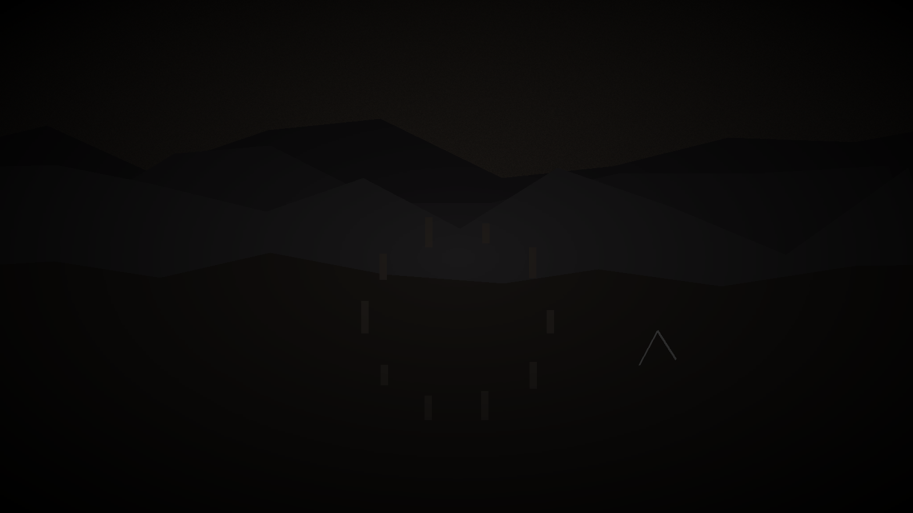
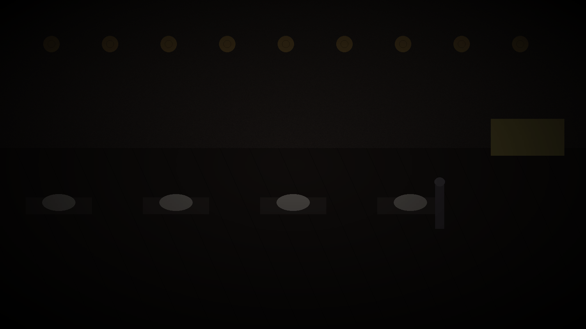
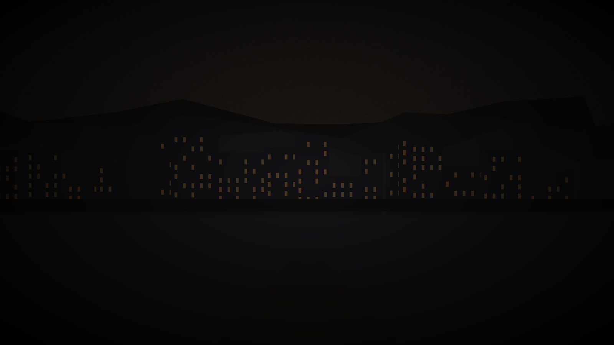
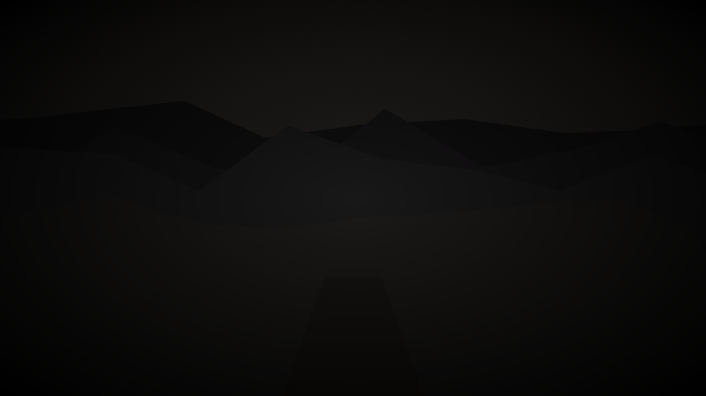

# Between-Session Discovery Quests

*Structured things to do between sessions - offline interviews with NPCs, documents to track down, locations to revisit on your own time.*

*You don't have to do any of this. The campaign works without it. But if you're the kind of person who wants to sit with a world between sessions rather than waiting for it to come back to you - this is for you.*

---

## How This Works

After each session, your GM will tell you which quests are available. There are three types:

**Interviews** - You can approach an NPC using the AI character tool (see the AI Tools chapter). Each interview has a suggested question. Follow where it goes.

**Documents** - Something specific is findable if you ask the right person or look in the right place. Tell your GM you're pursuing this; they'll give you the document or the scene.

**Locations** - A written description of what you find if you revisit a place between sessions. Tell your GM you want to go there; they'll give you the location entry.

*What you discover offline is yours to bring to the next session. Your GM recaps it for the table at the start of the next session, so no one falls behind.*

---

## After Session 1: What You've Just Walked Into

---

### Interview: Theron Waide (Tier 1 → Tier 2)

**The prompt:** Start with his standard AI character prompt. At some point in the conversation, try: *"I know what you found."*

**The question to start with:** *"What made you stay in the Archive after everyone else left the Spire?"*

**What you might learn:** Theron's specific relationship to Corven - why he took the Archive position in the first place, what he was looking for, and what it's cost him. In Tier 2, he'll start talking about the eleven years.

**Bring to next session:** How you feel about him now. Changed? Same? What would you ask him at the table that you didn't ask the AI?

---

### Document: The Earliest Restorer Pamphlet

**How to find it:** Tell your GM you want to search the Archive's public ephemera collection, specifically anything political from around Year 20.

**What you get:** Document A3 from the Deep Archive - the first Restorer pamphlet, from Year 20 of the twilight, before the movement had structure or leadership.

**The thing to notice:** The tone. These are not radicals. They are neighbors. They are asking politely.

---

### Location: The Ashring at 4 AM

**Tell your GM:** *"Between sessions, my character goes to the Ashring before the city is awake. What do they find?"*

**What you find:**

> The plaza is empty. The city bells are silent. The amber haze is at its darkest - what Varenholders call deep amber, the hour when the sky is closest to actual dark.
>
> The scorched stones are exactly what they look like in daylight. They don't change. They were burnt in a pattern fifty years ago and they've been this pattern ever since. You expected something dramatic. What you get is stone.
>
> There's a single candle burned down to almost nothing near the center of the circle. Someone left it last night. It's almost out. You could stay and watch it go.
>
> The heron from the river is standing at the edge of the plaza. You don't know how it got here from the water. It watches you for a long time before it leaves.
>
> The city doesn't feel different here than anywhere else. That's what you actually find: the Ashring is just a place. The weight of it is something you're bringing.

---

## After Session 2: People You've Met

---

### Interview: Sera Voss

**The question to start with:** *"What's the first thing you remember from your childhood?"*

**Unlock phrase (if you've built real trust with Sera):** *"Marta."*

**What you might learn:** Sera on the Lowmark before she was a protector. What she was like at twelve. What she was like the year Marta died.

**Bring to session:** The thing she said that you weren't expecting.

---

### Interview: Lira Anwick

**The question to start with:** *"What's the hardest part of your work that you don't usually talk about?"*

**Unlock phrase (when you've earned it):** *"Tell me about Mira."*

**What you might learn:** Lira's specific relationship to hope - she's a healer, she's been trying to heal something that isn't healable, what does she do with that.

**Bring to session:** Whether your character wants to protect her or tell her the truth. Both. Neither.

---

### Document: Corven's Grant Application

**How to find it:** Tell your GM you're searching the Archive's public research registry for anything written by Archmagister Corven from before the twilight.

**What you get:** Document B1 from the Deep Archive - his grant application from Year 15 Before the Twilight. The man at his most optimistic, asking for five hundred amber script to change the world.

**The thing to notice:** He's excited. He's not lying. He genuinely believed in this.

---

### Location: The Lowmark Care House, After Hours

**Tell your GM:** *"My character goes to the Lowmark care house after the evening shift to see what it's like when Lira's not there."*

**What you find:**

> The night practitioner is a young man named Fen who's been doing this for three years. He has the same quiet way of moving through the ward that all the Guild practitioners develop - precise, non-intrusive, present without demanding presence.
>
> The Stage 3 patients are mostly asleep. One isn't. She's awake and watching the ceiling with the particular completeness of Stage 3 - not looking at anything, not thinking about anything the way you think about things. Just there.
>
> Fen offers you tea. He talks about his patients the way Lira does, but younger - still figuring out how to hold it. "The compound helps," he says. "It's just never enough compound."
>
> On the wall is a painting. Ceva Doss, it says on the card below it: *The Lowmark Market at Noon, Year 0 (Before).* The market is full of people in sunlight so specific you can feel where it's coming from - to the left, high up, warm. Shadows pointing right. People squinting.
>
> Fen says he's never looked at it too long. "It makes me feel something I don't have a word for," he says. "Like remembering something I've never actually seen."

---

## After Session 3: The Weight of Knowing

---

### Interview: Brother Edoran

**The question to start with:** *"Why did you stay in the Auris faith after what the ritual did?"*

**Unlock (when trust is earned):** He will mention Annem eventually. When he does: *"Tell me about her."*

**What you might learn:** Who Edoran was before the grief organized him into a cause. What he's kept from that person.

**Bring to session:** Whether you believe him. Not whether his math is right - whether you believe he's honest.

---

### Document: Theron's Unsent Letter

**How to find it:** Tell your GM you asked Theron if you could look through his personal logbook - after earning his full trust.

**What you get:** The unsent letter from Year 42. The one where he said he was going to tell the Chancellor in the morning. The one he didn't send.

**The thing to notice:** He wrote that he was going to tell her. He didn't. He kept the letter.

---

### Location: The Restorer Compound at Dawn

**Tell your GM:** *"My character shows up at the Restorer compound before the morning session. What do they see?"*

**What you find:**

> Someone is already awake. A young woman you haven't met - mid-twenties, wears the Restorer's grey cord but loosely, the way people wear symbols they haven't fully committed to yet. She's sitting on the compound steps with a cup of something hot and reading from a small pamphlet that she folds away when she sees you.
>
> She introduces herself as Vel. She runs the Sevenday meetings. She is not as certain as Edoran and she is not as patient as the older members. She has been waiting for this to resolve since she was twelve years old.
>
> "My mother was at the Night of the Ritual," she says. "She described the light changing. She said the whole city changed at once. Like everyone breathed out at the same time." A pause. "She died in Year 22. The Desperate Winter." She says it matter-of-factly. "I keep thinking the things I'm doing here are for her. And then I think, no - she'd tell me to be honest about why I'm actually here. And honestly, I'm here because I grew up in the dark and I'm tired of it."
>
> She lets you in. Edoran isn't up yet. She makes you tea. She talks about what it's like to organize something this large around something this uncertain.

---

## After Session 4: The Reckoning

---

### Interview: Harran (if players have captured or met him)

**The question to start with:** *"When did you decide this was the only option?"*

**Unlock:** Only if players have specifically tried to understand his side: *"Tell me what you've lost."*

**What you might learn:** Harran before the Reckoning. The specific moment it turned from frustration to action. Whether he thinks he's right anymore.

---

### Document: Cormac's List

**How to find it:** Tell your GM you go to Cormac's dock office and look around while he's not there.

**What you get:** The list from the Deep Archive - ten things to do when the sun comes back. Includes: get a garden, sleep in, tell Sera she was right.

**The thing to notice:** Number 10 is *maybe get a second garden.* He is planning ahead. He has decided something.

---

### Location: The High Passes at Altitude

**Tell your GM:** *"My character travels with a supply caravan to the Graymere Holds. What happens at altitude?"*

**What you find:**

> At three hundred feet above Varenhold, the light is different.
>
> You can't say exactly how. The haze is the same. The sky is the same sourceless grey-amber. But there's something else in the air that you notice on the second day, something about the quality of the light at a specific angle in the morning, that feels — almost warm. Not lantern-warm. Something else.
>
> A Hold-man notices you noticing. He says: "About three times a year, usually, for maybe an hour. The old-timers know the days. We put out white cloth to see if it casts a shadow. Sometimes it does." He shows you a calendar he keeps. There are dates circled. Forty-three dates across the past five years, in clusters. "We haven't told the Spire because the last Spire people were rude," he says. "You seem less rude."
>
> He gives you the calendar. He also gives you a piece of cloth he's been using for ten years, with the shadow-marks on it from each event. It's the clearest direct evidence of the twilight's cycle that exists anywhere.

---

## After Session 5: After

---

### Interview: Whoever Survived

**There is no suggested question.** Talk to whoever the players are closest to. Ask them what they're going to do now.

**Bring to the epilogue:** What they said. The specific words.

---

### Location: The Ashring, One Year Later

**Tell your GM:** *"A year has passed. My character goes back to the Ashring."*

**What you find** depends on the ending. Your GM will give you the appropriate version. Every version includes: the memorial, the city's changed air, and something the character does when no one is watching.

---

## A Note on These Quests

None of this is required. You can come to every session with zero preparation and have a full, rich experience.

But if you find yourself thinking about these people in between sessions - if you wake up thinking about Theron's letter, or what Lira said, or what it means that Cormac's list ends with a second garden - these quests are for you.

The world is big enough to explore on your own time. It was built that way.
