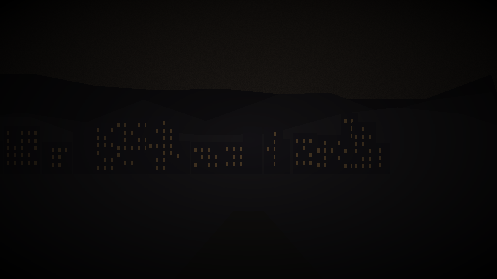

# Factions & Public Knowledge

*This chapter covers what your characters can learn through ordinary observation and interaction. The public face of each faction is visible here. The GM truth layers — true agendas, internal splits, real leadership dynamics — are in the collapsed sections below each faction.*

---

## The City Council

**What they are:** Varenhold's governing body, consisting of seven Councillors who represent the city's major interest groups - trade, scholars, healers, the guard, the working districts, and two at-large seats. The Chancellor serves as the Council's presiding officer and primary executive.

**Public reputation:** Generally competent, occasionally noble, visibly exhausted. The Council has kept the city functioning through fifty years of crisis, which is not nothing. They maintain the Dawnhalls, subsidize the Healers' Guild, negotiate aid from neighboring powers, and manage the city's shrinking revenue. Cynics in the city will tell you they've also kept themselves in power through fifty years of promising a solution they haven't delivered, but this critique doesn't fully account for what they've prevented: Varenhold has not collapsed, starved, or fractured into civil war, and that reflects real governance.

**Chancellor Mira Ostenveld** (publicly) is known as a careful, intelligent administrator with an unusual ability to hold multiple factions in something like balance. She has been Chancellor for eleven years and won reappointment twice. She is associated with the Restorer movement's goals (she has publicly supported increased restoration research funding) while maintaining relationships with groups across the political spectrum. She is known to work long hours, dislike rhetorical excess, and have a dry sense of humor she deploys sparingly.

**How to get an audience:** Formal petitions through the Council Registrar in the Highmark district, on Seconday and Fourthday mornings. Emergency matters can be flagged to the Chancellor's aide, a young man named Perrin who is overworked and sympathetic. Trade matters route through the Compact liaison office. Security matters to the Guard Captain. An introduction from any recognized faction leader significantly accelerates the process.

**What they're known for:** Emergency food distribution infrastructure, the Dawnhalls system, maintaining scholarly neutrality, the long-term aid negotiations with Solenne. Less admirably: a decade of expensive Spire research grants that have produced papers but not solutions.

> **Trust gate:** The Chancellor's private meetings and candid views are available only after the players have demonstrated they can handle difficult information without causing a crisis. Bring her evidence, not just questions — and understand that what she tells you in private may not match her public position.

**Skill Checks: The City Council**

<strong>History (proficient)</strong>

The City Council has governed Varenhold for the full fifty years of the twilight. Seven Councillors represent major interest groups; the Chancellor presides. The Council maintains the Dawnhalls, subsidizes the Healers' Guild, and manages the city's food supply contracts. Chancellor Mira Ostenveld has held the position for eleven years and won reappointment twice.

<strong>Insight (proficient)</strong>

Anyone who has spent time in Varenhold's civic spaces knows the Council is under pressure. Their public statements are carefully hedged, and they have been promising a solution to the twilight for decades. The city is patient but not indefinitely.

<strong>History (DC 12, reviewing Council documents at the Registrar)</strong>

The Council's internal decision record shows a significant vote six years ago on "escalating investigation priorities." The motion passed 4-3. The minority position, preserved in the public record, argued for "broader disclosure to affected parties." The measure that passed did not include that clause.

GM Only — City Council: True Agenda & Internal Splits

**True agenda:** The Chancellor wants the ritual resolved on terms that don't destroy the Dawnborn publicly — but she will accept a forced resolution if the alternative is the city's collapse. She has a fragment of Corven's original ritual notes and knows the cost is real. She hired the players specifically because they're outsiders who can absorb the political consequences of finding the answer she can't look for directly.

**Internal Council splits:**
- *Pragmatists* (Ostenveld, Holt, Ashby): Resolve the ritual on whatever terms are achievable. Dawnborn consent is ideal, not required.
- *Moralists* (Solm, and one swing vote): Dawnborn consent is required, full stop. A forced ritual is not an acceptable outcome regardless of outcome.
- *Swing vote* (Maret Lonn): Has not committed. Is waiting for more information. She has evidence of Keseph's Solennite funding and has not used it yet.

**What the Chancellor knows but hasn't said:**
- The food stores will hit rationing threshold in approximately four months. When rationing begins, the Desperate loses its moderate wing. She is watching this clock.
- She has been in indirect contact with Edoran through a third party (not Perrin). She does not know that Renn Vask overheard a separate channel between Harran and someone in her staff.

**Keseph:** Warden Keseph (Spire Theoretical Division) has been receiving Solennite funding through a private channel for six years. The Chancellor is aware this is possible but has not confirmed it. Maret Lonn has confirmed it and has said nothing yet.

**The contingency:** The Chancellor has identified a secondary ritual site at the old Founding Plaza if the Ashring is compromised. This is the "contingency" Renn Vask overheard referenced. It is not an alternative to the Ashring — it is a backup location if the Reckoning destroys the primary site.

---

## The Dawnborn

**What they are:** The ten adults born on the night the sun vanished. Exactly what this means medically or magically is debated; what is not debated is that all ten have demonstrated unusual capabilities - physical resilience, particular aptitudes, an apparent connection to the city itself that is hard to define and frequently observed.

**Public reputation:** Beloved. This is not an exaggeration and it is not propaganda - the city's relationship to the Dawnborn is genuinely warm, the product of fifty years of the Dawnborn doing things for the city without being asked. They are not officials. They hold no formal authority. They simply showed up, repeatedly, when the city needed them, and people remember this.

The three Dawnborn most publicly visible:

**Sera Vallin** is associated with protection - physical, practical, immediate. She grew up in the Lowmark, has spent her adult life working with the Healers' Guild as an emergency responder, and has the kind of public reputation that accumulates through specific remembered incidents: pulled a child from a collapsed building, stood between a crowd and a bad situation until the guards could arrive, carried grey-sickness patients when no one else would go near them. She is warm and direct in public. She is probably the most recognized face in the city after the Chancellor.

**Tomas Iren** has built a reputation as a mediator and de facto judge. Varenhold's formal legal system handles contract disputes and criminal matters; Tomas handles the cases that fall between - neighbor conflicts, guild grievances that haven't risen to formal dispute, family arguments where both parties need someone to listen. He operates out of a small office in the Highmark district. His judgments are not legally binding but are generally respected and usually followed. He is calm, patient, and gives the impression of someone who has heard a lot and is not easily surprised.

**Lira Anwick** is the Dawnborn most associated with the healing arts specifically. She trained formally with the Healers' Guild and is their most skilled practitioner of the treatment approaches developed specifically for grey sickness. She is less publicly visible than Sera or Tomas - she works in the care houses, which are not public spaces - but is deeply known and trusted within the communities most affected by the sickness. People in the Lowmark speak of her with particular affection.

**The Dawnhalls** are associated with the Dawnborn but not run by them - they're city infrastructure. The name reflects the timing of their founding (during the early years of the twilight) and the Dawnborn's involvement in their establishment, not an ongoing governance role.

> **Trust gate:** You can meet any of the Dawnborn without a check — they're public figures. What they'll actually say about the ritual, and about themselves, requires treating them as people rather than symbols. Their genuine trust takes time, and it's worth the investment.

**Skill Checks: The Dawnborn**

<strong>History (proficient)</strong>

The Dawnborn are the ten adults born on the night the ritual failed, fifty years ago. All ten are known by name and face in Varenhold; they are public figures who have spent their lives doing visible civic work. None hold formal government positions, but their informal authority in the city is significant.

<strong>Insight (proficient)</strong>

Anyone who has observed the Dawnborn over time notices something: they are individually carrying weight they do not discuss with each other. The warmth between them in public is real. The conversations they are not having are equally visible to anyone paying attention.

<strong>Insight (DC 13, speaking with any Dawnborn individually)</strong>

When asked about the ritual, each Dawnborn pauses before answering in a way that suggests they have thought about it considerably. Their answers are careful and slightly different from each other in ways that matter. They are not reading from the same script.

GM Only — The Dawnborn: True Internal Dynamics

**What the public doesn't know about each Dawnborn's current position:**

- **Sera Voss:** Has been willing for six months. Has not told anyone. Is waiting for the right moment to say it out loud, because once she does, it's real.
- **Tomas Areth:** Has calculated the asymmetry (five surge-phase anchors carry twice the load of the other five). Has prepared a will. Has not shared his findings. The Asymmetry Journal is the Session 4 discovery.
- **Lira Anwick:** Has privately decided she would say yes if no alternative survives — but has told no one, because doing so makes it real, and her daughter is three years old.
- **Ysel Maren:** Told Edoran yes months before the campaign starts. Has been waiting for someone to ask whether her consent was genuinely free.
- **Davin Shore:** Effectively willing; frames it as "not afraid of the alternative" rather than willing. Hears a low hum that has been getting louder.
- **Cormac Drell:** Told Edoran yes nine weeks ago. Is now privately wavering and terrified of saying so.
- **Aldric Stone:** Skeptical of the evidence. Will accept it when provided with physical, demonstrable proof. Cried alone when he was finally convinced.
- **Orya Doss:** Conditional — believes the problem hasn't been mapped correctly. The Spire subbasement she's found in her mapping discrepancies may matter.
- **Nin Fletch:** Pragmatic; will commit if he believes it's the most ethical path. His Archive theft history may become relevant.
- **Petra Vane:** Has been hiding in the Dusk Parishes for two years. Is not running from the decision — she needed distance to think without pressure. Finding her is Session 4.

**What the Dawnborn collectively know:** Nothing. They have not all spoken to each other about the ritual's true cost. Sera, Tomas, and Lira have each reached their conclusions independently. None of the ten has had an honest conversation with the others about what they each believe or what they've privately decided.

**The silence is significant.** Part of the campaign's moral weight is that ten people have been carrying this alone, in parallel, for months. The players may be the first people who speak to all ten.

---

## The Restorers

**What they are:** A reformist religious and civic movement with roots in Auris-worship, organized around the belief that restoring the sun is an urgent moral obligation, not merely a practical goal.

**Public reputation:** Passionate, persistent, grief-driven, legitimate. They have been making the same arguments for decades with varying degrees of organization and fervor. Most Varenholders have sympathy for their goals even when they find the movement's methods exhausting. The Restorers are not radical - they work through petitions, public meetings, and pamphlets, not disruption. The Council takes their positions seriously as a political constituency even when individual Councillors disagree with their specific proposals.

**What they say they want:** Dramatically increased resources for restoration research, a formal Council mandate to treat the twilight as an emergency rather than a chronic condition, and - their theological wing's position - public religious acknowledgment that the city has a spiritual obligation to seek the sun's return.

**Where to find them:** Sevenday evening meetings at the Auris temple's public hall. Their pamphlets appear on Dawnhall notice boards throughout the week. The Restorers have a small coordination office in the Highmark district that is technically a "scholarly society" for administrative purposes. Ask at the Auris temple; the Wounded-faction clergy are sympathetic and will direct you.

**How to be seen as an ally vs. a threat:** Show up to a meeting, introduce yourself, ask questions before offering opinions. The Restorers have dealt with enough people who parachuted in claiming to have solutions that they are appropriately skeptical of newcomers with answers. People who demonstrate they understand the complexity of the situation get further than people who arrive confident. If you're representing a church or scholarly institution with relevant expertise, say so early.

> **Trust gate:** Getting past the public meetings and reaching Edoran requires attending at least two sessions and demonstrating genuine commitment — not clever arguments. He's not hiding. He's vetting. The introduction to the inner circle comes after you've earned it.

**Skill Checks: The Restorers**

<strong>History (proficient)</strong>

The Restorers are a reformist movement within Auris-worship, organized around the belief that restoring the sun is a moral obligation. They have operated openly in Varenhold for over thirty years, working through petitions, public meetings, and pamphlets. Their current leader is Brother Edoran, a former Auris priest.

<strong>Religion (proficient)</strong>

The Restorers draw primarily from the Wounded faction of Auris-worship. Their theological position places them in tension with the Penitents, who believe active restoration attempts overstep human authority. The Wounded clergy at the Auris temple are sympathetic and will direct newcomers to the Sevenday meetings.

<strong>Insight (DC 12, attending a Restorer meeting)</strong>

The public meetings show a movement that is larger and more emotionally urgent than their pamphlets suggest. Most attendees have lost someone to grey sickness or know someone who has. The theology is secondary to the grief, for most of them.

GM Only — The Restorers: True Agenda & Internal Splits

**Three factions within the Restorers:**

- *The Grieving* (largest group): Members who have lost people to grey sickness. They are driven by personal loss and believe the ritual is a moral obligation. Edoran leads this group. They want consent — they are not willing to force anything. They are organized around grief, and grief has limits.

- *The Idealists* (second-largest): Principled advocates who believe the ritual is right in principle regardless of personal stakes. They are the most patient and the most likely to accept a slower path if one becomes available.

- *The Fanatics* (a minority, led by a man named Jaret): Willing to use force. They have not told Edoran the full extent of what they're planning. Edoran suspects but has not confirmed. If the players discover the Fanatics and report them to Edoran, he will be shocked and will take action — but he will also be forced to acknowledge that he has been less in control of his own organization than he believed.

**Edoran's real position:** He is not above strategic deception. He has made it very hard to say no to the ritual without forcing anything. He believes the distinction between "creating conditions where consent becomes inevitable" and "coercion" is morally meaningful. Players may disagree. His journal entry (deep-archive.md) reveals that he is not certain he's right.

**The Harran connection:** Edoran has been in contact with Harran through at least two intermediaries over the past year. He believes Harran's methods are wrong. He has not cut contact because he still believes Harran's timeline diagnosis is correct. This is a significant moral compromise he has not examined carefully.

**What the Restorers know about the ritual cost:** Edoran knows. The Grieving leadership suspects. The Idealists and Fanatics have not been told. This is a deliberate choice on Edoran's part — he does not believe the rank and file can hold this information without fracturing.

---

## The Desperate

**What they are:** Less a formal organization than a movement with a name. "The Desperate" is what people call the loose network of Varenholders - and Dusk Parishes emigrants - who believe the city's current approach is inadequate and are willing to take actions the Council would not sanction. The Desperate's tactics vary enormously across different cells: some are simply people talking about things they shouldn't, some organize unauthorized protests, and some - the fringe - are willing to do more.

**Public reputation:** Complicated. The core of the movement has broad sympathy from people who understand where the desperation comes from. Fifty years is a long time. The grey sickness is killing people. The Parishes are suffering. The sympathy curdles quickly when specific actions cross lines, which makes the Desperate's internal arguments about tactics genuinely consequential.

**What they say they want:** The same thing as the Restorers, but faster, and without waiting for the Council to get around to it. The Desperate are not ideologically distinct from the Restorers so much as they've lost faith in the process.

**Where to find them:** They don't have a public meeting space. They gather in Lowmark Dawnhalls, in the back rooms of taverns in the district nearest the Dusk Parish road, and in private homes. The way to find them is to ask in the Lowmark honestly - if you explain why you want to, someone will point you toward someone who knows someone. Being a newcomer with useful skills (investigation, contacts in other cities, arcane expertise) helps considerably.

**How to be seen as an ally vs. a threat:** Do not arrive representing the Council, the Spire, or a foreign government. Be direct about what you can offer. The Desperate are experienced at identifying people who want to use them for someone else's purposes, and they are not interested in being managed. If you're genuinely sympathetic to the cause and honest about your limitations, they respond to that. If you're trying to gather intelligence about them, assume they already suspect it.

> **Trust gate:** The Desperate don't have a front door. Help with a real problem first — securing food, treating patients, delivering information they can't get themselves. The inner network opens when you've demonstrated genuine stakes.

**Skill Checks: The Desperate**

<strong>History (proficient)</strong>

The Desperate is the loose network of Varenholders and Dusk Parish emigrants who have concluded the current approach is insufficient and are willing to act outside Council sanction. They have no formal structure and no single leader. The name was given to them by others and has stuck.

<strong>Insight (proficient)</strong>

People who have spent time in the Lowmark know the difference between the Desperate and simple desperation. The movement has structure under its apparent informality: people who know people, information channels that function, and a memory for who has helped and who has not.

<strong>Investigation (DC 14, Lowmark Dawnhall notice boards)</strong>

Some notices on Dawnhall boards are not what they appear. Routine food supply updates and neighborhood announcements occasionally contain secondary information readable to someone who knows the pattern: coded references to meeting times, supply chain irregularities, and movement in and out of the Parishes that the Council's official records do not capture.

GM Only — The Desperate: True Agenda & Leadership

**True leadership:** The Desperate's Lowmark network is led by a woman named Nessa. She is not the visible face — the visible faces are rotating organizers who absorb legal risk. Nessa is the strategic center. She has been organizing in the Lowmark for twenty years. She knows the grain supply numbers better than the Council does.

**The Grain Measure ledgers:** Nessa has maintained a parallel record of actual food distribution vs. official numbers for twelve years. The discrepancy — what the Council says is distributed vs. what arrives in the Lowmark — is approximately 15-20% consistently. This is not dramatic corruption; it is the accumulated effect of inefficiency, informal skimming at multiple levels, and bad-faith measurement. The ledgers are the most politically dangerous document in the city that most people don't know exists.

**The trigger:** If food rationing is announced — which happens when stores hit 20% capacity, approximately four months from campaign start — Nessa loses control of the moderate wing. Not because she loses her argument, but because people who have been managing their grief through hope will, at rationing, switch to managing it through action. She has said this publicly. She has said it privately. She means it and she is not exaggerating.

**The moderate/radical split:** The Desperate has people who believe the ritual is the right answer (aligned with the Restorers) and people who believe it doesn't matter — that the immediate problem is the food supply and the governance failure, and the ritual is a distraction from organizing for practical change. Nessa is personally in the latter camp but leads both groups. The split becomes critical if the players try to use the Desperate for ritual-related pressure.

**What they don't know:** The Desperate have no intelligence on the Reckoning's actual plans or capabilities. They know the Reckoning exists. They think it's a small group of people who are angry in an unproductive way. They are significantly underestimating it.

---

## The Healers' Guild

**What they are:** Varenhold's professional medical organization, officially a trade guild but in practice something closer to a public health institution. They train practitioners, maintain standards, run the care houses in every district, and operate the grey sickness wards in the Lowmark.

**Public reputation:** Politically neutral, universally respected, quietly invaluable. The Healers' Guild has maintained strict neutrality across fifty years of political changes by the simple expedient of treating everyone who needs treatment regardless of political affiliation. This is good ethics and good politics simultaneously. No faction wants to antagonize the Healers, so the Healers are left alone.

**What they want:** Resources. More practitioners, more supplies, better treatments for the grey sickness. Their current research program is the most active attempt to develop practical grey sickness interventions and is underfunded relative to the Spire's theoretical research. Guild leadership has made this funding disparity a recurring point of public advocacy with limited success.

**As an information source:** The Healers see more of Varenhold than almost anyone else. Their practitioners move through every district, every social class, every faction. They hear things in care houses that people say without thinking. Guild policy prohibits practitioners from sharing patient information, but the Guild collectively has a very accurate read on the city's real condition - the spread of grey sickness, the stress in different communities, what people are actually afraid of. A relationship with a guild practitioner is valuable. They will not share confidential information, but they will tell you what they can observe, and what they can observe is considerable.

**How to get access:** The Healers' Guild headquarters is in the Highmark district. Walk in. They take volunteers and welcome observers (non-intrusively) in their public care spaces. If you have healing training, the Guild administrator will probably have you doing useful work within an hour. If you have relevant research expertise (arcane, alchemical, herbal), the guild's research arm is worth meeting. If you just want to ask questions, be patient and be honest about why.

> **Trust gate:** The Guild's full research data — the real numbers on grey sickness progression, the cases Sevra Dain hasn't reported — becomes available once you've demonstrated you'll handle it responsibly and won't weaponize it for factional purposes.

**Skill Checks: The Healers' Guild**

<strong>Medicine (proficient)</strong>

The Healers' Guild is Varenhold's professional medical organization. They run care houses in every district, maintain clinical standards, and have the most detailed practical knowledge of grey sickness progression of any institution in the city. Guild practitioners are universally politically neutral; this is both ethics and policy.

<strong>Insight (proficient)</strong>

The Guild's political neutrality has a cost: they often know things they cannot say without being seen as taking sides. A practitioner who trusts you may share what they observe in general terms. The information they hold in aggregate about sickness rates and community stress is more accurate than the Council's official numbers.

<strong>Medicine (DC 12, volunteering at the Lowmark care house)</strong>

The patient intake numbers at the Lowmark care house run consistently higher than what the Guild reports publicly. Practitioners tracking their own caseloads show a gap between what they are treating and what ends up in the official count. The gap is consistent enough to be a pattern, not a recording error.

GM Only — The Healers' Guild: True Agenda & Hidden Data

**Sevra Dain's real numbers:** The grey sickness rate has increased 23% over the last two years. The Council's official numbers are 15%. Sevra counts her own patients. She has not corrected the official numbers publicly because doing so would trigger a political crisis she doesn't believe would help the patients currently in front of her. This is not corruption — it is a judgment call she will defend and does not feel good about.

**The proximity correlation (Tier 4 information):** Sevra has tracked that patients who spend significant time near a Dawnborn progress through Stage 1 at one-third the normal rate. She has not published this because the implication is uncomfortable — and because she doesn't know what it means for what happens to grey sickness patients if the Dawnborn die in the ritual. If the Lux energy releasing into the solar mechanism has the same proximity effect at scale, it might significantly benefit Stage 1-2 patients. If it doesn't, those patients lose their primary source of progression slowdown simultaneously. She is sitting on this data because she doesn't trust herself to be objective about it. (See knowledge-tiers.md, Grey Sickness Tier 4, for the full implication.)

**The waterway data:** Sevra has been tracking a pattern suggesting an environmental cause specific to the Lowmark waterways that accelerates Stage 2 progression. She hasn't reported it because she doesn't know what to do with the information and is afraid of the political consequences. This is solvable with DC 15 Investigation + access to her records. She will cooperate if players ask about it directly.

**Lira's compound issues:** Two confirmed cases of grey sickness acceleration from black market versions of Lira's compound. Sevra knows about both. She has not reported them publicly to protect Lira — and because reporting them would create a public health panic that discredits the only effective treatment available.

**What the Guild knows about the ritual:** Nothing specific. They know the ritual involves the Dawnborn and is being actively investigated. Sevra suspects the Dawnborn's proximity effect is mechanically relevant to both the grey sickness and the ritual's resolution. She has not shared this with anyone, including the players, until trust is established.

---

## The Spire Scholars

**What they are:** The academic community associated with the Spire - Varenhold's original university tower complex, now the center of the city's most sustained effort to understand and potentially solve the twilight through scholarly and arcane research.

**Public reputation:** Brilliant, insular, frustrating. The Spire produces excellent work, and it produces it slowly, and much of it is at a level of abstraction that doesn't obviously connect to the city's immediate problems. Fifty years of research have produced an enormous understanding of the twilight as a magical phenomenon and no practical path to ending it. The city is aware of this record. The Spire is aware that the city is aware of it. This mutual awareness has not improved relations.

**Internally**, the Spire is more politically complex than it appears from outside. There are genuine methodological disagreements that have become faction lines. The Theorists believe the solution requires complete formal understanding before any action. The Practitioners believe the Theorists are using rigor as an excuse for inaction. The Architects of the True Dawn (the secular movement described in the Pantheon chapter) split from the Spire partly over this disagreement.

**What they want:** Time, resources, and to be left alone to work. Also, quietly: the validation of having their work acknowledged as making progress. Fifty years of pressure is psychologically wearing even on people who sincerely believe they're doing the right thing.

**How to get access:** The Spire has public lecture days every Firstday afternoon, open to any Varenholder. The library's general collection is publicly accessible with a day-pass from the front desk. The research archives require a formal scholarly introduction or a Council authorization. Individual scholars are approachable in the public reading rooms and at the weekly faculty coffee hour (Fifthday morning, the Spire's ground floor common room) - they are more forthcoming one-on-one than they seem in institutional contexts. Having relevant expertise to offer, or questions that advance their research rather than just requesting information, is the best approach.

> **Trust gate:** The restricted research archives need formal authorization or a senior scholar's introduction. Isolde Menth can shortcut this if you have something useful to offer. Warden Keseph controls a gated section of the Theoretical Division — getting past him requires either the Chancellor's authorization or leverage he doesn't expect you to have.

**Skill Checks: The Spire Scholars**

<strong>History (proficient)</strong>

The Spire is Varenhold's scholarly center, a three-hundred-year-old institution that has been studying the twilight problem for fifty years. Its archives hold the most comprehensive collection of ritual documents and arcane research in the region. Public lectures are open every Firstday afternoon; the library's general collection is accessible with a day-pass.

<strong>Arcana (proficient)</strong>

The Spire currently runs three competing theoretical frameworks on the twilight's mechanism. None has produced a practical path forward. Internal disagreement between the Theorists and the Practitioners is visible to anyone who spends time in the public reading rooms. They share space and equipment; their professional contempt is open knowledge.

<strong>Investigation (DC 13, attending a Spire public lecture)</strong>

The questions asked at public lectures reveal the institution's internal politics. Scholars from different teams never acknowledge each other's findings. The questions Warden Keseph fields assume a different theoretical framework than those Isolde Menth fields. They are not working together in any meaningful sense.

GM Only — The Spire Scholars: True Agenda & Internal Splits

**Warden Keseph:** The head of the Theoretical Division has been receiving Solennite funding through a private channel for six years — approximately 800 amber script in total. The funding comes through a Compact intermediary to a personal account. In exchange, Keseph has been managing which theories receive institutional support and which don't. Specifically: Isolde's transfer method has been starved of resources, and the competing Theorist faction (which would produce papers validating Solennite's position that the ritual cannot be safely resolved) has been amplified. This is the "Keseph payment trail" in the Session 3 Investigation check (DC 16). Maret Lonn already has this evidence. She hasn't used it.

**Three competing teams:**
- *Keseph's Theorists:* Believe complete formal understanding is required before any action. Currently publishing papers that find new complications in the inversion path. Keseph has been quietly guiding this team toward "interesting problems" that delay a resolution date. He genuinely believes in careful theory — he is not entirely cynical — but his funding has distorted which careful theories he supports.
- *Isolde's Practitioners:* Believe the transfer method is viable and should be tested. Believe Keseph's team is using rigor as cover for political obstruction. They are correct about the obstruction and nearly correct about the transfer method — their mortality estimate is 15-20% rather than the stated 20-30%, and Isolde knows this.
- *The Architects of the True Dawn (secular):* Split from the Spire proper fifteen years ago over the Theorist/Practitioner divide. They have been working independently and have made progress that neither main faction knows about.

**Isolde's hidden number:** Her transfer method's mortality risk is 15-20% probability that one or two Dawnborn anchors become unstable during the transfer process and the ritual takes the destructive path for those individuals. She has been trying to resolve this. She has not yet succeeded. She presents the method to players as "approximately 20-30% risk" — overstating it slightly in the hope that the additional scrutiny will help her find the flaw. She wants to be wrong about the risk.

**What the Spire knows about the ritual:** The most technically accurate picture of any faction — except for the Ashfen Clans, whose oral tradition maps the mechanism more accurately. The Spire knows the inversion path exists. They have three competing theories about what it requires. None has been tested. Tomas Areth's asymmetry calculation, when players bring it to the Spire, will be the first genuinely new data they've received in four years.

---

## The Merchants' Compact

**What they are:** Varenhold's surviving merchant class and trading infrastructure, organized into a single Compact after the three pre-twilight guilds consolidated twenty years into the crisis when competition had become expensive and coordination had become necessary.

**Public reputation:** Pragmatic, self-interested, reliable. The Compact is not beloved but it is trusted to do what it says it will do, which is trade. They are the city's economic nervous system - if goods are moving in or out of Varenhold, the Compact is involved. They have relationships with every significant trading partner in the Reaches and with some beyond.

**What they want:** Stability. The Compact's primary political position is that instability is bad for business, which is true, and that therefore any change should be managed carefully, which is where other factions start to have questions. The Compact's idea of careful management often looks like slow movement and risk aversion. They are not opposed to restoring the sun; they are opposed to doing anything about it in a way that disrupts current trade relationships or commits the city to an obligation they're not certain it can fulfill.

**As an information source:** The Compact knows who's doing business with whom throughout the Reaches. They track supply chains, political relationships that affect trade, and movements of goods that sometimes have significance beyond their commercial value. A Compact contact who trusts you can tell you things about the regional political situation that aren't available anywhere else. The Compact charges for everything, including information - sometimes literally, sometimes in favors, sometimes just in the form of a relationship obligation. Nothing is free.

**How to get access:** The Compact House is in the Highmark district, adjacent to the old Exchange building. Walk in during business hours and state your business. If you're a merchant or represent commercial interests, you'll be treated as a peer. If you're something else, you'll be treated as a potential client or a potential complication, both of which have their uses. Having a letter of introduction from any Compact member anywhere in the Reaches is worth a great deal.

> **Trust gate:** Saret Onn's real position — what the Arveth Compact actually plans to do depending on the ritual's outcome — requires building a transactional relationship first. The Compact trades information for information. Know what you're offering before you ask.

**Skill Checks: The Merchants' Compact**

<strong>History (proficient)</strong>

The Merchants' Compact is the consolidated merchant organization formed twenty years into the twilight when three competing guilds concluded that cooperation was cheaper than competition. They maintain Varenhold's remaining trade relationships with five regional partners and manage the city's credit-writ system. Their headquarters is in the Outer Ring.

<strong>History +5</strong>

The Compact's relationship to Varenhold has shifted across the twilight period. In the early years they were investors. In the middle years, emergency trade partners. Currently they function primarily as a credit guarantor: the city's ability to purchase imported food depends on the Compact's continued backing of the writ system. This is a significant lever of influence the Compact does not publicize.

<strong>Insight (DC 12, visiting the Compact office during business hours)</strong>

The Compact's junior factors move with urgency that does not match the calm tone of public-facing meetings. Correspondence is read and replied to quickly. Dispatch riders arrive and leave more frequently than a stable trade relationship requires. Something in their information network is more active than the office's public posture suggests.

GM Only — The Merchants' Compact: True Agenda & Economic Pressure

**Saret Onn's real position:** He personally wants the ritual resolved. He understands the economics better than almost anyone outside the Compact: Varenhold has approximately four to six months before the credit-writ system becomes unstable, which happens when the Arveth Compact withdraws its guarantee. The Compact will do this when the food stores hit 20% capacity — not because it is punitive, but because the Compact's risk assessment at that point makes the guarantee unsupportable. Saret knows this number. He will not volunteer it. He will confirm it if players demonstrate they already know the general shape of the problem.

**What the Compact will do if the ritual succeeds:** Renegotiate Varenhold's trade status from emergency partner to full partner within six months. Property values in Varenhold would increase significantly within five years. The Compact has already prepared draft terms. This is what "first-mover advantage" means in the twenty-five-year-old trade report (Document A7 in deep-archive.md).

**What the Compact will do if the ritual fails indefinitely:** Begin transition planning for alternative northern routes. Withdraw the credit-writ guarantee at the food rationing trigger. This would collapse Varenhold's formal credit economy within months of rationing beginning — a compounding crisis on top of a food crisis.

**Factor Dara Mell:** The current Compact factor in Varenhold (not Saret Onn, who is the senior representative — Mell handles the day-to-day analysis). She has an updated version of Document A7, with numbers that are significantly worse. She does not leave it where people can find it. If players somehow access it (DC 18 Investigation of the Compact's inner office, or Saret Onn's deep trust), the current version shows food viability at 30% below what the Council is publicly stating, and estimates population viability dropping below city-scale within fifteen years if the twilight doesn't resolve.

**Helka's information network:** The proprietor of the Wayfarer's Rest (Ashfen Gate district) maintains a long-standing information-sharing relationship with the Compact — she tells them who's arriving, who's staying, what they're asking about. In exchange, the Compact tips her about trade disruptions that affect her supply lines. She is not a spy in the conventional sense — she doesn't report on her guests' private conversations — but she does flag significant arrivals. Saret Onn knew the players were in Varenhold before the Chancellor did.

---

## Working With Factions: Practical Guide

*This section answers the questions players usually ask: how do I actually get in the door, what do they want from me, and what happens if I work with their enemies?*

---

### The City Council: Seeking an Audience

**First contact:** Perrin, the Chancellor's aide (Highmark district, Council Hall). Young, perpetually behind on his correspondence, and genuinely sympathetic to people who are clearly trying to help rather than exploit.

**Access check:** Getting a basic meeting with a Councillor is DC 12 (Persuasion or History to explain your credentials). Getting a private meeting with the Chancellor is DC 15 without a faction introduction; DC 10 with an introduction from any recognized faction leader.

**What they ask in return:** Not money - the Council is not corrupt in the obvious sense. They ask for *clarity of purpose* and *not making things worse*. If you come to them with a problem, come with at least one proposed path forward. If you reveal information to them, understand that they will act on it according to Council priorities, not yours.

**Loyalty cost:** Openly working with the Desperate or the Reckoning while maintaining a Council relationship requires DC 14 Deception or the relationship frosts significantly. The Council is not paranoid, but they notice.

**Point of no return:** Leaking Council deliberations to the Restorers or Desperate, or taking unauthorized action that forces the Council's hand publicly. At that point the Council relationship becomes arm's-length at best.

---

### The Dawnborn: Building Trust

**First contact:** Sera is easiest to approach - she's in public spaces, she's approachable, and she responds to directness. Tomas is accessible through his Highmark mediator's office. Lira is the most difficult initial contact; she's in the care houses, and she's protective of her patients' time.

**Access check:** No formal check to *meet* a Dawnborn - they are public figures. Gaining genuine trust (the kind that opens up real conversation about the ritual and their feelings) is DC 12 Charisma (Persuasion or Insight) per Dawnborn after at least one substantive interaction. Some Dawnborn trust players more quickly based on shared background or demonstrated values.

**What they ask in return:** Nothing explicit. What they respond to: people who treat them as people rather than symbols. Asking about their actual work (Lira's patient load, Tomas's current cases, Sera's district issues) rather than the ritual opens doors faster than any other approach.

**Loyalty cost:** Dawnborn who see the players working with factions that want to compel the ritual (Reckoning especially) will not cut contact immediately, but they will become more guarded. Sera and Tomas will name this directly if asked.

**Point of no return:** Different for each Dawnborn. For Sera: physically threatening another Dawnborn. For Tomas: deceiving him to obtain information. For Lira: putting her daughter in danger.

---

### The Restorers: Getting Vetted

**First contact:** The Auris temple's public hall for Sevenday meetings; Wound-faction clergy (ask for the Sevenday coordinator, a woman named Vel). The Highmark "scholarly society" office for daytime access.

**Access check:** Being seen at two consecutive Sevenday meetings without disruption is sufficient for basic Restorer contact. DC 10 Persuasion to be introduced to mid-level members. DC 14 to request a meeting with Edoran, even through an intermediary.

**What they ask in return:** Patience during vetting, honesty about your connections (they already know who the players have met), and some demonstration of commitment to the cause - attending meetings, volunteering, or providing useful assistance before asking for useful information.

**Loyalty cost:** Simultaneous close ties to the Merchants' Compact or Spire Scholars reads as suspicious. The Restorers will ask about it directly. Ties to the Council are acceptable (many Restorers also advocate through Council channels) if the players are clear about the distinction.

**Point of no return:** Reporting Restorer internal information to the Council or Guard, or opposing the ritual in a way that damages the Restorer cause publicly.

---

### The Desperate: Earning Access

**First contact:** Ask in the Lowmark honestly. Not "where are the Desperate?" - that gets a blank look. Ask about the food supply situation, the grey sickness numbers, what people think about the pace of restoration efforts. Someone will suggest you talk to someone who knows someone.

**Access check:** DC 12 Persuasion or Insight to make initial contact and be received as potentially useful. DC 15 to be trusted with sensitive information without first demonstrating something. Having a useful skill (medical training, arcane ability, connections in other cities) reduces this by 3.

**What they ask in return:** Genuine stakes. The Desperate are not interested in observers or people who want to feel helpful. If you can solve a specific problem they're facing - securing food supplies, treating grey sickness patients, delivering information they can't get themselves - you'll be trusted. If you arrive offering abstract support, you'll be politely ignored.

**Loyalty cost:** Any visible cooperation with the Reckoning after their existence becomes known will damage Desperate relationship. The Desperate's membership includes people who strongly disapprove of Harran's methods.

**Point of no return:** Reporting Desperate organizing to the City Guard.

---

### The Healers' Guild: Professional Access

**First contact:** Walk into the Lowmark Healing House or the Guild headquarters in the Highmark. Say you want to help or have relevant expertise to offer.

**Access check:** Automatic basic access. DC 10 Medicine or Persuasion for an introduction to senior Guild staff. Sevra Dain is approachable with 10 minutes' notice; she is unusually accessible for someone of her institutional authority.

**What they ask in return:** Not causing problems. The Guild's neutrality is its most valuable asset. They will work with players who are trying to improve the situation, and they will stop working with players who are making things worse or who try to weaponize Guild access for factional purposes.

**Loyalty cost:** None on normal terms. If players try to use Guild access to gather intelligence on patients, or leverage Guild relationships for political gain, Sevra will notice and the Guild will withdraw.

**Point of no return:** Sharing confidential patient information without Guild authorization, or using the Guild's reputation to manipulate another faction.

---

### The Spire Scholars: Breaking Through the Bureaucracy

**First contact:** Public lecture (Firstday afternoon). Faculty coffee hour (Fifthday morning). The library front desk for day-pass access.

**Access check:** DC 12 Arcana or History to be taken seriously in academic conversation. DC 15 to get a private meeting with a senior scholar. DC 18 to access restricted research archives without formal Council authorization (Isolde Menth may shortcut this if the players have something she wants).

**What they ask in return:** Questions that advance their work rather than just requesting hand-outs. The scholars respond to intellectual engagement more than any other approach. Presenting a new piece of evidence, offering a synthesis of information from outside the Spire, or demonstrating expertise in a relevant area all open doors that formal requests don't.

**Loyalty cost:** The Spire has internal factions (Theorists vs. Practitioners). Getting deep access to one may not translate to access to the other. Keseph's division is a specific obstacle.

**Point of no return:** Taking documents from restricted areas without authorization. Keseph will have the players flagged, and Council authorization can be revoked.

---

### The Merchants' Compact: The Transaction Approach

**First contact:** Compact House (Highmark district), during business hours. State your business clearly.

**Access check:** DC 10 Persuasion or History for basic access. DC 12 to access trade records for specific inquiries. DC 16 to meet with Saret Onn (the senior Compact figure) without a prior relationship or strong introduction.

**What they ask in return:** Something of equivalent value. The Compact doesn't do favors. Information for information. Services for access. They are clear about this and will tell you what they want if you tell them what you want. The trade is usually fair.

**Loyalty cost:** Being openly associated with the Desperate or Reckoning will freeze Compact access. The Compact wants stability. The Desperate and the Reckoning represent instability.

**Point of no return:** Disrupting Compact trade relationships or using Compact trust to damage their reputation with trade partners.

---

## Faction Relationship Map

*A quick reference for who is aligned, tense, or indifferent with whom.*

| | City Council | Dawnborn | Restorers | The Desperate | Healers' Guild | Spire Scholars | Merchants' Compact |
|---|---|---|---|---|---|---|---|
| **City Council** | - | Allied | Cautious ally | Tense | Allied | Allied (strained) | Allied |
| **Dawnborn** | Allied | - | Sympathetic | Sympathetic | Allied | Neutral | Neutral |
| **Restorers** | Cautious ally | Sympathetic | - | Overlapping | Neutral | Skeptical | Tense |
| **The Desperate** | Tense | Sympathetic | Overlapping | - | Respected | Skeptical | Hostile |
| **Healers' Guild** | Allied | Allied | Neutral | Respected | - | Collaborative | Allied |
| **Spire Scholars** | Allied (strained) | Neutral | Skeptical | Skeptical | Collaborative | - | Wary |
| **Merchants' Compact** | Allied | Neutral | Tense | Hostile | Allied | Wary | - |

**Key:**
- *Allied* - active mutual support, coordination
- *Sympathetic/Respected* - goodwill without formal alliance
- *Cautious ally* - cooperative but watching each other
- *Neutral* - limited engagement, no strong feeling
- *Overlapping* - shared membership or goals, not the same organization
- *Tense* - competing interests, managed disagreement
- *Skeptical* - doubt about the other's methods or motives
- *Wary* - limited trust, potentially competitive
- *Hostile* - active opposition or significant animosity

GM Only — Hidden Faction Relationships

The public map above reflects how factions present their relationships. Below are the hidden links players can discover through investigation:

| Hidden Link | What Players Can Learn | How |
|---|---|---|
| Edoran ↔ Chancellor | Indirect contact through a third party; she knows about the Restorers' inner timeline | Renn Vask's intel, or DC 16 Insight after meeting both separately |
| Edoran ↔ Harran | Communication through two intermediaries; Edoran believes Harran is wrong in method, not diagnosis | Restorer Fanatics wing, or Harran himself |
| Keseph ↔ Solennite | Active funding channel worth ~800 amber script over six years; distorting Spire research priorities | Maret Lonn's evidence, or DC 16 Investigation in Session 3 |
| Saret Onn ↔ Helka | Information-sharing arrangement; Helka flags significant arrivals | DC 14 Investigation or Helka's trust |
| Harran ↔ Council aide | Renn Vask overheard a contact between the Reckoning's intelligence and a Council aide (not Perrin); the "contingency" discussion | Renn Vask in the Wanderer's Rest |
| Compact ↔ Nin Fletch's past | The client who paid for the Archive theft fifteen years ago was Compact-connected | DC 17 Investigation or Nin Fletch's full trust |

**The Reckoning** is not in the public map because its existence is nominally unconfirmed. The hidden relationships involving Harran (with the Council, with Edoran's periphery, with former Restorers) make the Reckoning far more embedded in Varenhold's politics than any faction publicly acknowledges.

