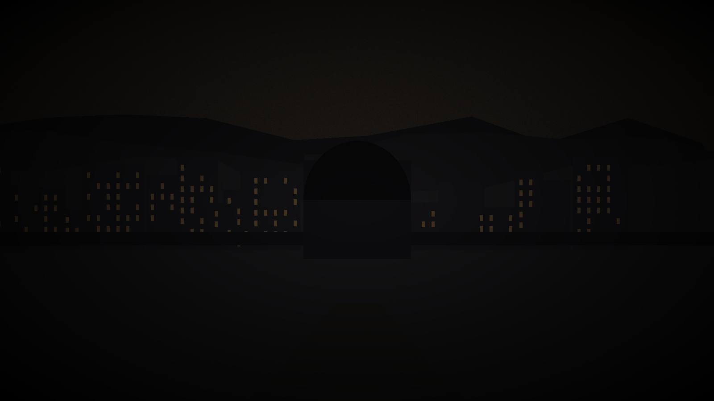

# Arriving in Varenhold

*A pre-session document for players. Share freely - no spoilers.*

---

## The Short Version

You have been hired - individually or together, the details of how can wait for the table - to investigate something in Varenhold, the city that has not seen the sun in fifty years.

Your employer is not the City Council. You are not here on official business. You are here because someone wants information and has reason to believe that official channels will not get it.

What you will find: a city that has been waiting for something for a very long time, and is running out of patience with waiting.

What you will not find: obvious villains, easy answers, or a clear correct choice.

---

## Varenhold in Three Hundred Words

You smell the city before you see it. Woodsmoke and preserved fish and something slightly sweet - the amber-vinegar that Varenholder cooks use the way other cities use salt. The road brings you over the last hill and there it is: a city that looks, at first glance, like most cities.

At second glance: no shadows. The sky is the color of old amber, sourceless, directionless light coming from nowhere in particular. There is no sun. There is just - light, of a kind. Enough to see by. Not enough to feel.

The buildings are stone and dark wood, layered like the clothes the people wear - the Varenholders dress in heavy wools and linens, deep colors, warm layers, against a cold that is not quite cold but somehow feels like it should be. Everyone you pass carries a lantern. Some wear small ones clipped to their belts. In what you'd call daytime, this seems redundant. After a few hours you understand: it is not about the light. It is about having something warm to hold.

The Ashfen Gate is where you enter, if you've come from the south. There is a wayshrine at the gate - a smooth stone pillar, ancient, worn to a gentle curve by generations of hands pressing it. A local tradition says you touch it when you arrive, and the Wanderer marks your passage. A few people ahead of you on the road do it without breaking stride, automatic as breathing.

The city is quieter than its size suggests. Sixty thousand people lived here once. Now perhaps forty thousand remain, and they move through the broader streets like people who remember when there were more of them. The Dawnhalls - great communal halls lit with amber lanterns - are the centers of activity. Everything else is smaller than the architecture suggests it should be.

Lowmark Stew is available everywhere. You should eat some. You'll be here a while.

---

## The Twilight: What It Actually Feels Like

The sourceless grey-amber light does not change. In Varenhold, you know it's "morning" because the city bells ring and people start moving; you know it's "evening" because the bells ring again and things quiet down. The light is the same during both.

After a few days this stops feeling strange and starts feeling heavy. There is no moment of relief at sunset, no sense of anticipation at dawn. Just the same light, and the same light, and the same light, and the knowledge that this has been true for fifty years.

There is a condition called the grey sickness. It affects roughly a third of the long-term population - a slow wasting, grey at the skin, fatigue, difficulty maintaining appetite or warmth. The Healers' Guild manages it. It does not kill quickly. It kills slowly, over years, and in the meantime it just - diminishes people.

The Dawnborn seem immune. The city has noticed.

---

## Six Background Hooks

Choose one, adapt it, or use it as a springboard for something of your own. These are specifically designed to give you a personal connection to the investigation.

**1. The Letter**
Three weeks ago, you received a letter from someone in Varenhold - a family member, a friend from years back, a former mentor. The letter described something they'd witnessed: a meeting, a document, a conversation they weren't supposed to hear. Then no further letters. You've come to find out what happened to them.

**2. The Debt**
You owe someone in Varenhold - money, a favor, or something more complicated. They've called it in. What they're asking is: find out something that the official channels haven't been able to confirm. You've come because you pay your debts.

**3. The Trail**
Your investigation of something completely unrelated - a stolen artifact, a missing person, a commercial irregularity - led you, through a chain of evidence you didn't expect, to Varenhold. Someone here knows something. You don't yet know who or what.

**4. The Calling**
Your deity - or your training, or your principles - has directed your attention here. A vision, a signal you recognized, an ethical obligation you couldn't ignore. You're not sure exactly what you'll find. You know you had to come.

**5. The Investment**
Someone with resources hired you. The arrangement is professional: you investigate, you report, you're compensated. You may or may not know the full scope of what you're looking for. You're here because this is the job.

**6. The Return**
You left Varenhold years ago - fled, or drifted, or was pulled somewhere else by something that seemed more important at the time. You're back now, for reasons you're still working out. The city is different from how you remember it. You might be different too.

---

## The Factions at a Glance

**The City Council** - governs Varenhold through its seven Councillors and the Chancellor. Has kept the city alive through fifty years of crisis. Widely seen as careful, occasionally noble, visibly exhausted by a problem they cannot solve.

**The Dawnborn** - the ten adults born the night the sun vanished. All have unusual abilities and reputations. The city's beloved. Sera (protector), Tomas (mediator), and Lira (healer) are the most publicly visible. They hold no formal authority and show up anyway.

**The Restorers** - reformist Auris-worship movement, grief-driven, not violent. Believe restoring the sun is a moral obligation. Hold public meetings at the Auris temple every Sevenday evening. Broadly sympathetic public reputation.

**The Desperate** - less a formal group than a movement. People who've lost faith in the official process and are willing to act outside it. Internal disagreements about how far to go. Strongest in the Lowmark and among Dusk Parish emigrants.

**The Healers' Guild** - medical professionals, politically neutral, universally respected. Run the grey sickness care houses. See more of the city than anyone else.

**The Spire Scholars** - academic mages and researchers. Fifty years of intensive study of the twilight problem. Excellent at theory, slow at practice. Public lectures on Firstday afternoons.

**The Merchants' Compact** - surviving trade infrastructure. Want stability above all. Have relationships throughout the Reaches. Nothing is free, but they deal honestly.

---

## The Gods in Brief

**Auris** - sun, light, growth. In crisis. His clergy in Varenhold are split between those who believe the god turned away as punishment and those who believe the god was wounded by the failed ritual. Praying to Auris here feels different.

**Morthis** - death as passage, not ending. His Ushers run the death-houses and sit with the dying. Quietly central to Varenhold life; the grey sickness has made him more prominent.

**Veth** - secrets, private knowledge, things that cannot be said aloud. No temples; worship is private. Patron of scholars, archivists, spies, and anyone carrying something they can't share.

**Dara** - hearth, community, shared meals. Most Varenholders have a small Dara shrine at home. No formal clergy; she is the goddess of the Dawnhalls even if people don't think of it that way.

**The Wanderer** - roads and passage. Worshipped at wayshrines. There is one at the Ashfen Gate you probably passed. Touch it when you leave.

**Kael and Mira** - war and mercy, always worshipped as a pair. The Twin Crowns rest on the same head. Patron of anyone who must cause harm to prevent greater harm.

---

## What to Expect from Sessions

Sessions run roughly three hours. Each has a shape: investigation, encounter, decision. The decision is usually the hardest part.

This campaign is not about winning. It is about choosing. The choices are real, the consequences are real, and there is usually no option that doesn't cost something.

You will sometimes be wrong. The campaign is designed to make you uncertain. This is not a failure state; it is the game working correctly.

The tone is serious. The city grieves. The people you meet are not abstractions - they have histories, needs, limits. Engaging with that honestly will get you more out of the game than treating them as obstacles or resources.

When something is unclear, ask. When something is uncomfortable in a productive way, engage with it. When something is uncomfortable in a non-productive way, say so.

---

## Three Questions to Answer Before Session 1

1. **Why is your character in Varenhold right now?**

2. **What does your character want from the sun returning?**

3. **What is one thing your character believes so firmly they've never seriously questioned it?**

Bring your answers. You don't have to share them. But have them.

---

*The Price of Dawn is a D&D 5e campaign of moral reckoning. The city has been waiting fifty years. So have the people in it. You have arrived at a particular moment in that waiting. What you do with it is up to you.*
