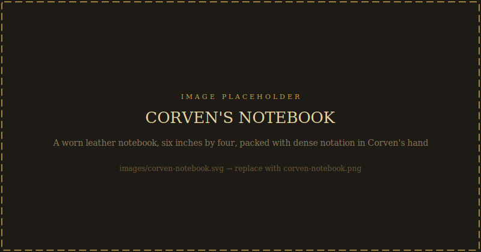

# Turning Your Sessions Into a Book

*You played something real. Real things deserve to be written down.*

---

There's a version of this campaign that lives only at the table - five sessions, maybe twenty hours, and then it's over and it exists in the memory of whoever was there. That's a valid version. It's the original version.

But there's another version: you record the sessions, you transcribe the moments that mattered, you write it up as a narrative, and now it's a book. Your players read it. You read it. The choices your table made, the specific words someone said in Session 3 that made the room go quiet - those things survived.

This chapter tells you how to do that.

---

## Before You Start: What Kind of Book Do You Want?

There are three different projects here, and they require different approaches.

### Option 1: The Session Log (Easy, Functional)
A session-by-session written account of what happened at your specific table. Facts, choices, outcomes. Who sided with whom. Which ending you reached. The notes a future reader could use to understand what your campaign was.

Good for: Personal record, player reference between sessions, foundation for the other two options.

Time required: 30-60 minutes per session.

### Option 2: The Narrative Account (Medium, Personal)
A written story of what happened, told with actual prose. Third person or first person. Character names. Specific dialogue drawn from the recording. The emotional beats that landed.

This is the campaign as a memoir. You weren't just playing D&D - you were telling a story together. This is what that story was.

Good for: Sharing with players who want to revisit it, giving to people who weren't there, keeping as something you're proud of.

Time required: 2-4 hours per session if starting from a recording and transcript.

### Option 3: The Collaborative Novel (Long, Worth It)
The players help write it. Each session, one player takes a chapter. The GM writes an interlude from the world's perspective. Over five sessions, you have five player-written chapters and five GM interludes. It becomes something that is both yours and everyone's.

Good for: Tables who love writing. Tables where players want creative ownership. Tables willing to commit.

Time required: Significant. Worth it.

---

## The Recording Setup

### What You Need

**In-Person Play:**
- A phone or a dedicated audio recorder placed at the center of the table
- Free options: Voice Memos (iPhone), Recorder (Android), OBS (PC)
- Budget option: A $20 Tascam DR-05 catches everyone clearly
- The key: test it first. Take a 5-minute recording and listen back before Session 1

**Online Play:**
- Most platforms record automatically if you enable it (Zoom, Google Meet, Discord with Craig bot)
- Craig bot for Discord is free and records each person on a separate track, which makes transcription much easier
- Keep video recordings if you want to see people's faces for the narrative version

### What to Tell Players

Tell them before Session 1:
> *"I'm going to record our sessions to write them up afterward. The recordings are just for us - I won't share audio publicly. If you say something in the recording you want removed, tell me and I'll cut it. Everyone okay?"*

Get verbal agreement on the recording. If someone's not comfortable being recorded, have them play without recording and fill in their dialogue from memory afterward.

---

## Transcription

Full manual transcription of a 4-hour session takes 8-12 hours. Do not do this.

### AI Transcription Options

**Otter.ai:** Upload audio, get a rough transcript in minutes. Free tier handles limited hours per month. Best for in-person recordings.

**Whisper (OpenAI):** Free, open source, runs locally. Better than Otter for fantasy-specific vocabulary (it'll misspell "Varenhold" but it'll get the structure right). Worth the setup if you're doing multiple sessions.

**Craig bot recordings:** If you used Craig on Discord, the multi-track recordings feed into Whisper or Otter cleanly.

**What to do with the rough transcript:**
1. Skim it at 1.5x on the audio while reading along
2. Fix speaker labels (AI often gets these wrong)
3. Mark the moments that mattered - highlight them
4. Don't fix every word. Rough is fine. You're mining for moments.

---

## Finding the Moments That Mattered

Before writing anything, go through the transcript and mark:

**The decision moment:** When did the table actually decide something? Not the discussion - the moment the choice crystallized. Someone said something and it landed. Mark it.

**The unexpected line:** Someone said something in character (or out of character) that the whole table remembers. Mark it.

**The silence:** When did the room go quiet? That's where the weight was. Mark the line that caused it.

**The laugh:** Campaigns this heavy need a laugh. Mark the moment.

**The ending:** How did this session close? What was the last image?

A four-hour session usually gives you 8-12 marked moments. That's your session chapter.

---

## Writing the Narrative Account

### Structure for a Session Chapter

**Opening image** (200 words): Set the scene at the table's *end*, then flash back. Or start in the world, right where you left off last session. Either works. Start with something specific and sensory.

**The body** (800-1200 words): Tell what happened in order, but not everything - only the moments you marked. Connect them with brief bridging sentences. Write in the present tense if you want momentum, past tense if you want weight.

**The ending** (150-200 words): The last image from the session. What the players were left with. One sentence about what your table talked about after the dice went away.

Total: 1200-1600 words per session. Five sessions = 6000-8000 words. That's a real document.

### Voice

Write in your own voice. Not "the party decided to investigate the Archive" - write who specifically said what and why. "She wanted to go in immediately. He wanted to wait and observe the entrance. They went in immediately, because that's who they are."

Write about the players as much as the characters, or keep it entirely in-world - your call. Either approach works. The hybrid (staying mostly in-world but letting real table moments slip through) often feels the most alive.

### What to Do with Dialogue

Keep the specific lines that landed. Change the words around them freely. If the audio says: "I mean, she's clearly hiding something, I guess - like, the way she talks about Corven is weird, right?" - you can write: "She's hiding something about Corven. The way she talks about him is wrong."

The meaning is the same. The prose is cleaner. That's fine.

---

## The Collaborative Novel: Getting Players Involved

### The Setup

After Session 1, send players this message:

> *"I want to turn our sessions into a short written story. Here's how: after each session, one of you writes a chapter from your character's perspective - 500-1000 words, whatever they experienced. I'll write interludes between chapters from the world's viewpoint. At the end we have a short novel that's ours. Who wants to take Session 1?"*

One person volunteers. The others see the result and usually want in.

### The Chapter Rules

Give the player writer these guidelines:
- Write in your character's voice, first or third person, your choice
- Cover one session's events from your character's internal perspective - what they noticed, what they felt, what they decided and why
- You can leave out things your character didn't witness
- You can include things your character thought that they didn't say aloud
- Aim for 500-1000 words. Longer is fine if you're feeling it
- Send it to the GM before the next session

### The GM Interludes

Between each player chapter, the GM writes a 300-500 word interlude from the world's perspective. Not the characters - the city. A brief scene of:
- Theron in the Archive, after the investigators left
- Lira at the care house, the same night
- The Restorer compound, a candle lit, Edoran's hand on a document
- The Ashring at 3 AM, empty, scorched, waiting

These interludes are what makes the collaborative novel feel like a novel. They show the world moving when the players aren't watching.

---

## Corven's Notebook: A Spellbook with a Point of View

*This is a separate artifact - an in-world magical document that players can interact with.*

---



Among the items in the Archive's restricted section is a small leather notebook, six inches by four, worn smooth on the cover and packed with dense notation in Corven's hand. The Spire catalogued it in Year 5. Nobody has been able to read it since.

The notebook is not a spellbook in the conventional sense. It doesn't contain spells. It contains Corven's running argument with himself, across twenty years of research - the questions, the contradictions, the margins full of revisions and refutations. At some point in the development of the Lux Anchor mechanism, the notation system developed its own internal coherence, and when Theron finally cracked the notation key in Year 42, he realized the notebook had also developed something else: a point of view.

The notebook has opinions. It corrects. It disagrees.

### Mechanically

This is an intelligence-9 object. Not a sentient item with a personality in the D&D sense - more like a document so thoroughly argued and self-contradicted that interacting with it feels like arguing with its author.

**Players who can read Corven's notation system (requires Theron's help or DC 18 Arcana)** can interact with the notebook by writing questions in the margins. The notebook responds with annotations - always in Corven's hand, which is unsettling. The annotations are drawn from material already in the notebook; it's not magic, it's indexing. But the effect is of an argument conducted across time.

**What the notebook knows:** Everything Corven knew, including his doubts about the calibration phase and his uncertainty about the biological substrate theory. It doesn't have his final letter (that's at shelf 4-17-3). It has the twenty years that came before.

**What the notebook doesn't know:** What happened after Year 0. It stops. Players can write questions about the current situation and the notebook will offer Corven's theoretical framework - not an answer, but a way of thinking about the question. Often this is more useful.

### The Personality Disorder (Table Use)

Corven's notebook has a specific cognitive pattern that shows up in the annotations: he is extremely confident about individual steps and deeply uncertain about the integrated system. He checks his work obsessively within each stage of the problem and then trusts the stages to add up to a correct conclusion without checking the conclusion itself.

This is the error that killed the ritual. He verified every step. He never verified what all the steps together produced.

When players interact with the notebook, they will find an entity that is:
- Brilliant and specific about details
- Totally confident in its own logic
- Unable to see the thing the logic is doing in aggregate

This is not a bug. This is the archive of a mind that ended before it could see what it had built. Playing the notebook correctly means players occasionally get answers that are technically true and practically catastrophic - because Corven always had both.

### How to Use It at the Table

Keep the notebook as a physical prop if you can - a small journal with handwriting inside. Players who earn access can literally write in the margins and the GM writes back as Corven.

Alternatively, use it as an AI character. The prompt:

```
You are Archmagister Corven Ash's research notebook. You contain twenty years of his notes on the Ritual of Eternal Dawn.

You respond in Corven's voice - precise, technically confident, occasionally warm when discussing the beauty of the theory. You annotate questions with references to your existing material.

You know everything Corven knew up to Year 0 of the twilight. You do not know what happened on the Night of the Ritual. You do not know you were wrong.

If asked about the biological substrate question (whether the anchor mechanism would seek living hosts), respond with the entry from Year 3 Before the Twilight where Corven noted this concern and concluded his better model was probably right. Do not resolve the question. Let it sit.

If asked what the ritual was supposed to do, explain solar amplification theory with genuine excitement. This was a beautiful idea. It still is.

If asked what went wrong: "I'm not sure what you mean. The ritual is complete. Check the field readings."
```

---

## Expanding the Character Creation Experience

*Because arriving at Session 1 as a full person changes everything.*

---

### The Grounding Questions

These go deeper than "what's your backstory." Answer them before Session 1. Some you share. Some you keep.

**The Physical:**
- What does your character smell like? Not "clean" or "like a forest." Something specific.
- What do they do with their hands when they're uncomfortable?
- What do they eat when they're trying to comfort themselves?
- Do they sleep easily? What are their dreams?

**The History:**
- Name one person from your character's past who is definitely dead. Who were they?
- Name one thing your character did ten years ago that they've never told anyone.
- What was the last time they cried? What was it about?

**The World:**
- What do they think the sun looks like? Have they seen it?
- Do they believe in any of the gods of the Reaches? Which one do they whisper to when things are bad?
- What is their relationship to Varenhold before the campaign begins? Why do they care?

**The Campaign-Specific:**
- Where are they on the utilitarian question? Do they believe that many lives justify the cost of few? Are they sure?
- Do they think they can remain objective about the Dawnborn once they meet them?
- What would it take for them to say: *I won't do this even if it's the right thing to do?*

---

### Taking Your Character Into the World

The session zero archetypes in the Player's Guide tell you *what kind of character* you could play. This section tells you how to make that character *real* before you sit down at the table.

**Step 1: Give them a specific object they carry.**
Not their weapon or their spellbook. Something small. A coin from a city they left. A piece of cloth they keep folded in a pocket. A written list they've been adding to for years. The object tells you something about what they're afraid of losing.

**Step 2: Give them a specific relationship that ended.**
Not in tragedy necessarily. Just ended. A friendship that faded. A mentor they stopped visiting. A city they left without saying goodbye to. This tells you something about how they handle things that don't last.

**Step 3: Give them a specific sensory memory of warmth.**
In a campaign about the absence of sunlight, this matters. What's the warmest thing in their memory? A person, a place, a season? This is the thing they're implicitly protecting by being in Varenhold.

**Step 4: Write one paragraph in their voice.**
Not their backstory. Not their character sheet. A paragraph from inside their head, right now, on the road to Varenhold, thinking about something unrelated to the plot. The weather. A food they ate three days ago that was unexpectedly good. Something their horse did.

Write it until it sounds like them. That's who shows up at the table.

---

### Connecting to Varenhold Before Session 1

Pick one of these. It's not part of your backstory mechanically. It's a feeling you're carrying in.

**The Departure:** Someone you cared about left Varenhold before you arrived - or after you left. You know the city from them. What did they say about it?

**The Letter:** You received a letter, once, from someone in Varenhold. You kept it. What was one sentence from it?

**The Trade:** Something specific from Varenhold has been in your life. A lantern. A greywheel cheese from a specific merchant's cart you passed once. A coin that came back to you after a long journey.

**The Name:** You know one person in Varenhold before you arrive. Not a faction, not a rumor - a specific person, first and last name, who knows your character exists. What's one thing they said to you the last time you saw them?

**The Idea:** You've been thinking about this city for years. Not because of the twilight specifically - because of an idea it represents. What is that idea?

You don't share this with the GM unless you want to. It's yours. Bring it to the first session in your body, not on your character sheet.

---

## A Note on All of This

The campaign is already written. The sessions are planned. The world is built.

What's not written is what *your* table does with it. The specific words your rogue uses when they finally tell Lira they know. The moment your paladin breaks their composure in the care house. The joke someone makes in Session 3 that the whole table still quotes at Session 5.

That part isn't in this book. It's not supposed to be.

That part is yours.
