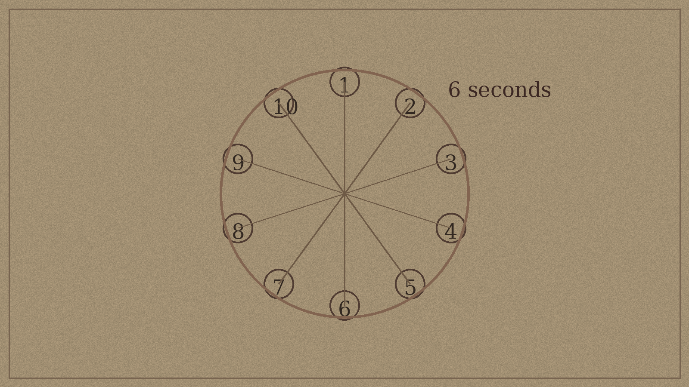

# Session 2 - The Weight of Light

**Central Dilemma:** Do you have the right to decide someone else's fate, even to save thousands?

**Session Goal:** Reveal the ritual's true cost. Let the players decide what to do with that knowledge before the Dawnborn do.

**GM Principle for This Session:** The reveal is not a twist. It's a weight. Give it room to land.

---

## Pacing Guide

| Time | Scene | Type |
|------|-------|------|
| 0:00-0:10 | Opening: What Changed | Ambient |
| 0:10-0:45 | Scene 1: The Reckoning Raid (Archive) | **Combat** |
| 0:45-1:05 | Scene 1B: The Ritual Diagram | **Puzzle** |
| 1:05-1:25 | Scene 1C: Theron Breaks | RP Reveal |
| 1:25-1:55 | Scene 2: Reckoning Vanguard (Dawnhalls) | **Combat** |
| 1:55-2:10 | Scene 2B: Theron's Journal | **Riddle** |
| 2:10-2:35 | Scene 2C: Do You Tell Them? | RP Branching |
| 2:35-2:50 | Scene 3: Edoran (mid-aftermath) | RP |
| 2:50-3:00 | Closing beat | Narrative |

*Guy Sanders structure applied: every scene block is Combat → Puzzle → RP reveal. The information lands after they've fought for it. The Dawnborn are in the room when the branching choice happens — it's not abstract.*

---

## Pre-Session Checklist

- [ ] Review Session 1 consequence tracker - adjust the Archivist's opening posture accordingly
- [ ] Decide: did the rumor about the cost start spreading between sessions?
- [ ] Identify which two Dawnborn the players are most connected to
- [ ] Have Brother Edoran ready to enter if the players haven't met him yet
- [ ] Place the Ritual Diagram puzzle (see below) in the Archive layout

### Player Companion Touchpoints

- **City pressure in play (`shops.md`):** When you open with rationing or market tension, anchor it in Wess Dalk's Grain Measure or Lira's Healing House. Their OGAS blocks (want: feed the Lowmark / keep patients alive; fear: shortages and false cures; lie: that they're coping fine) give you instant NPC stakes if the party wants to intervene between scenes.
- **Chasing or outrunning news (`travel.md`):** If the Reckoning flees with documents or the players rush to warn a Dawnborn in another district, grab the Eastern Track or River Trade encounters. The route complications already include Compact surveillance and Parish distress — perfect contrast to the party's own secrets.
- **Update the shared sheet (`tracker.md`):** After Theron's reveal and again after Scene 4, mark the Dawnborn consent table and the crisis level. Let the table watch the "willing" boxes change; it makes every conversation with Sera/Tomas/Lira land harder.

---



## Five Senses Opening

<audio controls style="width:100%;margin:0.5em 0 1.5em 0;">
  <source src="audio/session2-opening.wav" type="audio/wav">
</audio>

### Read-Aloud

> The city smells different this week. Fresh ration notices, still wet from the printer's ink, are pasted on the Lowmark walls in neat rows. Their paper catches the ever-present amber light and turns translucent at the edges. The grain dealers have hung grey cloth over their stalls in protest; the cloth shifts and rustles whenever the wind pushes down the street, like the city breathing through its teeth.
>
> Down near the Ashfen Gate, the Restorers are chanting. Not loudly, but persistently, the rhythm of a promise spoken under the breath. You can hear it even in Highmark, carried up the stone avenues between council buildings. Somewhere in that same quarter, someone says Petra Vane missed her last patrol. Nobody says her name louder than a whisper.
>
> Every face you pass studies you for half a heartbeat longer than usual. People know you're the Chancellor's choice now. They don't know what that means yet, but neither do you. Whatever changed while you were away has already started to lean on you.

## Opening: What Changed While You Were Away

Start Session 2 with a brief "what has the city been doing." Pick 1-2 of these depending on the Living World state:

- **Rationing announced:** The Lowmark food distributor posted notices. Lines formed before dawn (such as it is). Tempers in the market are short.
- **The Restorers are louder:** Their compound near the Ashfen Gate has more people than last week. Neighbors are complaining about chanting.
- **Petra Vane is missing:** One of the Dawnborn didn't show up to a public duty. Sera Voss is quietly worried. No one official has noticed yet.

> **GM Tip:** Drop these as ambient details - overheard at an inn, a posted notice, a contact's off-hand remark. The world should feel like it's already moving, not waiting for the players.

---

## Scene 1: The Reckoning Raid

**Guy Sanders structure: Combat → Puzzle → RP reveal**


**Location:** The Civic Repository. The party arrives to find the front door ajar. The duty clerk is gone. From upstairs: sounds of furniture moving. Fast. Purposeful.

### Read-Aloud

> The Repository's front door stands open six inches. No clerk at the desk. The amber light from the corridor lanterns falls across an overturned inkwell nobody has cleaned up.
>
> From the second floor, the sound of shelves being moved — not falling, not ransacked. Searched. Someone who knows what they're looking for.
>
> Then Theron's voice, through the floor: *"I have already told you — those documents are Council property, you cannot—"*
>
> A second voice, flat: *"We're past telling."*

The Reckoning got here first. Three Guards are on the second floor systematically pulling folios. A Fanatic entered from the upper window and has Theron cornered in his reading alcove. Captain Marsh is on the stairs — the pinch point between the party and Theron.

### Combat: The Archive (Scene 1)

*Same terrain as Session 1. Players know this building now — use that.*

**Combat order:**
- **Round 1**: Marsh on stairs, blocking. 2 Guards on 2nd floor with Theron. 1 Fanatic at alcove with Theron.
- **Round 2**: If Guards are not engaged, one begins bundling the ritual text (takes 2 actions to complete). Marsh calls: *"Get the text. We're not leaving without it."*
- **Round 3 trigger**: If 2 operatives drop, Marsh orders the fire.

**New wrinkle — Theron is a liability:**
He is barricaded in his alcove. He will not leave on his own. Any player who reaches him must spend their Bonus Action giving him a clear route out before he moves. Until then, the Fanatic has him effectively hostage — attacking the Fanatic risks Theron taking the backlash.

*Ixa's psionic range solves this quietly. Keiran can flank through the center gap. Kaelen's Commander's Strike calls a specific target so the Fanatic turns away from Theron first.*

**Secondary objectives** — same as original, now with higher stakes:

| Objective | Condition | Reward |
|---|---|---|
| **Protect the ritual text** | No folio leaves + fire doused in 2 rounds | All Session 3 clues intact; Investigation advantage on future Archive checks |
| **Evacuate Theron** | BA to clear his route; no attack hits him | He trusts them completely — shares the one piece he was still holding back |
| **Capture Marsh** | Reduce to 0 HP subdual or grapple (DC 14 STR) | Reckoning's next target; plus he knows where Petra Vane is |

**The Stacks Ignite** (unchanged — see stat blocks section for fire mechanics)

### After Combat: Document Recovery

The fire is out (or still smoldering if they let it go). Theron emerges from the alcove. He looks at the text. He looks at his hands. He looks at them.

*No combat note, no GM prompt — just the room, the smoke smell, the overturned shelves, and Theron standing in the middle of it holding the documents he couldn't bring himself to share.*

---

## Scene 1B: The Ritual Diagram (Puzzle)

**Where it happens:** Theron spreads the ritual text on the cleared table while the smoke settles. The document recovery is still happening around them.

**Setup:** The original ritual text survived. Players who examine it — or who help Theron sort and verify what's intact — discover the resonance diagram naturally, in the process of confirming nothing was destroyed.

*Running this at the table:* Don't call it "the puzzle." Hand players the prop (or describe the diagram). Ask: *"You're checking what they were after. What do you look for?"*

**The Mechanic — Three Tiers:**

**Tier 1 — DC 12 Investigation or Arcana** *(down from 10 — the smoke is making it harder, the pages are disordered):*
Ten anchor positions, one focal point: the Ashring plaza. Simultaneous activation required.

**Tier 2 — DC 15 Investigation or Arcana, or Session 1 notation key:**
Two anchor positions share a secondary link running through a demolished building on the Spire Quarter's eastern edge. Foundations are still there. The Cathedral now occupies adjacent ground.
*Significance: First hint of Isolde's transfer method. Players who note this are ahead in Session 3.*

**Tier 3 — DC 18 Arcana** *(DC 13 with notation key + History DC 12):*
A symbol Theron missed — or chose not to mention. An **inversion pathway**: if all ten Lux Anchors are present at the Ashring and *choose willingly* to release stored energy simultaneously, the ritual runs backward. Safe dispersal. Sun returns. No deaths. The word "willing" appears twice in the notation. "All ten" appears three times. One unwilling or absent anchor defaults to the destructive path.

*This is the alternative. Players who find it in Session 2 know it exists. They'll learn its full requirements in Session 4.*

**If players find Tier 3 and show Theron:**

> He stares at it for a long moment. *"I have been reading this text for eleven years."* He doesn't finish. He looks ashamed the way someone looks when they've been caught not looking hard enough at something they were afraid of. Then: *"This changes things. If all ten choose it — no one has to die. But all ten. Simultaneously. Willingly."* A pause. *"I don't know if that's possible."*

---

## Scene 1C: Theron Breaks (RP Reveal)

*This is the reveal. It happens AFTER combat and AFTER the puzzle. They earned it.*

> He flattens the text on the table and puts on his reading spectacles. His hands are very still now.
>
> "The Ritual of Eternal Dawn required a conduit. Something to anchor the solar energy as it was amplified, so it wouldn't simply disperse. Corven used a variant of sympathetic resonance — a binding that would create living receptors capable of holding the energy in stable form." He pauses. "The receptors were not supposed to be people."
>
> He looks up.
>
> "The backlash changed that. Ten children, born at the moment of inversion, absorbed the conduit function instead of the intended mechanism. They became — Corven's notation for this is 'Lux Anchors.' The energy is inside them. Has been for fifty years."
>
> He takes off his spectacles.
>
> "To complete the ritual and restore the sun, the Lux Anchors must be extinguished simultaneously at the original site. That is the notation's technical term: extinguished. I spent three years hoping it meant something else." He sets the spectacles down. "It doesn't."

### The Silence

Give the table ten full seconds. Don't fill it.

Then: *What do you do?*

> **GM Tip:** No options yet. No "you could try this alternative." Just the fact. The puzzle already showed them Tier 3 exists — but Theron just confirmed the default path. Both things are true simultaneously. That's where the weight is.

---

---

## Scene 2: Reckoning Vanguard at the Dawnhalls

**Guy Sanders structure: Combat → Riddle → RP branching**

**When it happens:** The party moves to the Dawnhalls — either to warn the Dawnborn, or because Sera sends word that something is wrong. Either way, the Reckoning got there first.

**What's wrong:** Petra Vane isn't missing. She's being held. The opening beat described her as absent from patrol — that was the Reckoning creating an opportunity. Two Reckoning Guards and one Fanatic are in the Dawnhalls lower corridor with Petra. A fourth operative, a Reckoning Infiltrator, has been inside the building for three days posing as a meal volunteer.

**Setup when party arrives:**

Sera meets them at the door. She's tense. *"Petra didn't check in. I found the volunteer missing from the kitchen. Something's in the lower level."* She already has her longsword out.

### Combat: The Dawnhalls Lower Corridor

**Terrain:**
```
╔═══════════════════════════════════════════════════════╗
║  [KITCHEN ENTRY — narrow]   [VOLUNTEER QUARTERS →]    ║
║       │                                               ║
║  ─────┤ MAIN CORRIDOR (20ft × 50ft)                  ║
║       │                                               ║
║  [STORAGE ALCOVES × 3]   [LOWER STAIRS ↓]            ║
║                                                       ║
║  [PETRA — restrained in alcove 2, 30ft in]           ║
╚═══════════════════════════════════════════════════════╝
```

**Enemy positions:**
- Reckoning Infiltrator: starts in volunteer quarters, flanks when combat begins. Knows the building layout.
- Guard × 2: blocking the corridor. One has Petra by the arm.
- Fanatic: at the lower stairs, ready to descend with Petra if things go wrong.

**Complication:** Petra is a Dawnborn. If the Fanatic gets her down the lower stairs, they have leverage — and a test subject. Stopping the Fanatic before round 3 is the secondary objective.

**Sera fights here.** She is controlled and efficient — use her Leadership action to give one player +d4 on their next roll each round. If Keothi goes Large, he blocks the corridor completely; Guards cannot pass. Ixa can reach the Fanatic by round 2 via the alcove route without triggering the Guards. Kaelen's Rally gives Petra enough Temp HP to stop her being dragged.

**Secondary objectives:**

| Objective | Condition | Reward |
|---|---|---|
| **Free Petra before round 3** | Disrupt Guard holding her by round 2 | Petra is unharmed; she becomes a key Session 3 ally with information about Reckoning patterns |
| **Capture Infiltrator** | He knows where Reckoning safe houses are; DC 13 Athletics to grapple before he bolts | +2 safe house locations; advance intel for Session 3 |
| **Keep the corridor clean** | No Dawnhalls civilians enter during the fight | No grey sickness complications; the ward-emitter from Session 1 isn't replicated |

**Reckoning Infiltrator (new):**
*Uses Scout stat block (MM p.349), +10 HP = 26 HP total*
- Knows the building. Advantage on Stealth checks inside it.
- **Saboteur**: As a bonus action (1/combat), can disable a light source within 10 ft, creating a 15 ft radius of dim light. Keiran benefits. Everyone else doesn't.
- Morale: Runs if Marsh is captured or if 3 operatives drop. Does not fight to the death.

### After Combat — Petra

She is shaken but not hurt. She's been restrained for two hours. She looks at Sera, then at the party.

*"They wanted to know about the dreams. They had a list of questions. Not about the ritual — about what it feels like. From inside."*

> **GM note:** The Reckoning isn't just after the documents. They're studying the Dawnborn's subjective experience of the Lux Anchor function. Why? That's Session 3. Plant it and don't answer it.

---

## Scene 2B: Theron's Journal (Riddle)

**Where it happens:** While the party is recovering from the Dawnhalls fight — waiting for Petra to be seen to, or when Theron is brought in. He has his journal on him. He's been carrying it.

*He opens it himself this time. He doesn't hide it. He places it on the table.*

> *Day 4,017. Still counting. Still unable to tell them. The mathematics of love and duty: I know the answer, and I cannot say it aloud. The day I found out, the day I should have gone to them immediately, I told myself I needed more time. That was 4,017 days ago. What kind of scholar am I?*

**The Riddle — Day 4,017:**
4,017 days = 11 years. Players who do the math: the eldest Dawnborn turned 39 eleven years ago. **History DC 13**: eleven years ago an estate sale dispersed the notes of Corven's second assistant. Theron attended. He didn't find out from the Archive. He bought the knowledge privately and sat on it.

**If players push him — *people died while you knew*:**

He has a specific answer. He gives it.

The Aldwyne family. Merchant husband, wife, two adult children. Four years ago they asked whether to emigrate to Solenne. He told them he was "close to understanding something that might change everything." He encouraged them to stay. He was not close. The father and eldest daughter died of grey sickness fourteen months later. The surviving wife and son left. Their address in Solenne is on a piece of paper in his coat. He has never written to them.

> *"I told myself I was waiting until I had something to tell them. I never had something to tell them."*

**If players confront him:**
> *"I told myself I was waiting until I was certain. I was already certain. I was waiting until I had no other choice. You are my no other choice."*

This can deepen trust or break it. Both are valid. Don't correct either response.

---

## Scene 2C: The Branching Point — What Do You Do With This?

*The Dawnborn are in the room. Petra is sitting against the wall. Sera is standing. They can see the party has been carrying something since the Archive.*

**The central question: Do you tell them now?**

There is no mechanic. Ask it at the table.

---

## The Riddle: Theron's Counting

*[This section is now embedded in Scene 2B above — the journal is found at the Dawnhalls, not passively at his desk.]*

**Where it happens:** During or after Theron's reveal, as players examine the ritual text.

**Setup:** The ritual text includes a diagram - a resonance map drawn by Corven showing how the ten anchor points connect to the ritual site and to each other. It looks like a star chart overlaid with a city map. Players who study it carefully (or who have the notation key from Session 1) can extract layers of information.

**The Mechanic - Three Tiers of Discovery:**

**Tier 1 - DC 10 Investigation or Arcana (anyone):**
The diagram shows the ten anchor positions and a central focal point - the Ashring plaza. The ritual requires all ten anchors to be simultaneously active at that point.

**Tier 2 - DC 14 Investigation or Arcana, or notation key from Session 1:**
Two of the ten anchor positions are connected to each other by a secondary line that runs through a different landmark - a building on the eastern edge of the Spire Quarter. The building no longer exists. It was demolished 30 years ago. But its foundations are still there.

> *Significance: This is the first hint of Isolde Menth's transfer method. The Cathedral now occupies adjacent ground. Players who notice this are a step ahead in Session 3.*

**Tier 3 - DC 18 Arcana, or notation key + a successful History check DC 12:**
There is a small symbol in the center of the diagram that Theron didn't mention — he may not have noticed it, or he may have been too focused on the cost to look further. The symbol indicates an **inversion pathway**: if all ten Lux Anchors are simultaneously present at the Ashring and *choose* to release the stored energy willingly, the ritual runs backward — the energy dissipates safely and the sun returns. No deaths required. But the key word, indicated twice in the notation, is *willing*. All ten. Simultaneously. The inversion cannot be partially completed; a single unwilling or absent anchor causes the default (destructive) path to activate instead. Players who find this in Session 2 know there is an alternative — they will understand its full requirements in Session 4.

**If players share Tier 3 with Theron:** He stares at it for a long moment. "I have been reading this text for eleven years. How did I not —" He doesn't finish. He looks ashamed. Then: "This changes things. Significantly. If it can be done willingly — if *all ten* choose it — no one has to die. But all ten. I don't know if that's possible."

---

## The Riddle: Theron’s Counting

*[Embedded in Scene 2B above — runs at the Dawnhalls after the rescue, not passively at his desk.]*

---

## The Combat: The Reckoning Raid (Archive)

*[Moved to Scene 1 above — combat now opens the session, before any reveal. Theron breaks AFTER they save him.]*

**Who are the Reckoning?** Splinter group from Restorers. Edoran believes in consent; the Reckoning believes the city’s survival overrides individual autonomy. They are not Edoran’s people. He despises them.

**The Stacks Ignite** — fire mechanics (referenced in Scene 1):

At the start of the **round immediately after two Reckoning operatives drop**, Captain Marsh orders: *”Burn it.”*

- A 10-ft shelf section becomes difficult terrain + heavy smoke. DC 13 CON save or disadvantage on attacks until start of next turn.
- Anyone adjacent when fire ignites: DC 13 DEX save or 2d6 fire + drop held item.
- Each unchecked round: spreads 5 ft, destroys one document bundle. Two bundles = “Protect the text” objective fails.
- **Douse**: action or 1st-level spell slot (create water) clears 5 ft section.

**Marsh retreat condition:** 20 HP or below. Tries to take one page. Separate trigger from fire order.

### Reckoning Guard (per guard)
*Stat block unchanged — see original below.*

**Reckoning Guards (3) tactics:** Pairs. One grapples, partner strikes the restrained target. Target: weakest player. They kill. Unlike the Restorers.

**Reckoning Fanatic tactics:** Enters from upper floor, drops into combat. Opens with *inflict wounds* from elevation if possible. *Hold person* on most dangerous player and flees if losing.

**Captain Marsh tactics:** Environment-focused. Shelf shove (DC 13 DEX or 2d6 + restrained). Goes for Theron as hostage if given opening.

---

## Scene 2C (continued): The Branching Point

Sera and Petra are in the room. Tomas will arrive within minutes — he heard something was wrong and is on his way. The Dawnborn are right here. The party doesn't have to go find them.

### Path A: They Tell Them Now

*The conversation happens with Sera and Petra present, Tomas walking in partway through. They are already shaken from the corridor.*

**Sera** — Asks if it's verified. When told yes, she is very quiet. Then: *"Alright. What are the actual options?"* She does not cry. She is a captain.

**Petra** — She was just held by people who were studying her. She says, very quietly: *"The questions they asked me. About the dreams. About what it feels like from inside."* She looks at Sera. *"That's what they wanted to know. They already knew the rest."*

**Tomas** — Arrives mid-conversation. Reads the room. Asks three precise clarifying questions. Says he has suspected. Is not angry. Asks: *"Is there an alternative mechanism? I saw a secondary notation in a diagram once, years ago. I wasn't sure what I was reading."* He noticed Tier 3. He didn't know it was real.

**Lira** — Receives a message and comes to the Dawnhalls. Goes cold. *"No."* Looks around the room. *"Find another way."* Walks out. Not finished — just finished right now.

| How players deliver it | Dawnborn response |
|---|---|
| Clinical and informational | Tomas respects it; Sera is steadied; Lira is colder |
| Apologetic and uncertain | Creates distress; they end up steadying the players instead |
| Direct but humanizing | Best outcome — they feel treated as people, not problems |
| Incomplete or hedged | They sense it; Tomas presses; trust drops when they find out later |

> **GM tip:** Let it be awkward. Someone pauses. Someone says the wrong thing first. The drama is in the human failure of the moment, not in any speech.

### Path B: They Don't Tell Them

Equally valid. They carry this alone for now.

Dramatic irony: every subsequent moment with a Dawnborn is loaded. Every time Sera thanks them. Every time Petra laughs.

**But the world doesn't wait:** Tomas arrives and says, carefully:

> *"You've been to see Theron. I know his handwriting on your papers. I've been waiting for someone to finally ask the right questions."* A pause. *"May I ask what you found?"*

If they deflect: *"When you're ready to talk, I'll be ready to listen. I've had a long time to prepare for this conversation."*

He knows something changed. He will find out eventually.

### Path C: Chancellor First

She will want to proceed. She will be practical. *"We don't have to tell them immediately. Find out if there's another way first."* She is not wrong. Go to Path B but with her pragmatism as company.

---

## Scene 3: Edoran's Perspective

**When:** End of the session. He finds them — not in a street ambush. At the Dawnhalls door, or at the Archive entrance, depending on where they ended up. He came himself because he couldn't trust a note.

> **How he knew:** Restorer contacts watch the Archive. Word that a group had closed-door access to the restricted section, with Theron visibly distressed afterward, reached Edoran within two hours. He has been waiting eleven years for this visit.

> "You know now," he says. "I can tell by how you're walking."

He is not triumphant. He is tired.

> "I've known for seven years. I obtained a copy of Corven's assistant's notes through a Restorer contact — the documents passed through several hands after the original estate sale, and one of our members recognised what they were. I have been waiting for someone official to find it, because I knew what would happen when I said it myself: nobody would listen to a cultist."

*(A pause.)*

> "Are you listening now?"

**What he offers:** Context. Empathy for the Dawnborn as individuals — he knows them personally. His position: the ritual must be completed, he hopes for consent, he has already spoken to those he believes are willing. He does not name them.

**What he asks:** Help finding the willing ones and protecting them. He does not believe the unwilling ones should be forced.

> **GM Note — the timeline players may notice:** The estate sale was eleven years ago. Theron attended. Edoran obtained a copy four years later through Restorer channels. They have been separately sitting on the same knowledge for different lengths of time. Players who connect this will understand: the city has been surrounded by people who knew and said nothing. For different reasons. With different costs.

---

## Closing Beat: The Weight Settles

End the session without resolution. This is intentional.

### Read-Aloud

> Outside, the amber light has done what it always does - neither brightened nor dimmed. In the market square, someone is playing a hand drum, the same three-beat rhythm over and over. Children are chasing each other around a fountain.
>
> You know something now that those children don't know. You know something that the people in that market don't know. You know something that most of the Dawnborn - *probably* - don't know yet.
>
> The question isn't whether you know. The question is what you do with knowing.
>
> The drum keeps playing.

### Post-Session Question

Ask the players directly: *"If you found out today that ten specific people had to die so that millions could live better lives - do you have the right to make that decision? Does anyone?"*

---

## Stat Blocks

---

### Tomas Areth, Dawnborn Mediator
*Medium humanoid (human), lawful neutral*

**AC** 12 (studded leather) | **HP** 39 (6d8+12) | **Speed** 30 ft.

| STR | DEX | CON | INT | WIS | CHA |
|:---:|:---:|:---:|:---:|:---:|:---:|
| 12 (+1) | 14 (+2) | 14 (+2) | 17 (+3) | 18 (+4) | 14 (+2) |

**Saving Throws** Int +5, Wis +6
**Skills** History +5, Insight +8, Investigation +5, Persuasion +4
**Senses** passive Perception 14 | **Languages** Common, Elvish | **CR** 2 (450 XP)

**Traits**
- *Lux Anchor (Passive).* Cannot be reduced below 1 HP more than once per long rest.
- *Patient Read.* Tomas has advantage on Wisdom (Insight) checks. He cannot be surprised in social situations.
- *Long Memory.* Tomas remembers everything relevant said in his presence. He can recall exact wording of conversations with a DC 10 Intelligence check.

**Actions**
- *Multiattack.* Tomas makes two attacks.
- *Short Sword.* *Melee Weapon Attack:* +4 to hit, reach 5 ft., one target. *Hit:* 5 (1d6+2) piercing damage.
- *Mediate (Recharge 5-6).* Tomas interposes himself in a conflict. All hostile creatures within 30 feet that can see him must succeed on a DC 16 Wisdom saving throw or be unable to take hostile actions against Tomas or his allies for 1 round. Creatures that succeed are immune for 24 hours.

**Tactics:** Tomas does not initiate combat. If forced to fight, he fights defensively and tries to end the confrontation through words. He uses *Mediate* when he or an ally is threatened. He targets the least aggressive combatant on the enemy side and attempts to reason with them mid-fight.

---

### Lira Anwick, Dawnborn Healer
*Medium humanoid (human), neutral good*

**AC** 13 (healer's pack, dexterity) | **HP** 44 (8d8+8) | **Speed** 30 ft.

| STR | DEX | CON | INT | WIS | CHA |
|:---:|:---:|:---:|:---:|:---:|:---:|
| 10 (+0) | 14 (+2) | 12 (+1) | 15 (+2) | 18 (+4) | 14 (+2) |

**Saving Throws** Wis +6, Cha +4
**Skills** Insight +6, Medicine +8, Nature +4, Perception +6
**Senses** passive Perception 16 | **Languages** Common | **CR** 2 (450 XP)

**Spellcasting.** Lira is an 8th-level spellcaster (Wis, DC 14, +6 to hit):
- Cantrips: *guidance, resistance, spare the dying*
- 1st level (4 slots): *cure wounds, healing word, bless*
- 2nd level (3 slots): *lesser restoration, prayer of healing*
- 3rd level (3 slots): *mass healing word, remove curse, spirit guardians*
- 4th level (2 slots): *death ward, guardian of faith*

**Traits**
- *Lux Anchor (Passive).* Cannot be reduced below 1 HP more than once per long rest. When Lira reaches 1 HP this way, creatures within 10 feet regain 5 HP.
- *The Living Reason.* Lira has a daughter (Mira, age 3). The knowledge of her daughter's existence gives Lira advantage on saving throws against effects that would magically compel her to act against her family's interests.

**Actions**
- *Healer's Strike.* *Melee Weapon Attack:* +4 to hit, reach 5 ft., one target. *Hit:* 4 (1d4+2) bludgeoning damage, and the target must succeed on a DC 14 Constitution saving throw or be stunned until the end of its next turn (a sharp nerve strike, not magic).
- *Spellcasting.* Lira casts a spell from her list.

**Reactions**
- *Emergency Ward.* When a creature within 30 feet drops to 0 HP, Lira can expend a spell slot as a reaction to cast *healing word* on them.

**Tactics:** Lira does not fight offensively unless her daughter is threatened. In any confrontation, she positions to protect the most vulnerable person present. If she must fight, she uses healing to stabilize allies while using her Healer's Strike to create openings for escape.

---

### Brother Edoran, Restorer Theologian
*Medium humanoid (human), lawful neutral*

**AC** 13 (leather armor) | **HP** 33 (6d8+6) | **Speed** 30 ft.

| STR | DEX | CON | INT | WIS | CHA |
|:---:|:---:|:---:|:---:|:---:|:---:|
| 11 (+0) | 14 (+2) | 12 (+1) | 14 (+2) | 16 (+3) | 16 (+3) |

**Saving Throws** Wis +5, Cha +5
**Skills** Insight +5, Persuasion +7, Religion +6
**Senses** passive Perception 13 | **Languages** Common, Celestial | **CR** 2 (450 XP)

**Spellcasting.** Edoran is a 5th-level spellcaster (Wis, DC 13, +5 to hit):
- Cantrips: *guidance, sacred flame, thaumaturgy*
- 1st level (4 slots): *bless, healing word, sanctuary*
- 2nd level (3 slots): *calm emotions, hold person*
- 3rd level (2 slots): *beacon of hope, mass healing word*

**Traits**
- *The Grieving Father.* Edoran's daughter died of grey sickness six years ago. He cannot be magically charmed, and he has disadvantage on saving throws against effects that appeal to parental love or grief (he knows the manipulation, but it still works).
- *Consent Above All.* Edoran will not willingly take an action that harms an unwilling Dawnborn. If compelled to do so by magic, he can make a DC 18 Wisdom saving throw to resist.
- *The Failed Petition.* Eight years ago, Edoran formally petitioned Chancellor Aldric (Ostenveld's predecessor) with what he knew about the ritual's cost. He was detained for two weeks on public disturbance charges, his documents were confiscated and returned damaged, and Chancellor Aldric died of grey sickness six months later without acting. He has not trusted official channels since. Players who press him about why he didn't go to the Council sooner will find this — and will have to decide what it means that the city silenced the one person trying to protect the Dawnborn eight years ago.
- *Seven Years of Shaping.* Edoran has been the primary outside confidant of three of the willing Dawnborn for seven years. He did not coerce them. He also did not step back. He counseled them through their hardest moments, validated their sense of purpose, and was present when no one else was. When Ysel and Davin say they have chosen willingly, they mean it. They also mean it within a relationship where Edoran's worldview has been the most consistent voice in the room. This is not manipulation. It is also not neutral. Players who confront Edoran about this — directly, carefully — will get an honest answer: *"I know. I've thought about it for five years. I believe their yes is real. I don't know how to prove it to you, and I'm not sure I can prove it to myself."*

**Actions**
- *Multiattack.* Edoran makes two attacks.
- *Staff.* *Melee Weapon Attack:* +4 to hit, reach 5 ft., one target. *Hit:* 4 (1d6+1) bludgeoning damage.
- *Spellcasting.* Edoran casts a spell from his list.

**Tactics:** Edoran is not a fighter. He uses *calm emotions* first in any conflict and *sanctuary* on himself if physically threatened. His goal in any confrontation is to talk. He will only use *hold person* as a last resort to prevent violence against the Dawnborn.

---

### Reckoning Guard
*Medium humanoid (human), lawful evil*

**AC** 14 (chain shirt) | **HP** 16 (3d8+3) | **Speed** 30 ft.

| STR | DEX | CON | INT | WIS | CHA |
|:---:|:---:|:---:|:---:|:---:|:---:|
| 14 (+2) | 13 (+1) | 12 (+1) | 10 (+0) | 10 (+0) | 9 (-1) |

**Skills** Athletics +4, Intimidation +1 | **Senses** passive Perception 10 | **Languages** Common | **CR** 1/2 (100 XP)

**Actions**
- *Multiattack.* The Guard makes two attacks.
- *Short Sword.* *Melee Weapon Attack:* +4 to hit, reach 5 ft., one target. *Hit:* 5 (1d6+2) piercing damage.
- *Heavy Crossbow.* *Ranged Weapon Attack:* +3 to hit, range 100/400 ft., one target. *Hit:* 6 (1d10+1) piercing damage.
- *Shove Shelving (Archive only).* The Guard shoves a bookcase. One creature within 5 feet of the case must succeed on a DC 13 Dexterity saving throw or take 7 (2d6) bludgeoning damage and be restrained until freed (Athletics DC 13).

---

### Reckoning Fanatic
*Medium humanoid (human), lawful evil*

**AC** 13 (leather armor) | **HP** 27 (5d8+5) | **Speed** 30 ft.

| STR | DEX | CON | INT | WIS | CHA |
|:---:|:---:|:---:|:---:|:---:|:---:|
| 10 (+0) | 14 (+2) | 12 (+1) | 12 (+1) | 14 (+2) | 11 (+0) |

**Saving Throws** Wis +4 | **Skills** Deception +2, Religion +3 | **CR** 1 (200 XP)

**Spellcasting.** Wis-based, DC 12, +4 to hit. Cantrips: *sacred flame*. 1st level (2 slots): *inflict wounds, hold person*.

**Actions**
- *Multiattack.* Two attacks.
- *Dagger.* *Melee or Ranged Weapon Attack:* +4 to hit, *Hit:* 4 (1d4+2) piercing.
- *Inflict Wounds (1st level slot).* *Melee Spell Attack:* +4 to hit, reach 5 ft. *Hit:* 10 (3d6) necrotic.

---

### Captain Marsh, Reckoning Commander
*Medium humanoid (human), lawful evil*

**AC** 18 (chain mail + shield) | **HP** 130 (20d8+40) | **Speed** 30 ft.

| STR | DEX | CON | INT | WIS | CHA |
|:---:|:---:|:---:|:---:|:---:|:---:|
| 16 (+3) | 14 (+2) | 14 (+2) | 13 (+1) | 12 (+1) | 12 (+1) |

**Saving Throws** Str +5, Con +4
**Skills** Athletics +5, Intimidation +3, Perception +3
**Senses** passive Perception 13 | **Languages** Common | **CR** 4 (1,100 XP)

*Note: Marsh's three-attack Multiattack and Tactical Commander aura together produce CR 4–5 offensive output. His CR is listed as 4 to reflect this; GMs using XP-based encounter tracking should use 1,100 XP.*

**Traits**
- *Tactical Commander.* While Captain Marsh is conscious, Reckoning Guards within 30 feet have advantage on attack rolls against creatures that are within 5 feet of an ally.
- *Ruthless Pragmatist.* When Marsh takes the Attack action, he can replace one attack with an attempt to push a creature 10 feet (contested Athletics check).
- *Legendary Resistance (2/Day).* If Marsh fails a saving throw, he can choose to succeed instead.
- *Flanking Commander.* When two Guards have the same target in reach of Marsh, his Bonus Action grants both of them advantage on their next attack against that target.
- *Counterstrike.* When a Reckoning Guard within 30 feet drops to 0 HP, Marsh can use his Reaction to move up to 15 feet and make one longsword attack.

**Actions**
- *Multiattack.* Captain Marsh makes three attacks.
- *Longsword.* *Melee Weapon Attack:* +5 to hit, reach 5 ft., one target. *Hit:* 7 (1d8+3) slashing damage, or 8 (1d10+3) two-handed.
- *Hostage Grab.* Captain Marsh grabs a Medium or smaller creature. The target must succeed on a DC 13 Strength (Athletics) or Dexterity (Acrobatics) check or be grappled. While grappled this way, the creature is used as a shield: attacks against Marsh have a 50% chance to hit the hostage instead (DM determines randomly).

**Reactions**
- *Opportunist.* When a creature within 5 feet falls prone, Marsh can make a longsword attack against them.

**Tactics:** Marsh sets his guards before he enters. He immediately identifies the highest-threat player and orders a guard to engage them, keeping Marsh's attention free. He goes for Theron as a secondary objective. If the ritual text is secured (or destroyed), he retreats regardless of HP. He will not die for a failed mission.

---

## Gestalt / Large Party Scaling — Level 5

*Session 2 plays at Level 5. Extra Attack is now online for martials. 3rd-level spells (Fireball, Hypnotic Pattern, Counterspell) are active. Gestalt characters are in their most dangerous growth window — high damage output, robust spell lists, but not yet the defensive walls of L7-8. Effective thresholds for 6-player gestalt L5: Easy ≈ 5,000 | Medium ≈ 10,000 | Hard ≈ 15,000 | Deadly ≈ 23,000.*

**The Reckoning Raid at L5 Gestalt:**

The threat is no longer "can they kill us" — it's "can we do everything at once while the room is on fire." Lean into that.

- **5 Reckoning Guards** with **Brutal Tactics**: on a successful grapple, immediate shortsword attack as a bonus action. Two coordinating Guards can lock a player in one turn. With Extra Attack online, losing one player's action to a Restrained condition matters.
- **3 Reckoning Fanatics** staggered across Rounds 1, 2, and 3. Three *hold person* casters is real. A Fireball clears them if they cluster — make sure they don't cluster. They enter from three different positions.
- **Captain Marsh** (see updated stat block above): 130 HP, AC 18, Legendary Resistance 2/day, Counterstrike reaction. A single Hypnotic Pattern cannot end this encounter. A single Fireball cannot end this encounter. Players must commit multiple actions to bring him down while the fire spreads. Retreat threshold: 30 HP.
- **The fire** triggers when two operatives drop. It is the dominant threat. A party that burns both Fanatics in Round 1 with AOE has just started the clock on the Archive. Make sure they feel this.

**Adjusted XP with stat block:** ~15,000 (with multiplier). Hard. Protecting the texts, keeping Theron alive, capturing Marsh — all compete simultaneously when Marsh has Legendary Resistance and the stacks are burning.

**Puzzle DCs for L5 Gestalt:** Ritual Diagram Tier 3: DC 21 Arcana without notation key, DC 16 with key + History check. Tier 1: DC 15. Tier 2: DC 18.

**Revelation pacing:** A gestalt party almost certainly solved Corven's riddle in Session 1. Theron's reveal is a confession to people who already know. That's harder than a reveal. Don't skip past his discomfort. Silence after *"It doesn't"* should last ten full seconds.

---

## Session 2 Consequence Tracking

| Outcome | Note |
|---------|------|
| Did they tell the Dawnborn? | Yes = they enter Session 3 as informed agents; No = pressure mounts |
| Ritual Diagram: what tiers did they find? | Note - Tier 3 (cancel mechanism) is critical for Session 4 |
| Did they read Theron's journal? | Note - affects trust with Theron |
| Reckoning raid outcome | Documents stolen/burned? Marsh captured, killed, escaped? |
| Did they meet Edoran? | Note his current relationship with the party |
| How did Lira respond? | Record her exact posture for Session 3 |
| Did Tomas reveal he suspected? | Yes = he becomes a key Session 3 ally |
| Did any player express certainty that the ritual should proceed? | Note - shapes NPC trust in Session 3 |

---

## GM Notes: Why This Session Works

The weight of this session is not the information. Information is easy. The weight is the choice: *who decides?*

The players now know something the Dawnborn don't. That knowledge is power. The decision of what to do with it is a microcosm of the central dilemma.

The Reckoning raid serves the theme: it shows what happens when someone decides they already know the answer and acts unilaterally. The Reckoning is the players' worst possible future - people who stopped asking questions and started forcing conclusions.

The puzzle rewards careful players with foreshadowing. The riddle rewards emotional intelligence with understanding of Theron. Neither is required to proceed, but both deepen the stakes.

Session 3 is about alternatives. But Session 2 is about whether alternatives are even the players' right to pursue.
