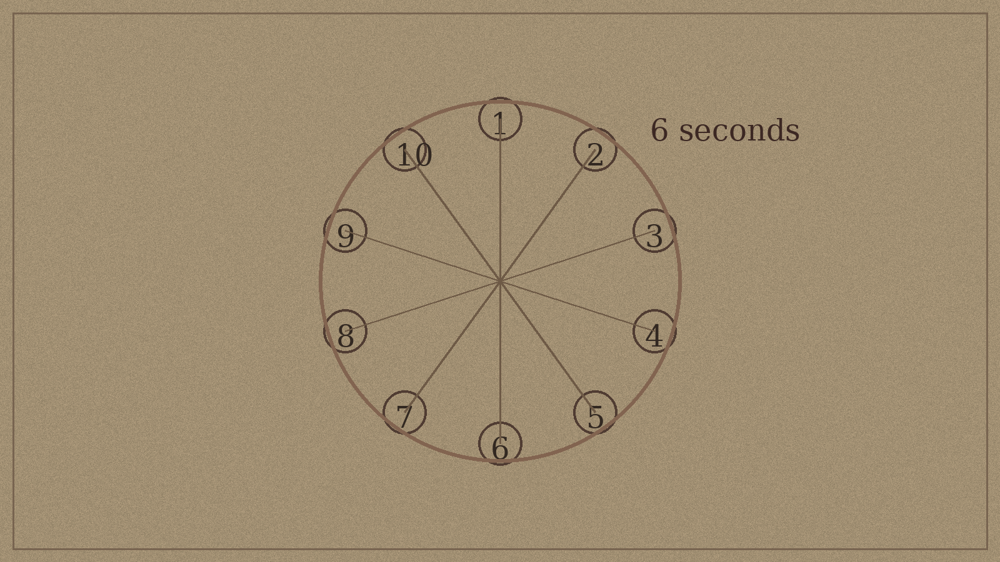

# Session 5 - The Price of Dawn

**Central Dilemma:** When the "right" choice and the "good" choice are different, which do you make?

**Session Goal:** Reach a conclusion that reflects everything the players chose. No correct ending. No hidden punishment for the "wrong" path.

**GM Principle for This Session:** Your job is to make the ending feel *earned*, not to make it feel *good*. They are different things.

---

## Pre-Session Checklist

- [ ] Review ALL four session trackers - this session is entirely built on their contents
- [ ] Identify the most likely ending path (see Ending Matrix below)
- [ ] Check Corven's Final Entry status - did players find it in Sessions 1-4? If not, place it in the Archive for the opening beat
- [ ] Know which Dawnborn are willing, unwilling, undecided - and which NPC relationships are strongest
- [ ] Prepare the Ritual Round mechanic card (see Combat section) - you will need it at the table
- [ ] Have epilogue entries prepared for: Sera, Tomas, Lira, Edoran, the Chancellor, and 2-3 ensemble Dawnborn most present in your campaign
- [ ] Prepare debrief questions - review the list at the end of this session

### Player Companion Touchpoints

- **Final tracker snapshot (`tracker.md`):** Freeze the faction reputation, Dawnborn consent, and crisis levels before the session starts, then update them live as last-minute choices land. The before/after photo becomes part of the campaign artifact and feeds the Session Recording workflow.
- **Logistics allies (`shops.md`):** Any proprietor the players reached Partner-level with can now pay off mechanically. Helka can smuggle Dawnborn past Reckoning blockades; the Ironbell Forge can reinforce the Ashring barricades; the Grain Measure can feed the waiting crowd. Call out their wants/fears so the table remembers why these allies matter.
- **Roadblocks and retrievals (`travel.md`):** If Petra, Lira, or any Dawnborn still need convincing, you'll likely hit the Eastern Track or River Trade one last time. Use those tables to show the city reacting on the way to the finale.

---

## Pacing Guide

*Target: 4-4.5 hours. This is the finale. Don't rush it. The debrief is not optional.*

| Beat | Scene | Time | Type |
|------|-------|------|------|
| 1 | Five Senses Opening + Final Morning | 15 min | Atmosphere / Stakes |
| 2 | **Riddle: Corven's Final Entry** | 20 min | Investigation |
| 3 | The Last Conversations | 25 min | Roleplay (NPC visits) |
| 4 | **Puzzle: The Inversion Circle** | 20 min | Exploration / Coordination |
| 5 | The Ashring Assembly | 20 min | Social / Decision |
| 6 | **Combat: The Last Stand** | 35 min | Combat (3 objectives) |
| 7 | The Ritual | 30 min | Climax (path-dependent) |
| 8 | Epilogues | 15 min | Narrative resolution |
| 9 | The Debrief | 15 min | OOC / Post-session |

---

## Five Senses Opening

*Read or paraphrase before anything else. Set the day.*

<audio controls style="width:100%;margin:0.5em 0 1.5em 0;">
  <source src="audio/session5-opening.wav" type="audio/wav">
</audio>

> The city smells different this morning. It takes a moment to identify why. Then you have it: there is no lamp oil smell. The Dawnhalls have not lit their morning lanterns. The people moving through the streets are quiet - not the usual silence of early hours, but a held-breath kind of quiet, the kind that has weight and direction.
>
> The amber sky is doing what it always does. But there is a crowd gathering at the Ashring quarter, not urgently - they're not running - but steadily. The way people move toward something they've been waiting for their entire lives.
>
> Fifty years. The city has been waiting fifty years for today.
>
> The question is what today actually is. That depends entirely on what you do next.

---

## Beat 1: The Final Morning

The Chancellor's seven-day ultimatum, if it was issued in Session 4, expires today or tomorrow. The city knows something is happening - rumors move faster than facts, and the Ashring gathering yesterday (Session 4) has been the subject of every conversation since.

The players wake to three facts that are now true regardless of their choices:

1. **The Dawnborn have made their positions known** - willing, unwilling, or absent. The split is public (at least within the circles that matter).
2. **The Chancellor has called the Council session** - a final vote on how to proceed. It is scheduled for midday.
3. **The Reckoning has moved** - overnight, Reckoning operatives have occupied the two main approaches to the Ashring. They are not attacking anyone. They are present as a statement.

**The players have the morning** before the Council session and before the Reckoning's patience runs out. Use this time for the Riddle and the Last Conversations.

---

## Riddle: Corven's Final Entry

*If players followed the clue trail from Sessions 1-2, they may have this already. If not, place it available now.*

### The Clue Trail

In Session 1, the assembled Notation Key contained a final line that produced a number sequence when decrypted: **4-17-3**. In the Civic Archive, this corresponds to Shelf 4, Row 17, Position 3 - a locked drawer in the back of the original ritual collection. Theron Waide knew about it. He left it locked because he was afraid of what he'd do if he read it.

**Three ways to reach it now:**
- Players with the Notation Key decryption from Session 1 go directly (no check)
- Players who built trust with Theron: he tells them about the drawer if asked; he has the key
- Players who didn't find either: the locked drawer is visible on inspection (DC 10 Investigation of the ritual collection shelf); Theron gives the key without much resistance if pressed - he has been waiting

**The drawer contains:** A sealed letter in Archmagister Corven's handwriting, dated the night of the ritual.

### The Letter

> *To whoever finds this - and I believe someone will, eventually, because nothing this consequential stays hidden:*
>
> *I was wrong about what I was building.*
>
> *The Ritual of Eternal Dawn was designed to store solar energy in living anchors - objects imbued with life-resonance that could release the stored light gradually over centuries. I calculated that the "living" quality of the anchor was a material property, like grain in wood. I was precise and I was thorough and I was completely mistaken about what "living" means in the context of ritual magic.*
>
> *The night of the ritual, ten children were born at the moment of the anchor-binding. They became the anchors. Not objects. People.*
>
> *I did not know this until the backlash killed me. I am writing this letter in the six minutes I have remaining. I want someone to know.*
>
> *The energy can be released. The anchors - the children, the people, I am sorry - can release it voluntarily if they all stand at the ritual site simultaneously and choose to invert the binding. All ten. Simultaneously. Willing. I built the inversion pathway into the ritual as a failsafe. It requires consent because the anchor is living.*
>
> *I built a failsafe that requires the death of ten people who had not yet been born.*
>
> *I do not know how to express what I have done. I know only that the pathway exists, that it requires willingness, and that no one should be forced.*
>
> *- Archmagister V. Corven*
> *Night of the Ritual*

### How the Letter Survived

Corven died on the ritual grounds. A junior assistant named Marit Solke survived the night — she was in the preparation room below, not the circle itself, when the backlash occurred. She found Corven's body the next morning. The letter was on his desk, sealed, addressed to no one. She brought it to the Archive with his other papers and materials, listed it in the intake log as "personal correspondence, night of the ritual," and filed it with the sealed ritual collection. She was twenty-three years old. She left Varenhold two years later and is not in any record the players can find.

Theron Waide discovered the drawer eleven years ago when cataloguing the sealed collection. He found the intake log entry, found the drawer, and found the key. He did not open it. He has been keeping the key in his desk ever since. The key has a tag in his handwriting: *"4-17-3. Do not lose."*

If players ask why he never opened it: "I knew whatever was in it would require me to do something. I have spent eleven years not being ready to do something."

### What This Changes

This letter does three things:

**1. The inversion is confirmed to require all ten willing.** Not five. Not a majority. All ten. The partial ritual paths in Sessions 2-4 were always incomplete.

**2. Corven was not a villain.** He was catastrophically wrong. He would have been horrified. This changes how players frame the story.

**3. "No one should be forced" is in his hand.** This is the moral argument against forced sacrifice, in writing, from the person who created the situation.

**How to use it:**

If players share the letter with the Dawnborn: Ysel reads it and is quiet for a long time. Then: *"He didn't mean to. That actually makes it harder, somehow."* Lira reads it and says nothing immediately. Tomas takes it and reads it three times.

If players share it with the Chancellor: She reads it. She sets it down. She says: *"He left us a confession and a solution and the solution requires consent. I understand."* She does not say what she understands. She is deciding whether to use the forced-sacrifice option anyway.

If players keep it: They are carrying Corven's guilt alone. That is also a valid story.

**The riddle element:** Players who read carefully notice the date - "Night of the Ritual." Corven wrote this while dying. He had six minutes. He chose to spend them on this letter. That choice has weight. What does it mean to know that the person who made this mistake spent their last minutes trying to ensure consent? The players must sit with this.

---

## Beat 2: The Last Conversations

The players have roughly two hours before the Council session. They can visit:

**Theron Waide (Archive)**
- If they've come for the letter: he is relieved. *"I always knew there was something in that drawer. I was afraid knowing would make things worse. Was I right?"*
- His final position: he will testify at the Council session if asked. He is terrified. He will do it.

**Brother Edoran (Restorer compound)**
- Depending on the campaign's path, he may be a reluctant ally or an arrested idealist or somewhere in between
- In any state, if shown Corven's letter: he reads it carefully. Then: *"He built in a consent clause. Of course he did. Of course that's what he did."* He doesn't say if that makes him more or less certain.

**Sera Voss / Tomas Areth / Lira Anwick (wherever their positions left them)**
- These are the final character moments before the ending
- Each NPC has one last thing they want to say - use their OGAS blocks and the attitude tables from Sessions 1-4 as your guide
- Do not script these. Know what each NPC wants from this conversation and follow the players' lead.

**The Chancellor**
- She will meet with the players before the Council session if they request it
- She has read the Asymmetry Journal (Tomas showed her, or she got it from the Spire)
- She knows about the inversion but she also knows it requires all ten, including the unwilling
- The meeting with the Chancellor is the players' last chance to affect her position before the vote

---

## Puzzle: The Inversion Circle

*Set up at the Ashring, in the time between the Council session and the ritual beginning. The puzzle is about coordination, not code-breaking.*

### What Players Find

The ten Primer Stones (activated in Session 4, or activatable now) each have a resonance that responds to the presence of a Lux Anchor. When a Dawnborn stands at a stone, the stone begins to glow.

The Inversion Circle requires all ten Dawnborn to stand at the ten stones simultaneously. The problem: *simultaneously* means within a six-second window (one round). The stones must all be at full glow when the central inscription is activated. If any stone goes dark - because its Dawnborn left, or was not willing to be there - the inversion fails and the ritual defaults to the original destructive path.

### The Coordination Problem

This is a logistics puzzle, not a magical one. The players must figure out:

1. **Physical placement:** The Dawnborn must be positioned one per stone before the window opens. Each stone is about 15 feet from the next in a 40-foot diameter ring.

2. **The timing:** Someone (the players, Tomas, or the players directing Tomas) must give a signal that triggers simultaneous activation. This can be as simple as a word or a gesture - but the signal must be clear and reach all ten positions.

3. **The willing problem:** Stones only respond to willing presence. A Dawnborn who is not fully consenting creates a "cold" stone that blocks the activation. If Lira is not willing, her stone goes cold. The puzzle cannot be solved around her.

4. **The missing problem:** If Petra hasn't been found, her stone has no one. The puzzle tells the players what they still need to do.

**The puzzle solution is not mechanical - it is relational.** The players cannot solve this with a skill check. They can only solve it by having the right conversations with the right people before they stand in the circle. The puzzle is the whole campaign, compressed to one moment.

### If Players Have Willing Stand-Ins for Unwilling Dawnborn

Players might ask: can a non-Dawnborn stand at a stone for an unwilling Dawnborn? The answer is no. The stones respond specifically to Lux Anchor resonance. Substitute participants cause the stone to pulse incorrectly and the ritual does not progress. Players who attempt this discover it immediately (the stone turns amber-red rather than amber-gold) and can try again before the main window.

### Three Paths to Understanding the Puzzle

- The activated Primer Stones from Session 4 (inscription reads: ALL MUST STAND WHERE TEN STOOD - THE UNWOUND RITUAL REQUIRES THE WILLING OF ALL)
- Corven's letter: "all ten must stand at the ritual site simultaneously and choose to invert"
- Edoran, if he's been an ally: he has studied the stones for years and understands the coordination requirement

---

## The Ashring, One Last Time

*Run this just before the combat - as the ritual is being set up.*

> The Ashring at the end of things looks exactly like it did at the beginning of things. The scorch marks. The amber light. The smell of old stone.
>
> You've been here before. It felt significant then. It feels different now - not more significant, just *more honest*. You know what happened here. You know what might happen here again.
>
> The question is whether you know why.

---

## Combat: The Last Stand

*This happens as the Dawnborn are taking their positions at the Primer Stones - or just before, if the players moved faster than the opposition expected.*

### Who Attacks

**Default: The Reckoning** - Harran (or a successor) leads a final intervention force. They are here to stop any ritual that doesn't have unanimous, freely given consent. They watched the Council session. They saw the vote. They don't trust the outcome. *(Stat blocks: Harran and Reckoning Veterans in Session 4. Use 8 Veterans + Harran as the default force; reduce to 6 Veterans if Harran was captured non-lethally in Session 4.)*

**If Reckoning was neutralized in Session 4:** A faction of Desperate commoners, led by someone radicalized by the crisis, makes a desperate play - not to harm the Dawnborn, but to force the ritual to happen *now*, before the window closes. They are terrified the players will find another delay. *(Stat blocks: use 8–10 Desperate Commoners + Senna Kard from Session 3, or substitute standard MM Cultists/Bandits if Senna was captured or died. This crowd fights like the Session 3 mob — de-escalatable, non-lethal-first, leader-dependent. The same tactics apply.)*

**If both are neutralized:** Warden Keseph, a Spire Scholar who has been selling twilight-research access to Solenne for twenty years, makes his move. He has profited from the twilight academically and politically. He wants the twilight to continue. He has hired mercenaries. *(Stat blocks: Warden Keseph, Mercenary Captain, and Mercenary Sellswords — all in this session's Stat Blocks section below.)*

### The Combat Setup

**Timing:** The attack comes when 6-7 of the Dawnborn are at their stones. The others are still approaching.

**Three Secondary Objectives:**

| Objective | Why It Matters | Consequence of Failure |
|-----------|---------------|----------------------|
| **Keep the Dawnborn at their stones** | Each Dawnborn who leaves their stone (willingly or by force) must be persuaded to return - that's a DC 14 Persuasion check, consuming the player's action | Each Dawnborn who can't be persuaded back is one step closer to Ending B or E |
| **Protect the central dais** | The dais inscription must be intact to trigger the simultaneous activation; it can be damaged (AC 14, HP 15, vulnerable to fire) | Destroyed dais = inversion impossible; only original destructive ritual remains |
| **Get the final word** | The activation signal must be called at the right moment; the person calling it must be able to be heard by all ten positions (40-ft diameter ring) | If signal is obscured by combat noise, players can spend their action to clear it; otherwise, a DC 14 Performance check to be heard |

### The Encounter Beat: Round 2

Someone - a Dawnborn, not the players - makes the moment shift.

If Ending A is likely (all willing): **Sera** steps off her stone, walks toward the combat, puts herself between the attackers and the circle, and says in her guard captain's voice: *"I chose this. Get out of our circle."* DC 14 Insight to realize she's giving the attackers one chance. DC 12 Persuasion for the players to keep her at her stone (she'll go back, but she needed to say it).

If Ending B/C is likely (partial resolution): **Tomas** calls out from his stone, during the combat: *"You are fighting over a decision that has already been made. By the people making it. Stop."* It is not a command. It lands like one.

If Ending D is likely (no ritual): **Lira**, from wherever she is, says nothing. Her silence is the loudest thing in the plaza.

### The Combat Ends When

- All attackers are defeated, fled, or persuaded to stand down
- The players successfully argue - mid-combat - that the ritual is or isn't what the attackers think it is
- A Dawnborn does something so unexpected it stops everything

### Post-Combat Window

After the combat, the players have one final chance to adjust the Dawnborn's positions before triggering the activation. This is the last moment to persuade, to share Corven's letter, to make a final argument.

**The Activation Signal:** Whoever calls it - player or NPC - must be at the center of the circle. The word or phrase can be anything. The players should choose. This is the last meaningful decision of the campaign.

---

## The Ritual Itself

After the signal, the ritual proceeds. What happens depends on which Dawnborn are in the circle and whether they are willing.

### Ritual Round Mechanics

*Use these if the ritual is interrupted after activation begins.*

| Round | Interruption Effect |
|-------|-------------------|
| 1 | One Dawnborn loses concentration. They can re-focus as a Bonus Action (DC 14 Concentration check). Ritual pauses but does not fail. |
| 2 | The dais begins drawing ambient magical energy. All creatures within 30 feet take 2d6 lightning damage (DC 14 Dex save, half on success). The Dawnborn at the stones are immune. |
| 3 | A Dawnborn is forcibly displaced from their stone (target the one in the most danger). They take 3d6 force damage and must return as a movement action. The ritual enters an unstable phase. |
| 4+ | The ritual has locked into one path. If all ten were willing: inversion completes regardless of further interruption. If fewer than ten were willing: the destructive path activates. It cannot be stopped without all Dawnborn simultaneously stepping out. |

*Note: The above mechanics only apply if someone attempts to interrupt mid-ritual. In most campaigns, the combat ends before the activation signal is given. These are the "something went wrong" table.*

---

## The Six Ending Paths

These are not rigid rails - they are likely endpoints based on the choices made in Sessions 1-4. Most campaigns will blend two or three paths. Use the Ending Matrix below to find the most relevant one.

### Ending A: Full Ritual, Full Consent

**Conditions:** All ten Dawnborn, or at least a critical mass, have voluntarily chosen to proceed. The unwilling are genuinely not coerced - they have either been swayed, found alternative solutions for themselves, or chosen to step back.

**How to set this up:** Petra was found. Lira was either persuaded (perhaps by Corven's letter, perhaps by an alternative for her daughter) or has found peace. Cormac's wavering was resolved. Tomas came off the fence.

**What Happens:**
The ritual is performed at the Ashring. Ten people stand in the scorch circle. The players' role is witnessing, not acting - this is the Dawnborn's moment.

### Read-Aloud (Ending A)

> They stand in the circle. All ten. Some are holding hands. Ysel is praying. Davin is looking at the sky with an expression you can't name.
>
> Sera finds you in the crowd. She says, quietly: "Thank you for telling us the truth."
>
> Then the light changes.

> *The sun rises over Varenhold for the first time in fifty years. The bells - all of them, including the ones that have been silent - ring.*

**The Cost:** Ten people are gone. People who were beloved. People who were real. The sun is real too. Both things are true.

**The Aftermath:** The city celebrates. And grieves. The players are part of both. The Dawnhalls will be renamed. Mira - Lira's daughter - will grow up in sunlight without her mother. These facts coexist.

---

### Ending B: Partial Ritual, Incomplete Resolution

**Conditions:** Some Dawnborn consented; others didn't and weren't coerced. The players chose consent over completion.

**How to set this up:** Lira refused and was protected. Petra wasn't found or chose not to participate. But the willing three (Ysel, Davin, and possibly Sera or Cormac) proceeded anyway.

**Surge-Phase Note for the GM:** The partial ritual's effectiveness scales with the raw *number* of willing participants, not their surge-phase amplitude. Surge-phase weighting matters for the inversion pathway (which requires precise resonance alignment across all ten). For the original destructive path, each willing anchor releases what it holds — regardless of whether it's a surge-phase anchor or not. Three participants produce a meaningful but incomplete effect: brightening, not full dawn. The surge-phase anchors (Sera, Tomas, Ysel, Lira, Petra) would yield a stronger partial result, but three standard-amplitude anchors still produce Ending B's described effects. The difference between "three willing including no surge-phase anchors" vs "three willing surge-phase anchors" is the *degree* of brightening — use this to texture the aftermath if the composition of the willing three becomes relevant.

**What Happens:**
The willing Dawnborn perform their portion. The city does not return to full daylight — but the twilight brightens. Crops improve marginally. Grey sickness progression slows. It is not a solution, but it is not nothing. The degree of improvement reflects who participated: if none of the three are surge-phase anchors, the brightening is subtle (candles seem warmer, the amber sky tilts slightly gold). If one or more surge-phase anchors participated, the improvement is more pronounced.

### Read-Aloud (Ending B)

> The light changes. Not completely - not the full sunrise you imagined - but *more*. Brighter. The amber deepens toward gold.
>
> It is not the sun. It is something like the sun's reaching hand.
>
> Lira is standing beside you. She is watching the light change. She is not crying. She says: "Is this enough?"
>
> You don't know. But the three people who chose to be here chose this. And the seven who are still standing are still standing.
>
> Maybe that's what you can live with.

**The Cost:** The city is better, but not healed. The question remains open. There is no clean ending - only a better tomorrow that is not yet complete.

**The Aftermath:** The surviving Dawnborn live in a city that is half-recovered and half-waiting. Lira keeps practicing medicine. Tomas keeps judging. The question of whether the remaining seven will ever choose is one the players leave open.

---

### Ending C: The Transfer (Isolde's Method)

**Conditions:** The players fully pursued Isolde's energy transfer, the Cathedral was destroyed, the transfer succeeded.

**How to set this up:** Isolde's method was verified. Players secured the Cathedral and got willing cooperation (or at least neutrality) from the Auris clergy.

**What Happens:**
The Lux Anchor energy is extracted from all ten Dawnborn and placed in the Cathedral's resonant architecture. The Cathedral is consumed in the process. The sun returns.

### Read-Aloud (Ending C)

> The Cathedral falls in on itself slowly, like a dream collapsing. The light it releases is - incandescent. The entire Outer Ring is lit by it for a moment, brilliant, warm.
>
> Then it's gone. And the sun is rising.
>
> All ten of the Dawnborn are on their knees in the street outside. Alive. Just people, now. Not extraordinary, not symbols. Just people blinking in real light for the first time in their lives.
>
> Lira is laughing. You've never heard her laugh.

**The Cost:** The Cathedral. Two hundred years of religious and cultural history. The Auris faith in Varenhold is in crisis - or renewal, depending on whom you ask.

**The Aftermath:** The Wounded faction of Auris believes the Cathedral's sacrifice was the god's own gift. The Penitents believe it was destruction of something sacred. The argument continues. It is a better argument to have than the previous one.

---

### Ending D: The Dawnborn Live, The Sun Does Not Return

**Conditions:** The players protected the Dawnborn absolutely, with no ritual completion. The city is saved through other means - a massive organized emigration, a political coalition, an incomplete scientific alternative.

**How to set this up:** Players spent the campaign building relationships, organizing institutions, or pursuing a scientific alternative that doesn't require anyone's death.

**What Happens:**
The sun does not return. The players negotiated, organized, or fought for a future that doesn't require anyone's death. It is a harder future. It is still a future.

### Read-Aloud (Ending D)

> There is no dramatic light. The sky stays amber. The bells don't ring.
>
> But Varenhold is still here. And so are its people - all of them, including the ten you were asked to condemn. The city will be smaller, harder, leaner. It will have to grow differently.
>
> Lira's daughter runs through the amber light chasing something. Lira watches her.
>
> It's not the ending anyone wanted. But you made it by choosing what you were not willing to do. That's also a kind of answer.

**The Cost:** Everything that was promised about the sun. The hope that drove the whole campaign. But the players can look every Dawnborn in the eye.

---

### Ending E: Forced Resolution / Incomplete Consent

**Conditions:** The Chancellor's deadline passed, the Council acted, or the players chose a path that required coercing unwilling Dawnborn.

**How to set this up:** This ending is usually the result of inaction or of choosing the city's survival over individual consent. The Chancellor votes to proceed. The Council provides the mechanism. The players were part of this — or couldn't stop it.

**Mechanics note for the GM:** The inversion pathway (no deaths) requires *all ten* Dawnborn to be genuinely willing. If any participant is coerced, absent, or unwilling, the inversion cannot complete.

When the inversion fails mid-attempt due to forced or absent participants, the result is not a clean "default to the original ritual." The original ritual works through individual, sequential energy release — each anchor releasing what it holds in controlled sequence. The inversion requires all ten releasing simultaneously in a cooperative resonance. When that cooperative resonance is attempted and breaks — because one participant's energy is fighting the process — the simultaneous release becomes uncontrolled. The energy doesn't find its channels. It cascades. All ten Lux Anchors are discharged at once, including the ones who never agreed to be there.

**In Ending E, all ten Dawnborn die.** The sun returns — the energy releases regardless — but it releases catastrophically, not elegantly. The willing died as they chose. The unwilling died because the ritual could not distinguish consent once the cascade began.

This is the crucial distinction from Ending B: in Ending B, the players run the *original* destructive ritual with *only the willing participants*, who release their energy voluntarily and sequentially. The unwilling are not in the circle. They are not part of the process. They live. In Ending E, someone put the unwilling in the circle and attempted the inversion anyway. The cascade is the consequence of that choice.

The memorial exists. The distinction between willing and unwilling names is visible if anyone looks. The city knows, eventually, what the difference was. How publicly that knowledge surfaces depends on what the players chose to do with Corven's letter and with Tomas's journal in the sessions before.

**What Happens:**
The sun returns. All ten Lux Anchors are extinguished — some by choice, some not. The campaign ends with the players carrying something they can't put down.

### Read-Aloud (Ending E)

> The sun rises. It is real and warm and fifty years late.
>
> You are standing at the edge of the Ashring. The ritual is complete. The city is already waking up — you can hear it, a sound like relief, spreading outward from the plaza.
>
> Lira is not here. Neither is Aldric, or Cormac, or Petra — none of the ones who said no. They are gone, the same as the ones who said yes. The ritual does not distinguish.
>
> The sun is up. The cost was real. You knew it would be.
>
> Did you make the right choice? That's not a question with an answer. That's a question you'll be living with.

**The Cost:** All ten Dawnborn. Some chose it. Some did not. The city can see the difference in the names on the memorial, if anyone looks closely enough. The players chose the city. That is a valid choice. It is not a clean one.

---

### Ending F: Catastrophe / No Resolution

**Conditions:** The players ran out of time, the Desperate or Restorers acted without them, the situation fractured beyond control.

**How to set this up:** This is the result of a campaign where things went decisively wrong - or where the players made a consistent choice to refuse all paths. It is not a failure state. It is a different story.

**What Happens:**
This ending is not a failure state - it is a different story. The ritual failed again, or was stopped, or was never completed. The city continues to decline. The players are part of a story about what people do when there isn't a solution.

### Read-Aloud (Ending F)

> The sky stays amber. The ritual didn't work, or wasn't completed, or was stopped. Whatever happened, happened.
>
> The city is still here. Still breathing. Still declining, slowly, in that way that gives you just enough time to pretend it isn't.
>
> You couldn't fix it. Maybe no one could. Maybe that's the honest answer.
>
> The drum in the market square is playing again. The same three beats. Someone keeps time, because time has to be kept, because this is what you do when there isn't a solution: you keep going.

---

## The Ending Matrix

| If... | Likely Ending |
|-------|---------------|
| All/most Dawnborn consented and alternatives failed | A |
| Some consented, players protected the unwilling | B |
| Players pursued Isolde's transfer successfully | C |
| Players refused all ritual paths and found/built alternatives | D |
| Chancellor's forced deadline or coercion occurred | E |
| Clock ran out without resolution | F |
| Multiple threads active | Blend A+B, or B+C |

---

## Epilogue Tables

After the ending scene, take 5-10 minutes to run epilogues for each major NPC. Ask players: *"What do you do next? What do you want to know about what happened to them?"*

### Epilogue by NPC

**Sera Voss**
- A: She is remembered. The city builds something with her name on it. (Ending A only - she didn't survive unless she stayed with the unwilling.)
- B: She is still alive. She returns to guarding the Lowmark. She asks after the players occasionally.
- C/D: She is still alive. She seems lighter. She laughs more.
- E: She is alive. She and Lira don't speak for six months. Then they do.

**Tomas Areth**
- A: He wrote everything down. His account of the ritual is found in the Archive a year later. He titled it "An Honest Record."
- B/C/D: He continues as judge. His rulings on impossible cases become legendary. People say he has a particular understanding of decisions with no good answers.
- E: He resigns as judge. Quietly. No public statement. He is found, a year later, as a mediator in the Dusk Parishes, helping communities negotiate food shares.

**Lira Anwick**
- A (if she was among the ten): Mira is three. She does not know her mother was a hero. She will learn, when she's old enough to understand what that means.
- B/C/D: She is alive. She is healing people. She is harder to reach than before, but she is there.
- E: She left. She may have gone to another city with her daughter. She may have come back. You'll have to find out.

**Brother Edoran**
- A/E: He stands at the Ashring and watches the sunrise alone. Then he walks away. He does not rebuild the Restorers. His daughter's name is on a stone in the Lowmark.
- B/C/D: He struggles with the incomplete outcome. He is honest about it. He eventually finds a new purpose - not restoration, but something else. The Lowmark care houses need organizational help.

**Chancellor Ostenveld**
- A/C/E: She wins reelection. The city recovers. She does not speak publicly about what the ritual cost. She is very quiet at the annual commemoration.
- B/D/F: She faces a no-confidence vote. She may survive it. Either way, she is diminished. She seems to feel that's appropriate.

**Davin Shore**
- A/E: He is remembered as the one who said yes first. The token — *"Of my own choosing"* — is reproduced on the memorial. Several copies end up in Lowmark homes. People who knew him say he would have found that embarrassing.
- B/C/D: He is still alive. He continues his watchman rounds. He is very calm. People in the Ashring quarter notice that he smiles slightly more than he used to.

**Ysel Maren**
- A/E: The Cathedral's Wounded faction holds a special vigil in her name each year on the ritual anniversary. She would have appreciated the theology of it. She would have disputed two of the hymns they chose.
- B/C/D: She is still alive. She continues leading the dawn-vigil services. The prayer cord on her windowsill now has eleven names on it.

**Cormac Drell**
- A (if his wavering was resolved and he chose willingly): He is remembered alongside Davin and Ysel. His decision came last. It came. That is what is noted.
- A (if his wavering was not resolved and he was in the circle): He is remembered. Whether his was a free choice or a forced one is a question the city doesn't ask openly. The players know.
- B/C/D: He is alive. He made his decision — whatever it was — and is living with it. He works the docks. He doesn't talk about it.
- E: He is gone. Whether he chose it in the end, nobody is certain. Davin would have known. Davin is gone too.

**Nin Fletch**
- A/E: He is remembered as the one who had a past and chose something better anyway. The Compact document he'd been sitting on for fifteen years was never relevant to anything. He went to his death knowing that, and finding it funny in a dark way.
- B/C/D: He is alive. He continues coordinating Dawnhall supply distribution. He files the old receipt. He doesn't open it again.

**Orya Doss**
- A/E: Her maps of the Spire subbasement are found in the Archive a year later. No one knows what the space was for. Scholars argue about it for a decade. She would have considered that a reasonable outcome.
- B/C/D: She is alive. She starts mapping the subbasement herself. She finds something. She tells the players first, if they're still in the city.

**Aldric Stone**
- A/E: His forge is closed. The Lowmark keeps it closed on purpose — they're not ready to put someone else in it. On the ritual anniversary, someone leaves a piece of unworked iron on the threshold. Nobody takes credit.
- B/C/D: He is alive. He returned to his forge within a week. He didn't explain why. The work was there. He does it.

**Petra Vane**
- A/E: She came back. She made her decision. The herbalism shop in Greenhollow is still there; the person who took it over sends a percentage of what she earns to Lira's daughter's childcare, continuing what Petra started anonymously. Someone told her what it was. She didn't stop it.
- B/C/D: She is alive, back in Greenhollow or returned to Varenhold if the players gave her a reason. The anonymous payments to Mira's childcare continue. Lira knows now.

**Theron Waide**
- Any ending: He retires from the Archivist position within a year. He spends his remaining years writing a complete history of the ritual — including his own role in concealing the truth. It is the most honest thing he has ever written. He publishes it three years before he dies.

---

## One Year Later: Epilogue Scenes

*Run these after the NPC epilogue tables. One year has passed. Read the appropriate scene based on the ending. These are the last words of the campaign - take your time.*

---

### Ending A: One Year Later

> *Varenhold, one year after the sunrise.*

> The market is fuller than it's been in decades. Fresh produce is still expensive - it will take years for the farms to fully recover - but there are tomatoes on the Lowmark stalls, and they are not rationed, and the children who buy them do not know what it was like when they cost a writ each.

> The Dawnhalls are still open. They won't close - the city has decided to keep them, not as emergency infrastructure but as civic institution, a memory of the thing that was built when everything was hard. Each one has been renamed. Not for the Dawnborn - the city couldn't agree on that - but after the years: the Year-Five Hall, the Year-Twenty Hall, the Year-of-the-Dawn.

> There is a memorial in the Ashring. Ten names. Below them: *They chose this.*

> People argue about whether those three words are enough. They will still be arguing in twenty years. That seems right.

> The shadow it casts is brand new. No one in the city is used to shadows yet. Children chase them.

*[GM: Pause. Let the image settle. Then close your book.]*

---

### Ending B: One Year Later

> *Varenhold, one year after the brightening.*

> The sky is not what it was before the twilight. The old records say it was blue - a specific blue, the kind that's hard to imagine unless you've seen it. What Varenhold has now is between: a pale, warm gold that isn't quite sunlight but isn't the old amber haze either. The grey sickness rate has dropped. The crops are growing better. It is not a cure, but it is a direction.

> The seven remaining Dawnborn live in a city that treats them with a complicated tenderness. They are not symbols anymore - the city is too tired for symbols - but they are not ordinary either. Lira is still at the care houses. Tomas is still judging. Aldric is back from hiding, quieter than before, and doing something with his hands that nobody expected.

> The memorial says three names. Below them: *They chose this too.*

> Seven people go to the memorial regularly. They don't tell each other. They know.

*[GM: Pause. Let the image settle. Then close your book.]*

---

### Ending C: One Year Later

> *Varenhold, one year after the Cathedral fell.*

> There is a plaza where the Cathedral of Auris once stood. The city debated what to put there - a memorial, a garden, a new hall, nothing - and in the end built a garden, because gardens require light, and there is light again, and growing things seemed right.

> The Auris faith in Varenhold is in its strangest, most contested, most alive moment in two centuries. The Penitents say the Cathedral's loss was judgment. The Wounded say it was sacrifice. A third faction - young, not yet named - says the god doesn't need a building. The argument is real, which means the faith is real, which the clergy count as a sign of health.

> Ten people who used to glow now do not. They are discovering what it means to be unremarkable. Some of them find it a relief. Some are still learning.

> Lira's daughter is four years old. She runs through the garden. She asks why the flowers are called what they're called.

> Lira does not have an answer, but she tries to find one.

*[GM: Pause. Let the image settle. Then close your book.]*

---

### Ending D: One Year Later

> *Varenhold, one year after the decision not to decide.*

> The city is smaller. Two thousand more people left in the year after it became clear that the sun was not returning. Most of them went to the Dusk Parishes, where the conditions are similar but family ties ran deep. Some went to the Compact. A few went to places where the sky still moves through full day.

> The ones who stayed are stayers. The old word. The highest compliment. The population is under thirty thousand now, but those thirty thousand are, on average, extraordinary at surviving hard things. The Spire is still working on alternatives. The grey sickness is still being managed. The amber lanterns are still being made.

> The ten Dawnborn still live in the city they protect. They go about their lives. Lira's daughter starts school. Sera rescues someone from a fire on the Lowmark docks. Tomas arbitrates a dispute about fishing rights that nobody else could solve.

> It is not the ending anyone wanted.

> It is still a life.

*[GM: Pause. Let the image settle. Then close your book.]*

---

### Ending E: One Year Later

> *Varenhold, one year after the forced sunrise.*

> The sun is real. The festivals were real. The first harvest under full light was real - a surplus, the first in fifty years, which the city wept over in the fields like grief instead of celebration, because abundance after long shortage always feels like grief first.

> The city does not speak publicly about what it cost. The memorial exists - ten names, or fewer, depending on who agreed - but the official ceremony is brief and the Chancellor attends alone.

> The Dawnborn who survived the ritual - the ones who chose - are remembered differently than the ones who didn't choose. The city knows, without saying it, that there is a distinction. It is uncomfortable to know this. The city lives with the discomfort.

> Lira was last heard of in the Dusk Parishes. She may come back. She has not said.

> The sun rises every morning. The players were part of that. They were also part of the other thing. Both are true.

*[GM: Pause. Let the image settle. Then close your book.]*

---

### Ending F: One Year Later

> *Varenhold, one year after nothing resolved.*

> The sky is still amber. The grey sickness rate has stabilized - not improved, just stopped accelerating for now. The food stores are at thirty percent. The city has been here before.

> The Dawnborn are still here. The ritual documents are in the Archive, or destroyed, or somewhere. The question of what Varenhold should do remains open. People argue about it. Some have stopped arguing and just live their lives.

> There is a child in the Lowmark who has never seen sunlight and is eleven years old and knows the name of every lantern-carrier in the district and has strong opinions about which type of lumenbread is best. Her name is Essa. She does not know about the ritual. She does not know that the sky could have been different. She is growing up anyway, in the amber light, building a life out of what the city has.

> This is also a kind of ending. The drum in the market square is playing. The same three beats.

> Someone keeps time.

*[GM: Pause. Let the image settle. Then close your book.]*

---

### The Last Line of the Campaign

*After you read the epilogue, before the debrief begins, say this - or something like it:*

> "That's the price of dawn. We'll take five minutes, and then I want to ask you all something."

*Then give them five minutes. Let people get up, get water, breathe. The debrief works better when there's a brief silence between the story and the talking.*

---

## The Debrief

This is not optional. Do it after the epilogues. It takes 10-15 minutes and it is the best part.

Go around the table and ask each player one of these questions. Use different questions for different players.

1. *"What would your character have done differently, if they could go back to Session 1?"*
2. *"Was there a moment where you were certain you were making the right choice? What was it?"*
3. *"Was there a moment where you were certain you were making the wrong choice - and you made it anyway?"*
4. *"Which NPC do you think about most? What would you want to say to them?"*
5. *"What does your character believe now that they didn't believe at the beginning?"*
6. *"Did your character make the right choice - the technically correct one - or the good choice - the one they could live with? Were they the same?"*
7. *"Corven spent his last six minutes writing a letter to ensure consent. What does that mean to you?"*
8. *"If Mira - Lira's daughter - grew up and asked you what happened, what would you tell her?"*

You don't need to answer these questions yourself, as the GM. But you can. Sometimes it's the best thing you do all campaign.

---

## Gestalt / Large Party Scaling — Level 8

*Session 5 plays at Level 8. 4th-level spells fully developed. ASIs and subclass features complete. Two full class progressions. At L8 gestalt, a party can trivially end most published CR 8 encounters in two rounds. The Last Stand must use lair actions, legendary mechanics, and secondary objectives simultaneously — or it becomes a speed bump before the real scene (the ritual). Effective thresholds: Easy ≈ 9,000 | Medium ≈ 18,000 | Hard ≈ 27,000 | Deadly ≈ 39,000.*

**The Last Stand (Default — Reckoning) at L8:**

- **Harran** (Session 4 stat block, 185 HP, AC 18, Legendary Resistance 2/day, 2 Legendary Actions). If Harran was captured non-lethally in Session 4, use the **Reckoning Inquisitor** (new stat block below) as the commanding officer.
- **12 Reckoning Veterans**. At L8 gestalt, Veterans die in one hit to most attacks. The threat is not their individual survival — it's that there are 12 of them simultaneously pursuing Dawnborn, stones, and the dais. They are coverage pressure, not damage pressure.
- **2 Reckoning Fanatics** in addition to Veterans. At L8, *hold person* is a DC 12 Wisdom save that most builds pass. But *silence* (the Fanatics have it at this level: add to their spell list) drops on the player most dependent on verbal spell components. That player's whole turn changes.
- **Ashring Lair Actions** activate at Initiative 20 (same as Session 4 but with the ritual now beginning to stir, one step stronger): Amber Surge deals 4d6 radiant (DC 16 Con). Resonance Pull pulls 20 feet (DC 16 Str). Lux Echo heals Dawnborn for 3d8+6. The Ashring has been building to this moment for 50 years.

**The Last Stand (Desperate — Commoners) at L8:**

- 12 Desperate Commoners + Senna Kard. These are civilians. Use L8 gestalt tools accordingly.
- If the party uses AOE, 2d4 bystanders take collateral damage (they were in the crowd behind the combatants). This creates the same Epilogue consequence as Session 3 mob AOE, but amplified: the city watched the party use high-level magic against desperate civilians at the ritual site. The victory reads differently in every post-session epilogue table.
- DC 15 Persuasion/Performance to talk Senna down mid-combat. With daughters' names: DC 11.

**The Last Stand (Keseph) at L8:**

Keseph as written (CR 3) is not a threat to a L8 gestalt party. Replace his stat block with the **enhanced Keseph** version: use the Archmage stat block (MM p.342, HP 130, 9th-level spells) reflavoured for his academic-political profile. His *Counterspell* reflex is now DC 17, and he has Legendary Resistance 1/day. He still folds when his treason is revealed — but surviving long enough for the reveal to land requires the players to not just incinerate him in Round 1.

**Ritual Mechanics — L8 Gestalt:** Concentration check: DC 14 as written. The real pressure is the secondary objectives during combat, not the check.

**Post-Combat Window:** Every player gets one moment before the activation signal — roughly 15 minutes for 6 players. Do not shortcut this. The activation signal is the last meaningful decision of the campaign. Give it silence. Give it weight. Give it whatever the table has earned.

**Ritual Activation Marker:** Keep it visible throughout. Amber stones are the tension. Update it in front of players whenever a Dawnborn is displaced. At L8 with Ashring Lair Actions pulling people around the plaza, someone is going amber in Round 2. Make sure the table sees it happen.

---

### Reckoning Inquisitor

*Use this stat block when Harran was captured or killed in Session 4 and the Reckoning still has operational capacity.*

*Medium humanoid (human), neutral*

**Armor Class** 17 (chain shirt + shield)
**Hit Points** 143 (22d8 + 44)
**Speed** 30 ft.

| STR | DEX | CON | INT | WIS | CHA |
|-----|-----|-----|-----|-----|-----|
| 13 (+1) | 13 (+1) | 14 (+2) | 16 (+3) | 18 (+4) | 16 (+3) |

**Saving Throws** Wis +8, Cha +7
**Skills** Arcana +7, Insight +8, Investigation +7, Persuasion +7
**Senses** passive Perception 14 | **Languages** Common, Elvish | **CR** 8 (3,900 XP)

**OGAS**
- *Occupation:* The Reckoning's intelligence and theological coordinator for the Varenhold chapter. Has been watching this campaign unfold from a distance for five sessions.
- *Goal:* Stop the ritual from proceeding with coerced or absent participants. Unlike Harran, she would accept Ending A (genuinely full consent). She is here because the city is about to do the worst thing it can do — not the worst thing available, just the worst thing available *to it* — and she needs someone to see her refuse.
- *Attitude:* Toward players: precise, informed respect. She knows which sessions she was watching. She has opinions about every choice. She will say so if asked, mid-combat or otherwise.
- *Secret:* She is the one who told Harran about the Chancellor's advance warning. She thought it would stop him from acting; instead it gave him permission. She has been living with that since Session 4.

---

**Traits**

**Legendary Resistance (1/Day).** If the Inquisitor fails a saving throw, she can choose to succeed instead.

**The Long Watch.** The Inquisitor has observed every major decision the players have made since Session 1. She has advantage on Insight checks against any player character she has studied. In return, players who succeed on a DC 15 Insight check during conversation with her realise she knows things about them. Specific things. This is not magic. This is eleven weeks of watching.

---

**Actions**

**Multiattack.** The Inquisitor makes two mace attacks, or one mace attack and casts one spell of 3rd level or lower.

**Mace.** *Melee Weapon Attack:* +5 to hit, reach 5 ft., one target. *Hit:* 5 (1d6 + 2) bludgeoning damage.

**Spellcasting.** 11th-level spellcaster (Wis, DC 16, +8 to hit):
- Cantrips: *guidance, sacred flame, thaumaturgy*
- 1st level (4 slots): *bless, command, healing word*
- 2nd level (3 slots): *calm emotions, hold person, spiritual weapon*
- 3rd level (3 slots): *beacon of hope, dispel magic, mass healing word*
- 4th level (3 slots): *banishment, death ward, guardian of faith*
- 5th level (2 slots): *flame strike, mass cure wounds*
- 6th level (1 slot): *harm*

---

**Legendary Action**

The Inquisitor can take 1 Legendary Action per round, only at the end of another creature's turn.

**Cast (1 action).** The Inquisitor casts a cantrip.
**Command Ally (1 action).** One Reckoning Veteran within 60 feet makes one weapon attack or uses Disengage as a reaction.

---

**Tactics**

Round 1: *Banishment* on the most physically dangerous player (DC 16 Charisma save or removed for up to 1 minute). *Guardian of Faith* summoned adjacent to the central dais.
Round 2: *Hold Person* on whichever player is closest to the Inquisitor. Legendary Action: Command Ally to go after a displaced Dawnborn.
Round 3+: *Dispel Magic* on any ongoing player concentration effect. Uses *harm* if brought below 70 HP — she is not above ending a fight decisively.
Surrender condition: Reduced to 0 HP with non-lethal damage, or if a player explicitly invokes her stated goal (stopping coerced sacrifice) and succeeds on DC 14 Persuasion. She stops fighting people who agree with her. She always has.

---

## Stat Blocks

---

### Warden Keseph, Spire Scholar

*Medium humanoid, neutral evil*

*Use this NPC if both the Reckoning and the Desperate have been neutralized and a final antagonist is needed. Keseph is the last person who benefits from the twilight continuing.*

**Armor Class** 12 (Mage Armor active, 15)
**Hit Points** 52 (8d8 + 16)
**Speed** 30 ft.

| STR | DEX | CON | INT | WIS | CHA |
|-----|-----|-----|-----|-----|-----|
| 9 (-1) | 14 (+2) | 14 (+2) | 17 (+3) | 12 (+1) | 11 (+0) |

**Saving Throws** Int +6, Wis +4
**Skills** Arcana +6, History +6, Insight +4, Persuasion +3
**Senses** passive Perception 11
**Challenge** 3 (700 XP)

**OGAS**
- *Occupation:* Senior Warden of the Spire's Theoretical Division; twenty years of twilight-funded Solennite research grants
- *Goal:* Stop the inversion before his academic relevance ends. He has spent twenty years being the foremost expert on an unsolved problem. If it gets solved, he is nothing.
- *Attitude:* Cold, academic, dismissive. He has told himself this is about rigor and proper process. He knows it isn't.
- *Secret:* He has been providing Solennite clergy with classified Spire research in exchange for funding. This is treason under Varenhold law. He will do anything to keep this buried.

---

**Traits**

**Twilight Dependency.** Keseph has built his career and connections entirely around the twilight remaining unsolved. He cannot be reasoned out of his position with logic; only with evidence of his treason (which the players can find in his Spire office) will he stand down.

**Academic Pride.** Keseph is genuinely brilliant. Any player who engages him in an arcane theory debate can make a DC 15 Intelligence (Arcana) check to find a logical hole in his argument. On a success, he is wrong-footed for one round (Disadvantage on concentration saves).

---

**Actions**

**Spellcasting.** Warden Keseph is a 7th-level spellcaster. Spell save DC 14, +6 to hit.
- Cantrips: *fire bolt, mage hand, prestidigitation*
- 1st level (4 slots): *mage armor, magic missile, shield*
- 2nd level (3 slots): *hold person, misty step, scorching ray*
- 3rd level (3 slots): *counterspell, fireball, slow*
- 4th level (1 slot): *banishment*

**Multiattack.** Keseph casts two cantrips or one cantrip and one spell of 1st level or higher.

---

**Reactions**

**Counterspell.** Keseph casts counterspell in response to a spell being cast within 60 feet. (Uses a 3rd-level slot.)

---

**Tactics**

Keseph positions at maximum spell range and uses *slow* in Round 1 to reduce the number of players who can reach him. He prioritizes *hold person* on players who look physically threatening. If his treason is revealed during the combat, he uses *misty step* to flee immediately - he values survival over victory.

**Capturing Keseph:** If reduced to 0 HP with non-lethal damage or captured, he will reveal his Solennite contacts in exchange for exile rather than execution. The players must decide if that deal is theirs to make.

---

### Mercenary Sellsword

*Medium humanoid, neutral*

*Use 6 of these alongside the Mercenary Captain and Keseph when the Keseph antagonist scenario is active. These are hired professionals, not ideologues — they fight for coin, not for the twilight.*

**Armor Class** 14 (studded leather)
**Hit Points** 22 (4d8 + 4)
**Speed** 30 ft.

| STR | DEX | CON | INT | WIS | CHA |
|-----|-----|-----|-----|-----|-----|
| 15 (+2) | 13 (+1) | 12 (+1) | 10 (0) | 10 (0) | 9 (-1) |

**Skills** Athletics +4, Perception +2
**Senses** passive Perception 12
**Challenge** 1 (200 XP)

---

**Traits**

**Hired Steel.** The Sellsword has no personal investment in the outcome. If the Mercenary Captain falls or surrenders, each Sellsword makes a DC 10 Wisdom saving throw. On a failure, they immediately disengage and leave the plaza. On a success, they continue fighting until combat ends.

---

**Actions**

**Multiattack.** The Sellsword makes two attacks.

**Shortsword.** *Melee Weapon Attack:* +4 to hit, reach 5 ft., one target. *Hit:* 5 (1d6 + 2) piercing damage.

**Hand Crossbow.** *Ranged Weapon Attack:* +3 to hit, range 30/120 ft., one target. *Hit:* 4 (1d6 + 1) piercing damage.

---

**Tactics**

Sellswords guard Keseph's flanks in two pairs, focusing fire on any player who moves toward Keseph. They do not use lethal finishing blows — their contract was "protect the Warden," not "kill strangers." If a player surrenders or goes down, they hold rather than execute. They are not evil; they are mercenaries.

---

### Mercenary Captain

*Medium humanoid, neutral*

*Leads the six Sellswords. A former city militia sergeant who found private contracts more reliable than civic duty. Professional, controlled, and aware that Keseph's treason makes this contract very uncomfortable.*

**Armor Class** 16 (chain mail, shield)
**Hit Points** 45 (7d8 + 14)
**Speed** 30 ft.

| STR | DEX | CON | INT | WIS | CHA |
|-----|-----|-----|-----|-----|-----|
| 16 (+3) | 12 (+1) | 14 (+2) | 12 (+1) | 11 (0) | 14 (+2) |

**Saving Throws** Str +5, Con +4
**Skills** Athletics +5, Intimidation +4, Perception +2
**Senses** passive Perception 12
**Challenge** 2 (450 XP)

---

**Traits**

**Contract Conscience.** If the players reveal Keseph's treason (proof of Solennite funding) during the combat, the Captain must succeed on a DC 12 Wisdom saving throw or immediately call his Sellswords off ("*I don't take traitor coin*") and allow them to pass. He will not fight for a man he believes has betrayed Varenhold. This is not weakness — it is the line he drew when he took his first contract.

---

**Actions**

**Multiattack.** The Captain makes three attacks.

**Longsword.** *Melee Weapon Attack:* +5 to hit, reach 5 ft., one target. *Hit:* 7 (1d8 + 3) slashing damage, or 8 (1d10 + 3) if used two-handed.

**War Cry.** *(Recharge 5–6)* The Captain rallies his forces. One allied Sellsword within 30 feet can immediately make one weapon attack as a reaction.

---

**Reactions**

**Parry.** When a melee attack would hit the Captain, he adds +2 to his AC against that attack (must be wielding a melee weapon).

---

**Tactics**

The Captain positions between Keseph and the most physically threatening player and uses War Cry to grant Keseph an extra attack opportunity on rounds when Keseph has already spent his Multiattack. He does not pursue — his job is to hold ground. If the treason revelation triggers Contract Conscience, he sheathes his sword, calls his Sellswords off, and says quietly: *"If what they're saying is true, Warden, we're done."*

---

### Ritual Activation Marker (Reference)

*This is not a stat block - it is a tracking tool for you during the ritual scene.*

| Position | Dawnborn | Status | Stone Color |
|----------|----------|--------|-------------|
| 1 (North) | Sera Voss | Willing/Undecided/Unwilling | Gold / Amber / Dark |
| 2 | Tomas Areth | Willing/Undecided/Unwilling | Gold / Amber / Dark |
| 3 | Ysel Maren | Willing/Undecided/Unwilling | Gold / Amber / Dark |
| 4 | Lira Anwick | Willing/Undecided/Unwilling | Gold / Amber / Dark |
| 5 | Davin Shore | Willing/Undecided/Unwilling | Gold / Amber / Dark |
| 6 | Petra Vane | Willing/Undecided/Unwilling | Gold / Amber / Dark |
| 7 | Cormac Drell | Willing/Undecided/Unwilling | Gold / Amber / Dark |
| 8 | Nin Fletch | Willing/Undecided/Unwilling | Gold / Amber / Dark |
| 9 | Orya Doss | Willing/Undecided/Unwilling | Gold / Amber / Dark |
| 10 (South) | Aldric Stone | Willing/Undecided/Unwilling | Gold / Amber / Dark |

*Track this during the session. At the moment of activation signal, count the Gold stones. All 10 = Ending A. 3-9 Gold = Ending B. 0-2 = ritual cannot proceed.*

---

## Final GM Note

The price of dawn is not the ten people. Or the Cathedral. Or the city that stays in twilight.

The price of dawn is the knowledge that it cost something. That you knew what it cost. And that you had to decide anyway.

Corven knew. He spent six minutes writing it down so someone else would know too.

The sun comes up - or it doesn't - and the players carry that knowledge home.

That's what this campaign is for. Not the monsters. Not the treasure. The question they're still answering after the dice are put away.

Run it well.
