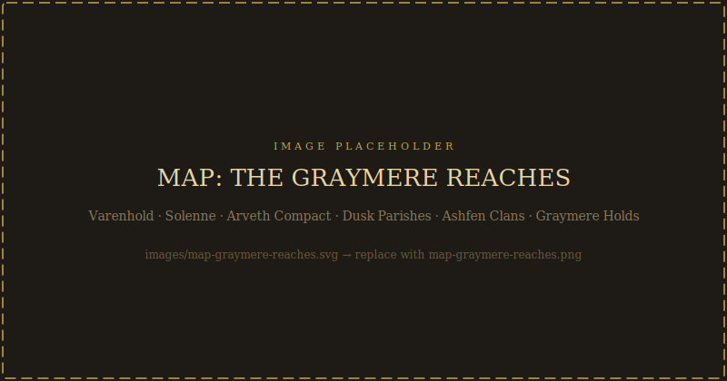
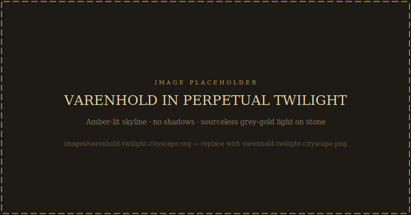
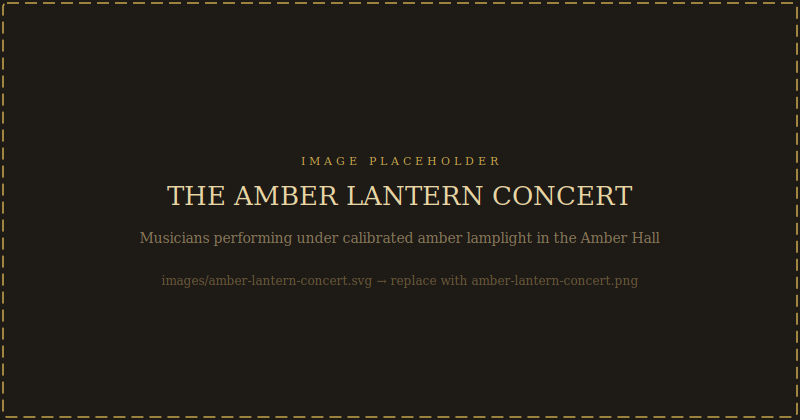

# The World Around Varenhold

*This chapter is fully player-safe. Read it before or between sessions.*

---

## The Graymere Reaches

Varenhold sits at the center of a region called the Graymere Reaches — named for the broad, slow river that drains the mountain snowmelt southward into the marsh country before eventually reaching the sea. The Reaches are not a nation. They are a geographic convenience, a name traders use for the loose collection of cities, parishes, clans, and mountain holds that share the same river valley and, historically, the same trade routes.

For most of the Reaches' recorded history, this arrangement worked well. Each power had something the others needed. No single nation was strong enough to conquer the rest. The river kept commerce moving, and Varenhold sat at the crossing where the eastern and western roads met the northern mountain passes.

Then the sun went out.

---

## Varenhold: The Crossroads City

### What Varenhold Was

Two hundred and fifty years ago, Varenhold was a minor fortified settlement at the junction of three trade roads. Its founders were practical people — merchants, retired soldiers, a handful of scholars who followed the merchants for the libraries — who saw that whoever controlled the crossing point would prosper regardless of what any particular nation needed that season.

They were right. Within fifty years, Varenhold had grown into a city. Within a century, it had a university district (the Spire), three competing merchant guilds (now consolidated into one Compact), and the diplomatic infrastructure of a major regional power without ever formally becoming one. Varenhold did not conquer. It facilitated. It taxed transit, brokered disputes, trained scholars that all the neighboring powers needed, and maintained a studied neutrality that made it useful to everyone.

The city's golden age ran roughly from 100 years ago to the night the sun vanished. Scholars estimate the population then at around sixty thousand. The architecture of the Highmark district dates from this period: broad arcades, public fountains, the Amber Hall where the city's famous amber-lantern concerts were held. Varenhold had developed a reputation for a particular kind of beauty — not grand or martial but intricate, golden, warm. The city's amber workshops were famous throughout the Reaches. Artists came here to study the quality of the light.

The light has changed since.

### What Varenhold Is Now

The twilight is not darkness. This surprises most newcomers. Varenhold exists in a permanent deep dusk — the light of a sun perpetually below the horizon, refracted through the atmosphere into a sourceless grey-amber glow. You can see. You can read, walk, work. But there are no shadows. There is no warmth in the light. And there has been no day for fifty years.

The current population is estimated at thirty-five to forty thousand. The rest have left — slowly, family by family, over decades. The ones who remain are the ones who couldn't leave, or wouldn't, or who have been waiting for something to change.

The Highmark district is quieter than the old paintings suggest. Some of the arcades are shuttered. The university still operates but at reduced enrollment; many students complete their foundational studies and then leave for Solenne or the Compact to practice their professions. The Spire itself — the Scholars' tower complex — remains active, because the twilight problem is a magical problem, and if anyone will solve it, it's theoretically them. Fifty years of theoretical work has not yet produced a solution.

**The Dawnhalls** are newer: communal gathering spaces built in the early years of the twilight, originally as emergency infrastructure (places to share food, coordinate labor, shelter people whose livelihoods had collapsed). They're still operating, now cultural institutions as much as practical ones. The Dawnhalls are where the city's public life happens: markets, assemblies, music, grief rituals. Each district has at least one.

**The Lowmark** is the working-class district nearest the river docks. It was always the rougher end of the city, and the twilight has made it rougher. The grey sickness — a wasting condition that seems to worsen without sunlight — is more prevalent here. The Healers' Guild runs a large care house in the Lowmark. The smell of Lowmark Stew (a hearty, heavily preserved vegetable and dried-meat broth that became the city's survival food during the first decade of the twilight) drifts out of almost every building.

---

## The Five Neighboring Powers

### Solenne (North)

Solenne is a city-state about four days' ride north of Varenhold, controlling the most important of the mountain passes through the Graymere Holds. It is a deeply pious city — Auris, the sun god, has been the dominant religious and civic authority there for at least two centuries. The city's skyline is dominated by the Cathedral of the First Light, a structure specifically designed so that the first morning rays strike its central altar. Since the twilight, no morning rays have struck it. The cathedral has been draped in mourning cloth for fifty years.

Solenne was Varenhold's most important trading partner before the crisis. The relationship has cooled dramatically, and the reasons are complicated. Some Solennite clergy believe Varenhold caused the twilight through impious ritual practice and that continuing trade with the city is participation in its sin. Others maintain more charitable views. The current High Penitent — Solenne's religious governor — has taken a moderate position publicly while quietly reducing the transit trade to a fraction of its former volume.

For players: Solenne characters (especially Auris clergy) will have a fraught relationship with Varenhold from the start. The city will be simultaneously grateful for any Auris presence and suspicious of Solennite motives. This is rich ground.

### The Arveth Compact (West)

The Arveth Compact is the most economically powerful entity in the Reaches — a mercantile republic of seven cities that long ago formalized their trade relationships into a governing charter. The Compact has no standing army but an extremely sophisticated system of economic leverage. They don't conquer; they buy, and what they can't buy, they price out of competition.

The Compact's approach to Varenhold's crisis is frank to the point of callousness: they see it as a market disruption. Varenhold's amber workshops still produce, but the market is different now. The transit taxes are lower because fewer goods travel through. The Compact has been steadily rerouting trade through alternative roads that avoid Varenhold entirely — not as punishment, but as efficiency. This has accelerated the city's economic decline.

Some Compact merchants still maintain permanent presence in Varenhold, because even a diminished crossroads city has value. These are the pragmatists. They don't want Varenhold to fail; they want it to stabilize. The Merchants' Compact inside Varenhold (a local organization, not affiliated with the Arveth Compact despite the name similarity) has complex ties with these visitors.

### The Dusk Parishes (East)

The Dusk Parishes are not a state in any formal sense — they're a loose collection of farming communities and small towns strung along the eastern river tributaries. They share a common culture, a common Varenhold-derived dialect, and a common problem: they are agriculturally devastated.

Fifty years without reliable light has broken their growing seasons. The Parishes have adapted — cold-tolerant crops, root vegetables, preserved fish from the river — but adaptation is not prosperity. The grey sickness is widespread here. Children born in the Parishes since the twilight have grown up never knowing direct sunlight. Many have never traveled as far as Varenhold.

The Parishes are culturally the most closely tied to Varenhold of any neighboring region. Families who emigrated from the Parishes settled much of the Lowmark. Lowmark Stew is a Parish recipe. The Dawnhalls were built partly on Parish communal-gathering traditions. This connection means Varenhold feels the Parishes' suffering directly — and the Parishes feel Varenhold's failures as their own.

Politically, the Parishes have no unified voice, but their de facto representative in Varenhold is a rotating council of parish delegates who come to the city for seasonal market-days. They are the loudest advocates for the Restorer movement — because in the Parishes, the sun is not a philosophical question.

### The Ashfen Clans (South)

The southern marshlands — the Ashfen — are older than Varenhold, older than the Graymere trade routes, older than most things in the region. The clan people who have lived there for generations have a complex relationship with the larger world: they trade, they speak the common tongue, they have been known to send their brightest young people to the Spire for education. But they have never allowed a foreign power to govern them, and they don't intend to start.

The Ashfen Clans use a form of magic that the Spire scholars categorize as "pre-systematic" — it predates the standardized arcane frameworks taught at any formal institution. Clan practitioners (called Wadewalkers, after the marsh-walking tradition that's central to their initiation practices) can do things that puzzle formally trained mages, and they have their own theories about the twilight that the Spire has been reluctant to take seriously because they don't fit the established frameworks.

The Clans are formally neutral in Varenhold's political situation but have their own concerns. The marsh ecosystem has been disrupted by the twilight — some species have disappeared, others have spread invasively. The Clans have been documenting these changes with the same precision they apply to everything in their environment, and they are more worried than they've publicly stated.

For players: Ashfen Clan characters will be viewed with a mixture of fascination and condescension in Varenhold — which is a useful social dynamic to play with. Their perspective on the twilight is genuinely different from the Spire's, and genuinely useful.

### The Graymere Holds (North-Northwest)

The mountain confederation that controls the high passes is less a government than a tradition: fifteen to twenty semi-independent holds that agree to maintain the roads, share the tolls, and not fight each other. The Holds' current leader — the Passage-Warden, an elected position — is a pragmatic woman named Herath who has held the post for twelve years and seems likely to keep it indefinitely, because she is very good at maintaining roads and very bad at inspiring factional conflict.

The Holds are the most geographically isolated from the twilight's immediate effects — at high altitude, the atmospheric changes are different, and several of the Hold settlements have reported occasional brief moments of something approaching natural light, which has made them objects of intense scholarly interest from the Spire. The Holds themselves are cautious about how much access they grant; the last time they let a Spire expedition into the high peaks, it ended badly.

Trade through the Holds has decreased as Varenhold has declined, but not as dramatically as the eastern and western routes. The passes are the passes; there's no alternative geography. The Holds will trade with whoever controls Varenhold, and they expect that to continue being true.

---

## Trade and the Twilight's Toll

Before the twilight, Varenhold's economy rested on three things: transit taxes on goods passing through the crossroads, its amber workshops and the goods they produced, and the export of trained scholars and specialists. All three have suffered.

**Transit trade** is down to roughly forty percent of its former volume, as the Arveth Compact and other powers have developed alternative routes. The taxes the city collects are proportionally reduced.

**The amber workshops** still operate, but the market has shifted. The famous amber-glow lanterns Varenhold produced — designed to approximate natural sunlight — were luxury goods in a world with sunlight. In the twilight, they've become essential goods throughout the Reaches. Demand has actually increased, but so has competition from cheaper imitators in Arveth cities. The workshops produce more units at lower prices and lower margins than before.

**Scholar export** has dropped sharply. The Spire still trains graduates, but the best students leave as soon as they can. The Spire's academic reputation has also suffered — fifty years of failing to solve the twilight has made the institution look impotent, whatever other work it produces.

What has replaced some of this revenue is grimmer: aid. Solenne sends relief shipments, irregularly and conditionally. The Compact buys preserved goods at below-market prices on "humanitarian" terms. The Holds offer favorable toll rates. Varenhold is not starving — the Dawnhalls' food networks and the river access to Dusk Parish fishing keep the population fed — but it is an aid recipient, and that has changed how the city understands itself.

---

## Varenhold's Culture

### Character

Varenholder character — the thing that locals mean when they say someone is "a true Varenholder" — is an admixture of pragmatism, pride, and a quiet, unfashionable stoicism that they would never call by that name. They call it *staying*. The city's informal self-mythology is built around the people who didn't leave: who stayed when it got hard, who built the Dawnhalls, who figured out Lowmark Stew, who kept the workshops running, who maintained the university even when enrollment dropped.

This makes them somewhat suspicious of newcomers — not hostile, usually, but watchful. You're arriving in a city that's been waiting for something for fifty years. What do you want? What are you offering? Will you stay when it gets harder, or are you like the others who drifted through and left?

The city's relationship to grief is complex. There is a local tradition called *the Dusk Sitting* — twice a year, the whole city essentially stops for a day, and people gather in the Dawnhalls or in private to mark the passing of time without the sun. It is not a religious practice (though some have religious dimensions); it is closer to a civic ritual. Newcomers sometimes find it profoundly moving. Some find it morbid. Locals generally appreciate visitors who engage with it seriously.

### Arts

The amber-lantern concert tradition is Varenhold's most famous artistic export. The concerts use specifically calibrated amber lamps to create a light environment that approximates, imperfectly, a warmly lit interior — and musicians compose and perform for that light. The scores specify both sound and light, written in a notation system unique to Varenhold. At their best, they are moving in a way that's hard to describe to people who haven't experienced them; at their worst, they're a kind of elaborate nostalgia exercise that doesn't accomplish much.

Varenhold's visual art has shifted in fifty years. The amber-tinted, warmly lit paintings that defined the pre-twilight period gave way first to starker grey-and-ochre work, then to a more recent movement that tries to find beauty in the twilight itself — paintings of the sourceless light on water, portraits of people by lamplight, large-scale depictions of the Dawnhalls' interior glow. Critics outside Varenhold sometimes find this work claustrophobic. Critics inside find the outside critics missing the point.

Melancholy music is the norm. Not sad music, exactly — not music designed to make you cry — but music that sits with something unresolved and doesn't force it to resolution. There's a local form called the *lanternhalt*, a slow ballad structure with an unresolved final chord, built on the idea that the song is waiting for something that hasn't come yet.

### Food

Preserved goods form the backbone of Varenhold cuisine: smoked fish, pickled vegetables, dried fruits traded up from the Compact, salt-preserved everything. Fresh produce exists but is expensive; the city's interior growing spaces (converted warehouse gardens, rooftop plots, Dawnhall community gardens) supplement what comes in by trade.

**Lowmark Stew** is the city's most famous dish and its most democratic one: a thick broth of whatever dried and preserved goods are available, slow-cooked with river herbs and finished with a few drops of Ashfen marsh oil (which every serious Lowmark cook maintains a small reserve of). No two pots are exactly alike. The dish is eaten at every social level, in private homes and Dawnhall kitchens alike.

Varenhold produces a good smoked fish paste, a distinctive amber-colored vinegar made from fermented grain mash, and a hard cheese called **greywheel** that has become something of a regional export — better in its way than the cheeses that came before, because fifty years of adapting dairy production to the twilight has forced innovation.

**Lumenbread** is bread baked in amber lantern warmth rather than conventional ovens — a technique developed in the first decade of the twilight when fuel was scarce and heat concentration was necessary. It produces a dense, slightly sweet loaf that keeps well and has become genuinely preferred over conventionally baked bread by most lifelong Varenholders.

### Dress

Varenholders dress in layers — the twilight is not dramatically colder than full day, but the psychological effect of no sun has led the culture toward warmth. Heavy wool, layered linen, deep colors (the amber and ochre of the pre-twilight period remain fashionable; dark green and burgundy have been adopted in the twilight era). Most people carry a small lantern or wear one at the belt when moving through the city at what would have been nighttime — because the twilight doesn't vary much, locals have kept to something like a day/night schedule maintained by city bells, but the light doesn't help you know which is which anymore.

The **lantern-carrier** tradition — certain people, usually guild members or city employees, who carry larger lanterns and light the way in public spaces — has evolved from a practical service into something closer to a civic institution. Children aspire to be lantern-carriers. There are lantern-carrier songs.

A small Varenhold-specific fashion: a knotted cord worn at the wrist, in colors that indicate something about the wearer's connection to the city. Red for a native Varenholder. Blue for a resident of at least five years. Yellow for a visitor. Green for a merchant with regular business in the city. No one enforces this system; no one quite knows when it started; no one stops doing it.
